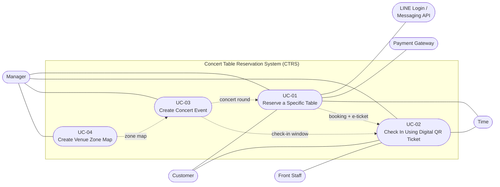

# Concert Table Reservation System for Restaurant

**2110521 วิศวกรรมสถาปัตยกรรมซอฟต์แวร์ (Software Architecture)**

> Transcribed from `Deliverable-1.pdf` (32 pages). Page images are in [png/](png/). The document is split into [use-cases.md](use-cases.md), [requirements.md](requirements.md) and [adr.md](adr.md).

## Group Members — SE 101

| Name | Student ID |
|---|---|
| Chetsada Winaikoson | 6772012221 |
| Waris Natirutthakorn | 6872081621 |
| Natcha Thawinpipat | 6870083521 |
| Watayut Aiamanan | 6970267821 |

This document is an integral component of the subject 2110521 Software Architecture, Department of Software Engineering, Faculty of Engineering, Chulalongkorn University, Semester 1 of the academic year 2026.

---

## Problem Description

Pubs and bars still rely on manual chat messaging and phone calls to handle table reservations, leading to delayed staff responses, lost bookings, lack of real-time floor plan visibility, and frequent allocation errors where customers do not get their requested tables. Currently, handling table inquiries and confirming seat statuses manually consumes substantial staff time and often leads to miscommunications during peak hours. The system should streamline table reservations through a web app accessed via LINE Messenger, providing a real-time interactive floor plan, digital QR tickets for check-in, and automated cutoff reminders with arrival confirmation and extension requests.

## Target Customer

- **Manager (Bar/Venue Owner):** Full access to create the venue zone map (zones, tables, and table types), create and publish concert rounds with their prices, rule on check-in escalations, monitor booking traffic, and view booking analytics.
- **Staff (Front-of-House / Host):** Scan QR codes on digital tickets for fast check-in, monitor real-time table statuses, handle walk-ins, and create cutoff/postponement requests.
- **Customer:** Browse interactive floor plans, reserve specific tables with seat view perspectives, receive automated cutoff reminders, and check in via digital QR pass.

---

## Scenario (use-case & description)

### Use Case Diagram

System boundary: **Concert Table Reservation System (CTRS)**

The diagram below is derived from the use case descriptions in this document. The original diagram on page 3 of the PDF ([png/page-03.png](png/page-03.png)) is out of date: it names UC-03 "Manage arrival and cutoff" and UC-04 "Configure venue and floor plan", which do not match the descriptions.

| Use case | Primary actor | Supporting actors |
|---|---|---|
| UC-01 Reserve a Specific Table | Customer | LINE Login, LINE Messaging API, Payment Gateway, Manager (degraded-mode slip review), Time (hold expiry) |
| UC-02 Check In Using Digital QR Ticket | Front Staff | Customer, Manager (escalation ruling), Time (no-show marking) |
| UC-03 Create Concert Event | Manager | — |
| UC-04 Create Venue Zone Map | Manager | — |

Dependencies between use cases: UC-04 produces the zone map required by UC-03; UC-03 produces the concert round used by UC-01 and the check-in window and grace period used by UC-02; UC-01 produces the Confirmed booking and e-ticket used by UC-02.

---

## Document Sections

| Section | File |
|---|---|
| Use Case Descriptions (UC-01 to UC-04) | [use-cases.md](use-cases.md) |
| Functional & Non-functional Requirements | [requirements.md](requirements.md) |
| Architecture Decision Records (ADR-01 to ADR-07) | [adr.md](adr.md) |
