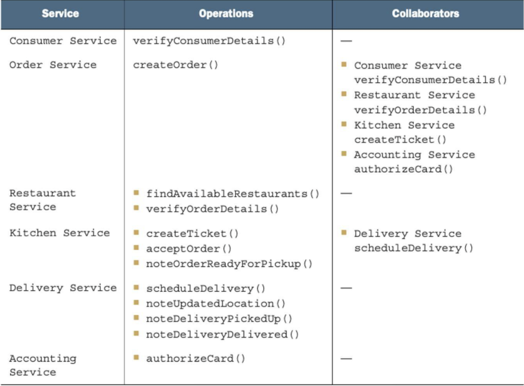
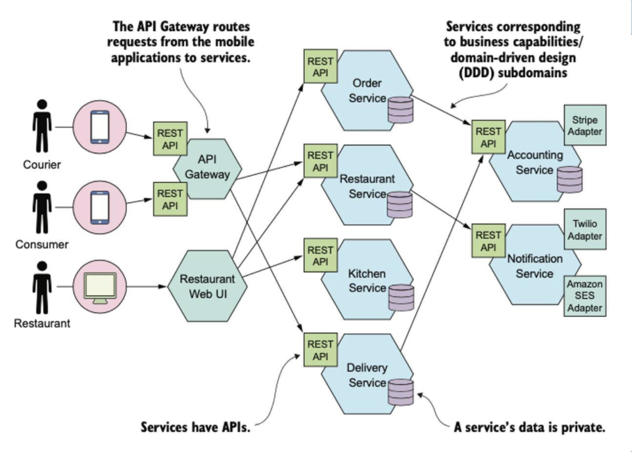
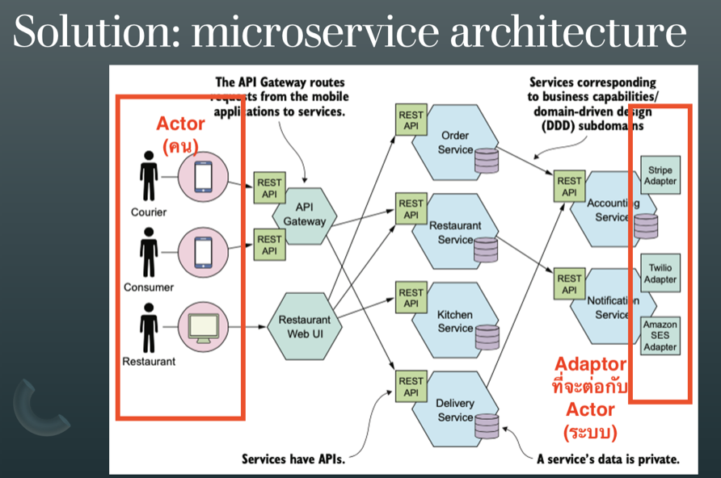
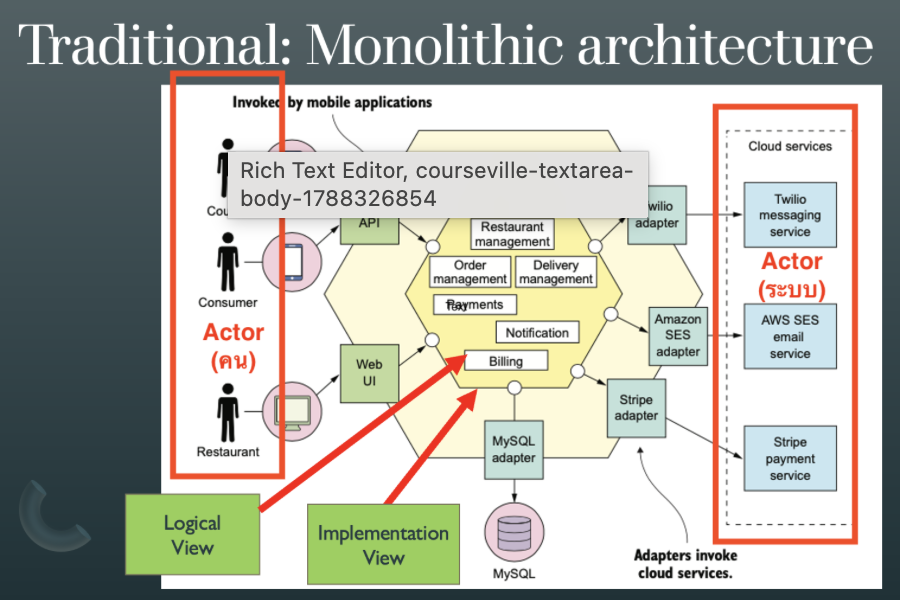

# Deliverable #2 brief

> Brief as posted in MyCourseVille, kept as given; only markdown structure (headings, lists, line breaks) was added. The images posted with it are at the end.

ดูสิ่งที่ต้องส่งใน Announcement

## ประกาศ: แนวทางการส่งงาน Term project Deliverable #2: Microservice Design with Collaborations

### สิ่งที่ต้องส่งตาม Syllabus

กำหนดส่ง

- กลุ่มวันพุธ: 8 กันยายน
- กลุ่มวันอาทิตย์: 12 กันยายน

ส่ง 2 ส่วน

- ตาราง Service–Operations–Collaborators
- Architecture Diagram ของระบบ

Diagram ไม่จำเป็นต้องใช้ notation หรือรูปทรงเหมือนตัวอย่าง FTGO เป๊ะ ขอเพียงแสดงให้เห็น Actor, Service, External System และความสัมพันธ์ที่สำคัญของระบบอย่างชัดเจน

งานครั้งนี้ยังเป็น architecture เวอร์ชันแรก สามารถปรับเปลี่ยนได้ใน progress ครั้งต่อ ๆ ไป แต่ขอให้มี component และ operation ที่สำคัญต่อ 3 Business Use Cases ของกลุ่มครบถ้วน

### แนวทางก่อนส่งงาน

#### 1. เริ่มจาก Actor และ Business Use Case ก่อน แล้วจึงออกแบบ Service

ทบทวนแนวคิดจาก SE1 เรื่อง Use Case: ใครเป็นผู้เริ่มการทำงานของระบบ และต้องการทำอะไร เช่น Customer, Vendor, Admin หรือ External System ไม่ควรใช้คำว่า “User” อย่างเดียวหากจริง ๆ แล้วมีหลายบทบาท

จากนั้นจึงพิจารณาว่า Business Use Case แต่ละเรื่องต้องอาศัย business capability อะไรบ้าง และควรให้ Service ใดรับผิดชอบ

ไม่จำเป็นว่า 1 Use Case = 1 Service — Use Case หนึ่งอาจทำงานร่วมกันหลาย Service และ Service หนึ่งอาจรองรับหลาย Use Case ได้

#### 2. User Management เป็นพื้นฐานของระบบ ไม่ใช่ Business Use Case โดยอัตโนมัติ

ใน architecture เวอร์ชันแรก สามารถยังไม่แสดง User Management Service ก็ได้ เช่นเดียวกับตัวอย่าง FTGO ที่ลดรายละเอียดส่วนนี้ออกเพื่อให้เน้น business domain ก่อน

การลงทะเบียน, Login, Logout หรือจัดการข้อมูลบัญชีพื้นฐาน ไม่นับเป็น 1 ใน 3 Business Use Cases ของโปรเจกต์

แต่หากการจัดการผู้ใช้เป็น business logic สำคัญจริง เช่น Membership ระดับ Platinum/Gold/Silver ซึ่งมีสิทธิประโยชน์หรือกติกาทางธุรกิจต่างกัน จึงอาจนับเป็น Business Use Case ได้

#### 3. ไม่จำเป็นต้องสร้าง Authentication Service แยกเพียงเพื่อให้ architecture ดูเป็น Microservices

ระบบจริงอาจใช้ Identity Provider/Auth Service แยกต่างหาก หรือใช้ระบบภายนอกก็ได้ ขึ้นอยู่กับการออกแบบ

สำหรับงานในขั้นนี้ ยังไม่ต้องแยก Authentication Service หากไม่มีเหตุผลทาง architecture ที่ชัดเจน โดยภายหลังเราจะเรียนเรื่อง API Gateway และการจัดการ Authentication/Authorization เพิ่มเติม

และ ไม่ควรเชื่อม User Service เข้ากับทุก Service เพียงเพื่อแสดงว่าแต่ละ Service ต้องตรวจสิทธิ์ การตรวจสอบตัวตนระดับต้นทางอาจทำที่ Gateway ส่วน authorization ที่เกี่ยวกับ business rule ควรตรวจใน Service ที่เป็นเจ้าของ operation นั้นตามความเหมาะสม

#### 4. ตรวจว่า Business Logic อยู่ใน Service ที่เหมาะสมจริง

ตัวอย่าง ถ้ามี Use Case เช่น “จองบริการ / แก้ไขการจอง / ยกเลิกการจอง” ต้องเห็นว่ามี Service ใดเป็นเจ้าของ logic และข้อมูลการจองอย่างชัดเจน ไม่ควรมีเพียง UI แล้วไม่เห็นว่า business operation ถูกประมวลผลที่ใด

ถ้า Service มีข้อมูลที่ต้องเก็บอย่างถาวร ควรระบุ data store ที่ Service นั้นเป็นเจ้าของด้วย หลักสำคัญคือ ข้อมูลของ Service ควรเป็น private ต่อ Service นั้น และ Service อื่นควรเข้าถึงผ่าน API แทนการอ่านฐานข้อมูลกันโดยตรง

ทั้งนี้ ไม่ใช่ทุก Service จำเป็นต้องมี Database หาก Service นั้นไม่มี state หรือข้อมูลที่ต้องจัดเก็บเอง

#### 5. Decompose ตาม Business Capability ไม่ใช่แค่แบ่งระบบให้มีกล่องหลายกล่อง

จุดประสงค์ของ Microservices ไม่ใช่ “ยิ่งมี Service เยอะยิ่งดี” แต่คือการแบ่งระบบออกเป็น Service ที่มี responsibility ชัดเจน มี cohesion ภายในสูง และ coupling ระหว่าง Service ต่ำ

ระวังทั้งสองด้าน:

- Service ใหญ่เกินไปจน business logic เกือบทั้งหมดอยู่ที่เดียว
- Service เล็กเกินไปจนแต่ละ Service แทบไม่มี business responsibility ของตัวเอง

ให้ลองเทียบกับ FTGO เช่น Order, Restaurant, Kitchen และ Delivery Service ซึ่งแยกตาม business capability / domain responsibility

#### 6. ตั้งชื่อ Service จากสิ่งที่ Service รับผิดชอบใน Domain

ควรอ่านชื่อแล้วพอเข้าใจบทบาทได้ เช่น Order Service, Booking Service, Delivery Service, Payment Service

หลีกเลี่ยงชื่อกว้าง ๆ เช่น Data Service, Processing Service, Matching Service หากชื่อดังกล่าวยังไม่บอกว่าจัดการข้อมูลอะไร ประมวลผลอะไร หรือ match อะไร

#### 7. ตารางและ Diagram ต้องสอดคล้องกัน

Service ที่อยู่ในตาราง Service–Operations–Collaborators ควรปรากฏใน Diagram และ Service สำคัญที่อยู่ใน Diagram ก็ควรมีรายละเอียดในตาราง

ก่อนส่งให้ลองตรวจจาก Use Case ย้อนกลับว่า

Actor → เรียก Operation อะไร → Service ใดรับผิดชอบ → ต้อง Collaborate กับ Service/External System ใด → ข้อมูลสำคัญถูกเก็บที่ใด

#### 8. Technology Stack ยังไม่ต้องซับซ้อนในเวอร์ชันนี้

ในรอบแรกสามารถ

- ใช้ REST ทั้งระบบ
- ใช้ฐานข้อมูลชนิดเดียว
- หรือยังไม่ระบุรายละเอียดบางส่วน

ได้ทั้งหมด และ ยังไม่แนะนำให้ใส่ Message Broker เพียงเพราะต้องการให้ architecture ดูซับซ้อน เพราะเรายังไม่ได้เรียนรายละเอียดส่วนนี้

ใน progress ครั้งถัด ๆ ไปจึงค่อยพิจารณาว่าแต่ละส่วนควรใช้ REST, gRPC, asynchronous messaging หรือ database แบบใดตามคุณสมบัติของงาน และในฉบับสุดท้ายให้กลับมาตรวจ requirement ด้าน technology ตามที่กำหนดไว้ท้าย Syllabus อีกครั้ง

#### 9. แสดง External System เป็น Actor/Collaborator ให้ชัดเจน

Actor ไม่จำเป็นต้องเป็นคนเท่านั้น ระบบภายนอก เช่น Payment Gateway, Email Service, Map Service หรือระบบของ Partner ก็ถือเป็น external actor/system ได้

ตัวอย่างจาก FTGO จะแยก Stripe, Twilio และ Amazon SES ออกจาก Service ภายในระบบ และใช้ Adapter เป็นตัวเชื่อมต่อ ซึ่งช่วยให้ business logic ภายในไม่ผูกกับ API ของผู้ให้บริการภายนอกโดยตรง

#### 10. สำหรับงานนี้ ให้ลูกศรใน Diagram แสดง Request/Invocation Flow

เพื่อให้ทุกกลุ่มใช้ความหมายเดียวกัน ให้ตีความลูกศรว่า

A → B = A เป็นผู้เรียก B

ไม่ต้องวาดลูกศรย้อนกลับเพื่อแสดง response

เช่น ถ้า A ขอข้อมูลจาก B แล้ว A นำผลไปเรียก C ให้เขียน A → B และ A → C

แต่ถ้าเขียน A → B → C จะหมายความว่า B เป็นผู้เรียก C ซึ่งเป็น architecture คนละแบบ

ดังนั้นอย่าวาดเป็น chain เพียงเพื่อให้ภาพดูง่าย แต่ให้วาดตาม ผู้ที่ initiate request จริง

### ขั้นตอนที่แนะนำก่อนเริ่มวาด Diagram

ให้ทำตามลำดับนี้จะง่ายที่สุด:

Actor → 3 Business Use Cases → Operations → Service Responsibilities → Collaborators → Data Ownership → Architecture Diagram

จากนั้นตรวจรอบสุดท้ายว่า “ถ้าเอาชื่อ Service ออก แล้วดูเฉพาะ responsibility แต่ละกล่อง เรายังอธิบายได้หรือไม่ว่าแต่ละ Service รับผิดชอบ business capability อะไร และ Use Case ทั้ง 3 ทำงานครบตั้งแต่ต้นจนจบหรือไม่”

ถ้าตอบได้ชัดเจน Architecture เวอร์ชันแรกก็ถือว่าอยู่ในทิศทางที่ถูกต้องครับ

### Images posted with the announcement

The FTGO example of Richardson's *Microservices Patterns*. Their position in the original post was not recorded.

*Col.png: FTGO Service–Operations–Collaborators table.*

*Mic.png: FTGO microservice architecture diagram: API Gateway, services with REST APIs and private databases, adapters to Stripe, Twilio and Amazon SES.*

*Microservice.png: lecture slide "Solution: microservice architecture", the same diagram with the actors (people) and the adapters to external systems marked.*

*Monolith.png: lecture slide "Traditional: Monolithic architecture", FTGO as a monolith with the actors, the logical view and the implementation view marked; a MyCourseVille tooltip covers part of it.*
