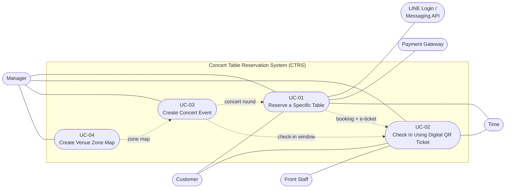

# Known issues in the submitted deliverables

Inconsistencies found in [Deliverable-1.pdf](../../deliverables/report/Deliverable-1.pdf) (D1) and
[Deliverable-2.pdf](../../deliverables/report/Deliverable-2.pdf) (D2), recorded 2026-09-29. They are **not fixed**: the
submitted files stay as handed in for now. They are fixed in the project document, version 2.0 draft 1
(workspace/report/project-document/; its change-log document, Section 2, lists the resolutions); the Status column names the change that fixes each one. Page numbers are PDF pages. Teacher feedback that asks for changes is kept
separately in [../received/teacher/](../received/teacher/).

| ID | Issue | Where | Status |
|---|---|---|---|
| KI-01 | Use case names in the diagram differ from the descriptions | D1 p3; D1 p15, p19; D2 p2 | Resolved in doc 2.0 draft 1 (CH-04) |
| KI-02 | Actors in the diagram differ from the descriptions and the requirements | D1 p2, p3, p23, p25; D2 p7 | Resolved (CH-02, CH-04, CH-05, CH-11) |
| KI-03 | Two arrival models: cutoff with extensions, or check-in window with no-shows | D1 p2, p3, p13, p23–25, p28–29; D2 | Resolved: check-in window model kept (CH-02, CH-08, CH-11, CH-15) |
| KI-04 | Who asks for a postponement is stated two ways | D1 p2, p24, p29 | Resolved (CH-02) |
| KI-05 | The requirements leave out behaviour the use cases and D2 depend on | D1 p2, p23–25 | Resolved (CH-11, CH-02) |
| KI-06 | Three different mechanisms expire a table hold | D1 p27, p28, p31; D2 | Resolved: ADR-08 (CH-13, CH-14) |
| KI-07 | ADR-02 leaves its decision open | D1 p27 | Resolved: ADR-09 (CH-14) |
| KI-08 | ADR-04's Web Push channel is missing from D2 | D1 p29; D2 p5, p7 | Resolved: ADR-10 (CH-15) |
| KI-09 | D2 counts three business use cases but lists four | D2 p2; D1 p19 | Resolved (CH-18) |
| KI-10 | sendSlipDecisionNotice() has no caller | D2 p5, p7 | Resolved (CH-19, CH-20) |
| KI-11 | Two diagram arrows end on another service's private database | D2 p7 | Resolved (CH-20) |
| KI-12 | Section numbering and page layout of D2 | D2 p2, p3, p6, p8 | Resolved (CH-18) |
| KI-13 | Department name on both covers | D1 p1; D2 p1 | Resolved (CH-21) |
| KI-14 | The ADRs do not yet meet the syllabus minimum technology requirements | D1 p26–32; D2 p7; syllabus item 17 | Partly resolved: REST and gRPC in ADR-12 (doc 2.0 draft 11, CH-34); broker, service discovery, second database open for Deliverable #3 |
| KI-15 | The Service–Operations–Collaborators table misses operations that the use cases need | D2 p5, p7 | Resolved in doc 2.0 draft 11 and 12 (CH-35 to CH-39) |
| KI-16 | UC-01 lost its preconditions, postconditions and basic-flow steps 1 to 11 in draft 21 | doc 2.0 drafts 21 to 26 | Resolved in doc 2.0 draft 27 (CH-57); the build now checks every use case |
| KI-17 | The back-office has no route that lists Draft rounds | doc 2.0 draft 27, Appendix D | Open: decide listRounds() or a status query on GET /rounds before the back-office is built (progress 2) |
| KI-18 | The polled table map shows every customer the booking id of a held or booked table | code review of the scenario tests, 2026-09-30 | Open: the id is opaque, but the Customer's view could omit `booking_id` (the live view of the Manager needs it); decide in progress 2 |

## KI-01 Use case names in the diagram differ from the descriptions

Found by Watayut: the names of UC-03 and UC-04 in the use case diagram differ from the use case descriptions.

| Use case | In the diagram (D1 p3) | In the descriptions (D1 p4, p10, p15, p19) and D2 p2 |
|---|---|---|
| UC-01 | Reserve a specific table | Reserve a Specific Table |
| UC-02 | Check in using digital QR ticket | Check In Using Digital QR Ticket |
| UC-03 | **Manage arrival and cutoff** | **Create Concert Event** |
| UC-04 | **Configure venue and floor plan** | **Create Venue Zone Map** |

UC-01 and UC-02 differ only in capitalization. No description exists for "Manage arrival and cutoff"; see KI-03.
The [Deliverable #1 brief](../../problem/deliverable-1/problem.md) asks for a use case diagram consistent with the use cases described.

## KI-02 Actors in the diagram differ from the descriptions and the requirements

- **Names.** The diagram (D1 p3) has Customer, Staff and Admin / Venue Owner. The descriptions have Customer, Front Staff and
  Manager as primary actors, and plain "Staff" in their stakeholder lists. Target Customer (D1 p2) has "Manager (Bar/Venue
  Owner)" and "Staff (Front-of-House / Host)". The functional requirements (D1 p23) say "allow admins to create and edit venue
  zone maps" but "allow managers to create a concert round", while the security requirement (D1 p25) knows only the roles
  Manager, Staff and Customer. D2 p7 uses Customer, Front Staff and Manager.
- **Associations.** The diagram links Customer and Staff to UC-03 and links Admin / Venue Owner to UC-04 only. In the
  descriptions the Manager is the primary actor of UC-03 and UC-04, reviews a transfer slip in degraded mode in UC-01 and
  rules on escalations in UC-02. LINE, the Payment Gateway and Time act in the descriptions but are not in the diagram.

Proposed alignment, drafted in an earlier transcription pass from the descriptions (not applied to any deliverable):

| Use case | Primary actor | Supporting actors |
|---|---|---|
| UC-01 Reserve a Specific Table | Customer | LINE Login, LINE Messaging API, Payment Gateway, Manager (degraded-mode slip review), Time (hold expiry) |
| UC-02 Check In Using Digital QR Ticket | Front Staff | Customer, Manager (escalation ruling), Time (no-show marking) |
| UC-03 Create Concert Event | Manager | — |
| UC-04 Create Venue Zone Map | Manager | — |

Dependencies between use cases: UC-04 produces the zone map required by UC-03; UC-03 produces the concert round used by UC-01 and the check-in window and grace period used by UC-02; UC-01 produces the Confirmed booking and e-ticket used by UC-02.

## KI-03 Two arrival models: cutoff with extensions, or check-in window with no-shows

- **Cutoff model.** Problem Description and Target Customer (D1 p2): "automated cutoff reminders with arrival confirmation
  and extension requests". Functional requirements (D1 p23–24): show the cutoff time before confirmation; "Arrival &
  Notification System" sends cutoff reminders through LINE, lets customers choose "I'm on my way" or a 30-minute extension,
  lets staff approve or reject it, and expires reservations after the effective cutoff. Non-functional requirements (D1 p25):
  cutoff times and extension request statuses. ADR-03 (D1 p28): node-cron for background cutoff scheduling. ADR-04
  (D1 p29): reminders before cutoff with "On My Way" / "Postpone 30 mins" cards. The diagram's UC-03 "Manage arrival and
  cutoff" (D1 p3).
- **Check-in window model.** UC-02 (D1 p10–14): the check-in window and grace period come from the round created in UC-03,
  and a booking not checked in by the end of the grace period becomes a no-show (p13 still says "at the cutoff"). D2 p2 and
  its services follow this model: getCheckInWindow(), markNoShows(), and no reminder, arrival-confirmation or extension
  operation.
- No use case description covers reminders or extensions.

## KI-04 Who asks for a postponement is stated two ways

Target Customer (D1 p2) says Staff "create cutoff/postponement requests". The functional requirements (D1 p24) and ADR-04
(D1 p29) say the customer requests the 30-minute extension and staff approve or reject it.

## KI-05 The requirements leave out behaviour the use cases and D2 depend on

- No requirement (D1 p23–25) mentions payment of the full table fee, the Payment Gateway, refunds, transfer slips and the
  degraded payment mode, the 15-minute hold, the waitlist, check-in escalation or no-shows. UC-01 and UC-02 specify all of
  them, and D2 has services and operations for them, for example the Payment Service, holdTable(), escalateCheckIn() and
  markNoShows().
- Target Customer (D1 p2) promises the Manager booking-traffic monitoring and booking analytics. No requirement, use case or
  D2 operation covers them.

## KI-06 Three different mechanisms expire a table hold

ADR-02 (D1 p27) uses short-term Redis distributed locks for table selection. ADR-06 (D1 p31) uses MongoDB TTL indexes for
"temporary reservation locks or draft bookings that expire if not checked out within a few minutes". ADR-03 (D1 p28) uses a
node-cron background task to release expired reservations. UC-01 and D2 specify a 15-minute hold, expired by Time through the
Booking Service, with "first lock wins" in the Table Availability Service. No ADR says which mechanism applies, "a few
minutes" does not match 15 minutes, and Redis does not appear in D2. The D2 feedback suggests leaving real-time updates
out of the MVP, which bears on ADR-02.

## KI-07 ADR-02 leaves its decision open

ADR-02 (D1 p27) decides "WebSocket (or Server-Sent Events - SSE)". ADR-03 (D1 p28) then picks Socket.io, and D2 p7 draws a
WebSocket push.

## KI-08 ADR-04's Web Push channel is missing from D2

ADR-04 (D1 p29) uses the LINE Messaging API "supplemented by Web Push notifications". In D2 (p5, p7) the Notification Service
calls only the LINE Messaging Adapter.

## KI-09 D2 counts three business use cases but lists four

D2 p2 refers to "the three business use cases of Deliverable #1", lists four (UC-01 to UC-04), and then says "Maintaining the
venue zone map is not itself one of the three business use cases". D1 p19 defines it as UC-04 Create Venue Zone Map with
use case type "Business / Creation".
The [Deliverable #2 brief](../../problem/deliverable-2/problem.md) asks for coverage of the group's 3 business use cases; the only use cases it rules out as non-business are
user-management ones such as registration and login (guideline 2).

## KI-10 sendSlipDecisionNotice() has no caller

The Notification Service offers sendSlipDecisionNotice() (D2 p5). The Payment Service reviews slips with
reviewTransferSlip(), but its collaborators are the Payment Gateway Adapter, the Media Storage Adapter and the Booking
Service. The Booking Service's Notification collaborators omit it, and the diagram (D2 p7) has no arrow from the Payment
Service to the Notification Service.
Guideline 7 of the [Deliverable #2 brief](../../problem/deliverable-2/problem.md): the table and the diagram must agree, checked from each use case through its operations and
collaborators.

## KI-11 Two diagram arrows end on another service's private database

In the diagram (D2 p7) the arrow from the Booking Service to the Table Availability Service ends beside the Table Status DB,
and the confirmBookingPayment() arrow from the Payment Service ends on the Booking DB. The legend says a cylinder is a data
store owned privately by its service, so the two arrows can be read as cross-service database access.
Guideline 4 of the [Deliverable #2 brief](../../problem/deliverable-2/problem.md): a service's data is private, and other services reach it through the service's API, not its
database.

## KI-12 Section numbering and page layout of D2

"Scope of this deliverable" (p2) and "Service–Operations–Collaborators" (p3) are both numbered 1, and "Architecture diagram"
(p7) has no number. Page 6 holds only the last two Notification Service operations, and page 8 is blank.

## KI-13 Department name on both covers

Both covers (D1 p1, D2 p1) say "Department of Software Engineering, Faculty of Engineering". The course belongs to the
Department of Computer Engineering: the syllabus (item 4) gives ภาควิชาวิศวกรรมคอมพิวเตอร์, and the page header of both
documents shows the CHULA ENGINEERING COMPUTER logo.

## KI-14 The ADRs do not yet meet the syllabus minimum technology requirements

The syllabus (item 17, minimum requirements for the term project) asks for at least one REST service, one gRPC service,
one service behind a message broker and an API gateway, a description of service discovery, and at least two types of
database, both relational and NoSQL. The ADRs (D1 p26–32) and the architecture (D2 p7) use REST only, no message broker and
MongoDB as the single database engine, and say nothing about service discovery. The Deliverable #2 brief (guideline 8)
allows REST only and a single database in the first architecture version and asks to revisit the technology requirements
later; Deliverable #3 already needs a REST service and a gRPC service with CRUD. Found 2026-09-29; to be decided with
Deliverable #3.

Update 2026-09-29: ADR-12 (project document 2.0 draft 11) decides REST from the web apps and the payment webhook through
the API Gateway to the services, and gRPC between the services. Still open: a service behind a message broker (ADR-12
has none in the MVP), how services are discovered, and a second, relational database next to MongoDB (ADR-06).

## KI-15 The Service–Operations–Collaborators table misses operations that the use cases need

Found 2026-09-29 by walking every step of the four use cases through the Service–Operations–Collaborators table (D2 p5)
in the order that guideline 7 of the [Deliverable #2 brief](../../problem/deliverable-2/problem.md) suggests: actor,
operation, service, collaborator, where the data is stored. Missing in D2:

- No service owns the back-office accounts, their sign-in and their roles (FR-65, FR-66, ADR-07).
- No operation verifies a scanned ticket before the entry is confirmed (UC-02 steps 3–4); there is only checkInBooking().
- No operation reads the bookings of a round for the Manager's live view (FR-42).
- No operation lists, reads, validates or activates a zone map (UC-03 steps 6–7, UC-04 steps 8–12, FR-74), and none
  reads or sets the business parameters (FR-38).
- The sold-out status of a round (UC-01 step 3, AF-2) needs the number of free tables, which the Concert Round Service
  has no way to get.
- No operation reads the customer profile to pre-fill it (UC-01 step 12b), and no LINE message is sent when a payment
  fails (FR-21).
- getDeliveryStatus() has no caller.

Resolved in the project document 2.0 draft 11: Table 5.3 completed (CH-35) and checked by the traceability tables of
Appendix A (CH-36), where every operation appears in at least one row and every MVP requirement is realised.

## KI-16 UC-01 lost its preconditions, postconditions and basic-flow steps 1 to 11 in draft 21

Found 2026-09-30 while mapping screens to use case steps (Appendix D): the Basic Flow of UC-01 started at step 12. The
edit of CH-50 (draft 21, UC-09 and UC-10 included by UC-01, steps renumbered from 12) replaced the text from the third
Relationships bullet to step 11 with nothing, and the HTML table still rendered, so the PDF checks did not catch it; the
redline of draft 21 showed the deletion but was not read that closely. Resolved in draft 27 (CH-57) with the text of
draft 20 and the flow names of draft 21; build_report.py now refuses to build when a described use case has no Basic
Flow, no Preconditions or Postconditions, or steps that do not run 1..n.

## KI-17 The back-office has no route that lists Draft rounds

Found 2026-09-30 by the coverage check of Appendix D (Section D.3): the round editor (B3) needs the Draft and Published
rounds of the venue, while GET /rounds is getUpcomingRounds(), the Customer's published upcoming rounds with their
sold-out status. Options: a listRounds() operation of the Concert Round Service for the Manager (Table 5.3, Table 6.4,
Table 6.9, the code), or a status query on GET /rounds that the gateway allows for staff roles only. To decide before
the back-office is built (progress 2); until then a Draft round is reopened by its id.

## KI-18 The polled table map shows every customer the booking id of a held or booked table

Found 2026-09-30 while writing the scenario tests (Table 6.7 TableStatus carries `booking_id`, and the gateway serves the
same message to the Customer Web App and to the live view). The id is opaque and gives no access (GET /api/bookings/{id}
is restricted to the owner, FR-40), so nothing leaks today; but the Customer's read could omit it. Options: a second
read for customers, or the gateway blanking the field for the customer role. To decide in progress 2.

Two defects found the same way were fixed in the code at once (SEATS commit of 2026-09-30): a Published round whose
zone map or sale list changed before booking opened did not rebuild its table map (UC-03 AF-3 step 2), and a Customer
could read a Draft round by its id (UC-03 AF-1 step 1).

