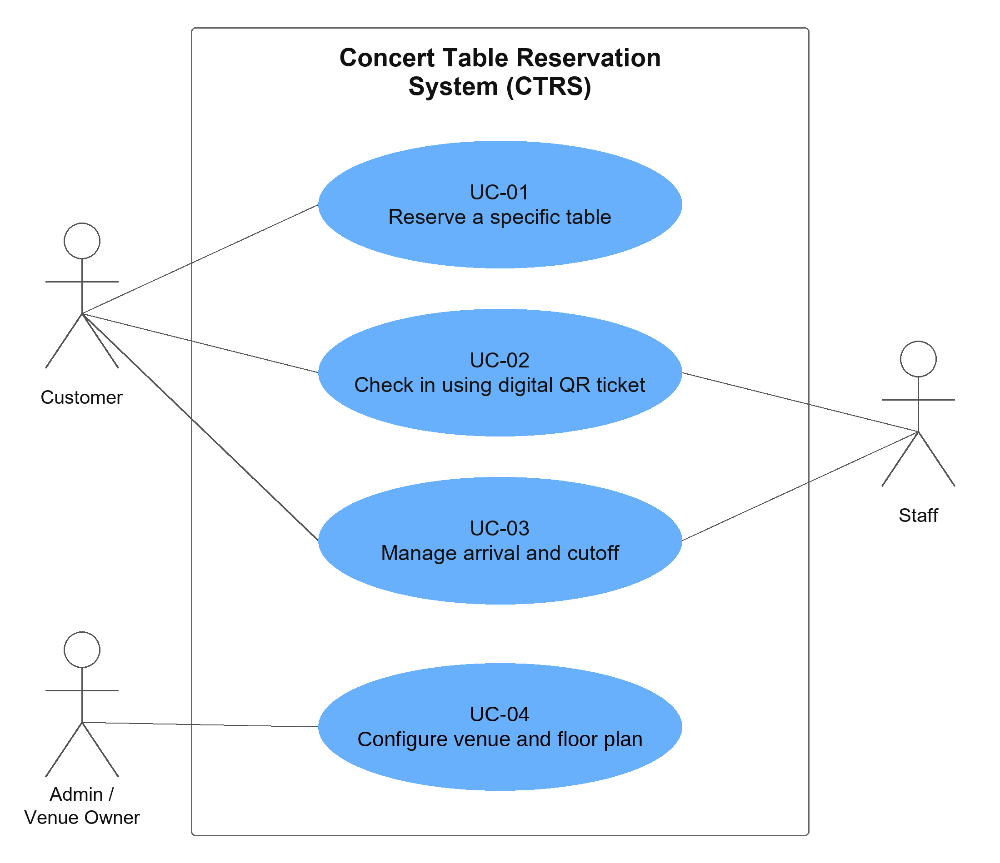

# Concert Table Reservation System for Restaurant

**2110521 วิศวกรรมสถาปัตยกรรมซอฟต์แวร์ (Software Architecture)**

> Transcribed from [Deliverable-1.pdf](../../../deliverables/report/Deliverable-1.pdf) (32 pages), the version handed in. Page images are in [png/](png/) (render with `python3 tools/render_pages.py --all`); the use case diagram of page 3 is also extracted at full resolution to [assets/use-case-diagram.png](assets/use-case-diagram.png). The document is split into [use-cases.md](use-cases.md), [requirements.md](requirements.md) and [adr.md](adr.md).

## Group Members — SE 101

| Name | Student ID |
|---|---|
| Chetsada Winaikoson | 6772012221 |
| Waris Natirutthakorn | 6872081621 |
| Natcha Thawinpipat | 6870083521 |
| Watayut Aiamanan | 6970267821 |

This document is an integral component of the subject 2110521 Software Architecture, Department of Software Engineering, Faculty of Engineering, Chulalongkorn University, Semester 1 of the academic year 2026.

---

## Problem Description

Pubs and bars still rely on manual chat messaging and phone calls to handle table reservations, leading to delayed staff responses, lost bookings, lack of real-time floor plan visibility, and frequent allocation errors where customers do not get their requested tables. Currently, handling table inquiries and confirming seat statuses manually consumes substantial staff time and often leads to miscommunications during peak hours. The system should streamline table reservations through a web app accessed via LINE Messenger, providing a real-time interactive floor plan, digital QR tickets for check-in, and automated cutoff reminders with arrival confirmation and extension requests.

## Target Customer

- **Manager (Bar/Venue Owner):** Full access to create the venue zone map (zones, tables, and table types), create and publish concert rounds with their prices, rule on check-in escalations, monitor booking traffic, and view booking analytics.
- **Staff (Front-of-House / Host):** Scan QR codes on digital tickets for fast check-in, monitor real-time table statuses, handle walk-ins, and create cutoff/postponement requests.
- **Customer:** Browse interactive floor plans, reserve specific tables with seat view perspectives, receive automated cutoff reminders, and check in via digital QR pass.

---

## Scenario (use-case & description)

### Use Case Diagram

System boundary: **Concert Table Reservation System (CTRS)**. The diagram as submitted on page 3 (figure extracted from the PDF at full resolution):

| Use case, as named in the diagram | Actors associated in the diagram |
|---|---|
| UC-01 Reserve a specific table | Customer |
| UC-02 Check in using digital QR ticket | Customer, Staff |
| UC-03 Manage arrival and cutoff | Customer, Staff |
| UC-04 Configure venue and floor plan | Admin / Venue Owner |

> Transcription note: the names of UC-03 and UC-04 and the actor names in the diagram differ from the use case descriptions. The submitted document is transcribed as it is; see issues KI-01 and KI-02 in [../../notes/known-issues.md](../../notes/known-issues.md).

---

## Document Sections

| Section | File |
|---|---|
| Use Case Descriptions (UC-01 to UC-04) | [use-cases.md](use-cases.md) |
| Functional & Non-functional Requirements | [requirements.md](requirements.md) |
| Architecture Decision Records (ADR-01 to ADR-07) | [adr.md](adr.md) |
