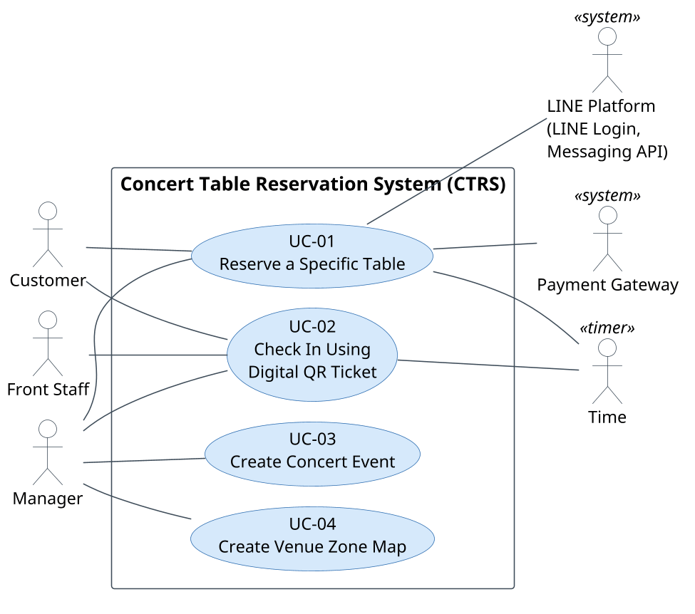

# 2 Scenario (use-case & description)

## 2.1 Use Case Diagram

*Figure 2.1 Use case diagram of the Seating & Event Availability Tracking System (SEATS)*

The diagram names each use case as its description does and shows every actor that takes part in it: the Customer, the Front Staff and the Manager, and the secondary actors LINE Platform (LINE Login and the Messaging API), Payment Gateway and Time. There is no «include» or «extend» relationship: UC-04, UC-03, UC-01 and UC-02 follow one another because each produces what the next one needs (zone map, concert round, confirmed booking), which is an order of use, not a relationship between use cases.

*Table 2.1 Use cases, actors and increments*

| Use case | Primary actor | Secondary actors | Increment |
|---|---|---|---|
| UC-01 Reserve a Specific Table | Customer | LINE Platform, Payment Gateway, Time (hold expiry), Manager (transfer-slip review, Increment 2) | MVP |
| UC-02 Check In Using Digital QR Ticket | Front Staff | Customer, Manager (escalation, Increment 2), Time (no-show marking, Increment 2) | MVP |
| UC-03 Create Concert Event | Manager | — | MVP |
| UC-04 Create Venue Zone Map | Manager | — | MVP |

## 2.2 Use Case Descriptions

Each use case is described in a table after Dennis, Wixom and Tegarden: name, identifier and importance, actors and type, stakeholders, brief description, trigger, relationships, pre- and postconditions, then the basic flow with its phases in braces and its extension points in bold, the subflows, the alternative flows and the exception flows. Flows that the MVP does not build are marked *(Increment 2)*.

### 2.2.1 UC-01 Reserve a Specific Table

*Table 2.2 Use-case description of Reserve a Specific Table*

<table class="uc" markdown="1">
<tr markdown="1">
<td class="c1" markdown="block">

#### Use Case Name

Reserve a Specific Table

</td>
<td class="c2" markdown="block">

#### ID

UC-01

</td>
<td class="c3" markdown="block">

#### Importance Level

High — MVP; EF-2, EF-3 and EF-4 in Increment 2.

</td>
</tr>
<tr markdown="1">
<td colspan="2" markdown="block">

#### Primary Actor

**Customer**

Secondary actors: **LINE Platform** (LINE Login and the Messaging API), **Payment Gateway** (simulated in the MVP), Time (hold expiry) and, from Increment 2, the **Manager** (transfer-slip review).

</td>
<td markdown="block">

#### Use-Case Type

Business / Transactional

</td>
</tr>
<tr markdown="1">
<td colspan="3" markdown="block">

#### Stakeholders and Interests

- Customer: Wants to select a suitable table and receive reliable booking confirmation.
- Front Staff: Wants accurate reservations with fewer manual inquiries and table allocation errors.
- Manager: Wants efficient table utilization and visibility into bookings.
- Payment Gateway: Wants correct payment requests and reliable delivery of payment results.

</td>
</tr>
<tr markdown="1">
<td colspan="3" markdown="block">

#### Brief Description

Customer accesses the web app through LINE Messenger, browses the upcoming concert rounds, views the real-time zone map and holds a specific table for 15 minutes. After completing the profile, accepting the booking terms and paying the full table fee through the Payment Gateway, the system confirms the booking, issues an e-ticket with a QR code and sends it to the Customer by LINE. In the MVP the Payment Gateway is simulated (ADR-11).

</td>
</tr>
<tr markdown="1">
<td colspan="3" markdown="block">

#### Trigger

Customer wants to reserve a table for a concert round. Trigger type: external.

</td>
</tr>
<tr markdown="1">
<td colspan="3" markdown="block">

#### Relationships

- Association: **Customer** (primary actor); **LINE Platform**, **Payment Gateway**, Time and, from Increment 2, the **Manager** (secondary actors).
- Include: none.
- Extend: none.
- Generalization: none.
- Related use cases: Relies on LINE Login for customer authentication, the LINE Messaging API for confirmation messages, the Payment Gateway for payment, and the concert round created in UC-03 on a zone map from UC-04. Produces the Confirmed booking and e-ticket used in UC-02; the check-in window and grace period applied in UC-02 come from the round created in UC-03.
- Business rules: BRULE-01, 02, 03, 07, 08, 09, 11, 12, 16, 17.

</td>
</tr>
<tr markdown="1">
<td colspan="3" markdown="block">

#### Preconditions

- Customer has the LINE application and is a friend of the shop's LINE Official Account.
- Manager has created the concert round with its zone map, table types, package prices and booking-open time (UC-03).
- The Payment Gateway is available: in the MVP the simulated gateway; from Increment 2 the merchant account is active and the shop's bank account for degraded mode is configured.

</td>
</tr>
<tr markdown="1">
<td colspan="3" markdown="block">

#### Postconditions

**Success (basic flow; EF-3 slip approved, Increment 2; EF-6):**

- Booking state = Confirmed; the payment is recorded; the table is booked for the round; the e-ticket is issued; the confirmation has been sent by LINE or is retrievable under My Bookings.

**Cancelled (AF-4 cancel; AF-6 consent refused; EF-5 login failed):**

- Booking state = Cancelled (or no booking was created); the hold is released and the table is available again; no payment exists.

**Expired (EF-1 hold expired; EF-3 slip rejected or not attached and EF-4 hold ended before a result, Increment 2):**

- Booking state = Expired; the table is available again and the zone map is refreshed; no money is held from the Customer; the Customer has been informed on screen and by LINE.

**Refunded (EF-2 payment result after hold expired, table no longer available; Increment 2):**

- Booking state = Expired; the payment and the refund are both recorded; the table remains with the other customer; the Customer has been informed by LINE that the payment is being returned.

</td>
</tr>
<tr markdown="1">
<td colspan="3" markdown="block">

#### Basic Flow

{Open the Customer Frontend}
1. The use case begins when the Customer opens the Rich Menu of the LINE Official Account and chooses "Reserve a table".
2. System signs the Customer in through LINE Login and uses the LINE user id as the customer identity. **{LINE Login Result}**

{Browse Rounds}
3. System displays the upcoming concert rounds with artist, date, start time, booking-open time and status: not yet open, open, sold out.
4. Customer selects a round that is open for booking.

{View the Table Map}
5. System displays the zone map of the round: every table with its number, zone, table type, package price and status (available, held, booked), refreshed within 2 seconds of any change (FR-06).
6. Customer selects an available table.

{Hold the Table}
7. System verifies that the table is still available and places a hold on it for the hold period of 15 minutes.
8. System marks the table as held for every other customer (first lock wins) and displays the remaining hold time.
9. System shows the booking summary (round, table, package content and package price) and asks for the party size.
10. Customer enters the party size.
11. System computes and displays the full table fee: the package price of the selected table type in its zone plus the extra-person fee for every person above the capacity of the table type.

{Complete the Customer Profile}
12. System checks whether a customer profile already exists for the LINE user id.
    - a. If this is the Customer's first booking, System shows the purpose of data collection and asks for consent, name and phone; Customer provides them and System stores the customer profile.
    - b. Otherwise System pre-fills the profile and Customer confirms it.

{Accept the Booking Terms}
13. System displays the booking terms: full payment confirms the booking, the check-in window opens 2 hours before the show, the grace period is 30 minutes after the start, and a no-show is not refunded.
14. Customer accepts the terms.

{Pay the Full Table Fee}
15. System creates a payment request for the full table fee with the Payment Gateway and opens the gateway's hosted checkout inside the web app.
16. Customer chooses a payment method (PromptPay QR, card, mobile banking, e-wallet); in the MVP the simulated gateway offers a successful and a declined payment.
17. Customer submits the payment through the chosen method before the hold expires.

{Payment Completed}
18. Payment Gateway verifies the payment and sends the payment result to System by signed webhook. **{Payment Result Received}**

{Confirm the Booking}
19. System verifies the authenticity of the payment result and the amount, records the payment, sets the booking to Confirmed and marks the table as booked; if the same payment result arrives again, System ignores the duplicate. **{Booking Confirmed}**

{Issue the E-Ticket}
20. System issues the e-ticket: it generates a signed booking reference valid only for that concert round and table, encodes it in a QR code, stores it with the booking, and makes it available under My Bookings.
21. System displays the confirmation and the e-ticket on screen.
22. System sends the confirmation message with the e-ticket and the booking terms to the Customer through the LINE Messaging API (subflow S-1). **{Confirmation Delivery Result}**
23. The use case ends.

</td>
</tr>
<tr markdown="1">
<td colspan="3" markdown="block">

#### Subflows

##### S-1 Notify the Customer by LINE
1. System composes the message from the booking data and the booking terms template.
2. System sends it as a push message through the LINE Messaging API and records the delivery result.
3. The subflow returns to the step that invoked it.

</td>
</tr>
<tr markdown="1">
<td colspan="3" markdown="block">

#### Alternative Flows

##### AF-1 Round Not Yet Open for Booking

At {Browse Rounds}, if the Customer selects a round whose booking-open time has not arrived,

1. System shows the round's details and its booking-open time and does not display the zone map.
2. Resume the basic flow at {Browse Rounds}.

##### AF-2 Round Sold Out

At {Browse Rounds}, if the Customer selects a round whose status is sold out, or at {View the Table Map}, if the last available table of the round is taken while the map is displayed,

1. System shows the round as sold out and closes the zone map if it is displayed.
2. Resume the basic flow at {Browse Rounds}.

##### AF-3 Table Just Taken by Another Customer

At {Hold the Table}, if the verification finds that the selected table has already been held or booked by another customer (first lock wins),

1. System informs the Customer that the table has just been taken and refreshes the zone map.
2. Resume the basic flow at {View the Table Map}.

##### AF-4 Customer Cancels During the Hold

At any point between {Hold the Table} and {Payment Completed}, if the Customer cancels the booking,

1. System releases the hold immediately, sets the booking to Cancelled and returns the table to available.
2. The use case ends.

Leaving the web app without cancelling does not release the hold; it runs until it expires (EF-1).

##### AF-5 Payment Declined

At {Payment Result Received}, if the Payment Gateway reports that the payment was declined,

1. System shows the decline and the remaining hold time.
2. Resume the basic flow at {Pay the Full Table Fee}.

##### AF-6 Consent Refused

At {Complete the Customer Profile}, if the Customer declines the data-collection consent,

1. System explains that the booking cannot continue without it, releases the hold and sets the booking to Cancelled.
2. The use case ends.

##### AF-7 Invalid Profile Data

At {Complete the Customer Profile}, if the name is empty or the phone number is not a valid Thai mobile number,

1. System marks the field and asks for a correction; the hold timer keeps running.
2. Resume the basic flow at {Complete the Customer Profile}.

</td>
</tr>
<tr markdown="1">
<td colspan="3" markdown="block">

#### Exception Flows

##### EF-1 Hold Expires Before Payment

At any point between {Hold the Table} and {Payment Result Received}, if the hold period of 15 minutes ends without a payment result (Time actor),

1. System releases the table, sets the booking to Expired and refreshes the zone map for every customer.
2. System informs the Customer by a LINE message that the hold has expired and that the table may be selected again if still available (subflow S-1).
3. The use case ends.

##### EF-2 Payment Result Arrives After the Hold Expired *(Increment 2)*

At {Payment Result Received}, if a successful payment result arrives after the hold has expired,

1. System checks whether the table is still available.
   - a. If the table is still available, System places a new hold and resumes the basic flow at {Confirm the Booking}.
   - b. If the table has been taken, System requests a refund of the payment through the gateway's refund API, records the refund, and informs the Customer by LINE message that the table was taken in the meantime and the payment is being returned (subflow S-1). The use case ends.

##### EF-3 Payment Gateway Unreachable (Degraded Mode) *(Increment 2)*

At {Pay the Full Table Fee}, if the Payment Gateway cannot be reached,

1. System keeps the hold, shows the shop's bank account and the full table fee, and asks the Customer to transfer the fee and attach the transfer slip.
2. Customer transfers the fee in a banking application and attaches the slip in the frontend.
3. System stores the slip with the booking, marks the booking "awaiting slip verification", extends the hold until the Manager's decision (degraded mode) and notifies the Manager.
4. Manager reviews the slip in the back-office.
   - a. If the Manager confirms the payment, System records the payment, sets the booking to Confirmed, marks the table as booked and resumes the basic flow at {Issue the E-Ticket}.
   - b. If the Manager rejects the slip, or no slip is attached before the hold ends, System releases the table, sets the booking to Expired and informs the Customer by LINE message (subflow S-1). The use case ends.

##### EF-4 Payment Result Not Received *(Increment 2)*

At {Payment Completed}, if no payment result has arrived within 60 seconds after the gateway's checkout reported completion,

1. System queries the gateway's payment status API every 10 seconds until a result is known or until 10 minutes after the hold ends (NFR-23).
   - a. If the payment is confirmed, resume the basic flow at {Confirm the Booking}.
   - b. If the hold ends first, EF-1 applies; any payment result that arrives later follows EF-2.

##### EF-5 LINE Login Fails or Is Cancelled

At {LINE Login Result}, if LINE Login fails or the Customer cancels it,

1. System explains that reservation requires a LINE account and returns to the Rich Menu.
2. The use case ends.

##### EF-6 Confirmation Message Cannot Be Sent

At {Confirmation Delivery Result}, if the LINE Messaging API rejects the message or the account's push quota is exhausted,

1. System records the failure and retries three times over five minutes.
2. The use case ends normally; the booking is Confirmed and the e-ticket stays available under My Bookings.

</td>
</tr>
</table>

### 2.2.2 UC-02 Check In Using Digital QR Ticket

*Table 2.3 Use-case description of Check In Using Digital QR Ticket*

<table class="uc" markdown="1">
<tr markdown="1">
<td class="c1" markdown="block">

#### Use Case Name

Check In Using Digital QR Ticket

</td>
<td class="c2" markdown="block">

#### ID

UC-02

</td>
<td class="c3" markdown="block">

#### Importance Level

High — MVP; AF-1, EF-3 and EF-4 in Increment 2.

</td>
</tr>
<tr markdown="1">
<td colspan="2" markdown="block">

#### Primary Actor

**Front Staff**

Secondary actors: **Customer** (presents the e-ticket) and, from Increment 2, the **Manager** (rules on escalated tickets) and Time (no-show marking).

</td>
<td markdown="block">

#### Use-Case Type

Business / Transactional

</td>
</tr>
<tr markdown="1">
<td colspan="3" markdown="block">

#### Stakeholders and Interests

- Customer: Wants quick check-in and access to the correct reserved table.
- Front Staff: Wants to verify reservations quickly and prevent duplicate check-ins.
- Manager: Wants accurate attendance information and a live view of table occupancy and of no-show tables free for walk-in guests.
- Time: Triggers the automatic no-show marking at the end of the grace period.

</td>
</tr>
<tr markdown="1">
<td colspan="3" markdown="block">

#### Brief Description

Customer arrives at the door and shows the e-ticket QR code on the phone. Front Staff scans the code with the back-office on a smartphone; System verifies the signed booking reference against the central record (Confirmed, tonight's round, not yet checked in, check-in window open) and displays the table, package, party size and payment status within 2 seconds. Front Staff checks the party size, confirms the entry, System sets the booking to Checked-in with time and staff account and updates the live view for the Manager. Invalid or duplicate tickets are escalated to the Manager; bookings not checked in by the end of the grace period are marked no-show, and their tables are shown as free for walk-in guests, sold by hand at the venue.

</td>
</tr>
<tr markdown="1">
<td colspan="3" markdown="block">

#### Trigger

Customer arrives at the door and shows the e-ticket QR code on the phone. Trigger type: external.

</td>
</tr>
<tr markdown="1">
<td colspan="3" markdown="block">

#### Relationships

- Association: **Front Staff** (primary actor); **Customer** and, from Increment 2, the **Manager** and Time (secondary actors).
- Include: none.
- Extend: none.
- Generalization: none.
- Related use cases: Uses the Confirmed booking and e-ticket issued in UC-01 and the venue-issued back-office account of the Front Staff. Updates the live view seen by the Manager. Escalations are ruled on by the Manager; a no-show frees its table for walk-in guests, paid by hand at the venue and never offered to a waitlist (BRULE-06).
- Business rules: BRULE-04, 05, 06, 09.

</td>
</tr>
<tr markdown="1">
<td colspan="3" markdown="block">

#### Preconditions

- Customer holds a Confirmed booking for tonight's concert round and has the e-ticket on the phone (UC-01).
- Front Staff is signed in to the back-office on a smartphone with a camera using a venue-issued username and password account.
- The check-in window of the round is open: from 2 hours before the start until the end of the grace period.

</td>
</tr>
<tr markdown="1">
<td colspan="3" markdown="block">

#### Postconditions

**Success (basic flow; AF-1 to AF-4; EF-3 accepted):**

- Booking state = Checked-in with time and staff account; the party is seated at its table; the shared live view shows the table as occupied.

**Failure (AF-3 window not open; EF-1; EF-2; EF-3 refused; EF-5):**

- Booking keeps its previous state; an escalation or a refusal is recorded.

**No-show (AF-5; EF-4):**

- Booking state = No-show; the table is shown as free for walk-in guests; the full table fee is forfeited.

</td>
</tr>
<tr markdown="1">
<td colspan="3" markdown="block">

#### Basic Flow

{Present the E-Ticket}
1. The use case begins when the Customer arrives at the door and shows the e-ticket QR code on the phone.

{Scan and Verify}
2. Front Staff scans the QR code with the back-office on the phone. **{Booking Reference Obtained}**
3. System decodes the signed booking reference and verifies, against the central record, that the booking exists, is Confirmed, belongs to tonight's concert round, has not been checked in before, and that the check-in window is open (subflow S-1). **{Verification Result}**
4. System displays the verification result within 2 seconds: table number and zone, table type and package, party size paid for, the name on the customer profile, and payment status "paid in full".

{Confirm Entry}
5. Front Staff confirms the number of guests present against the party size paid for. **{Party Size Confirmed}**
6. Front Staff confirms the entry; System sets the booking to Checked-in, records the time and the staff account, and shows the table number to guide the party.
7. System updates the live view of the back-office so that the Manager sees the table as occupied.

{Use Case Ends}
8. The use case ends when the party has been shown to the table.

</td>
</tr>
<tr markdown="1">
<td colspan="3" markdown="block">

#### Subflows

##### S-1 Verify the Booking Reference
1. System checks the signature of the booking reference.
2. System loads the booking and checks its status, round, table and prior check-in.
3. System compares the current time with the round's check-in window and grace period.
4. The subflow returns to the step that invoked it.

</td>
</tr>
<tr markdown="1">
<td colspan="3" markdown="block">

#### Alternative Flows

##### AF-1 Customer Cannot Show the QR Code *(Increment 2)*

At {Present the E-Ticket}, if the Customer cannot show the e-ticket (no battery, no signal, deleted message),

1. Front Staff looks the booking up in the back-office by name, phone number or booking reference.
2. System shows the matching Confirmed bookings for tonight's round.
3. Front Staff selects the one whose name matches the customer's identification.
4. Resume the basic flow at {Booking Reference Obtained} with the selected booking.

##### AF-2 QR Code Unreadable

At {Scan and Verify}, if the camera cannot read the code (damaged screen, glare),

1. Front Staff types the booking reference printed under the QR code.
2. Resume the basic flow at {Booking Reference Obtained}.

##### AF-3 Check-In Window Not Open Yet

At {Verification Result}, if the current time is more than 2 hours before the start,

1. System shows the time at which the check-in window opens and does not change the booking.
2. Front Staff asks the Customer to return at that time. The use case ends.

##### AF-4 More Guests Than the Party Size Paid For

At {Confirm Entry}, if more guests are present than the party size paid for,

1. If the guests fit within the capacity of the table type, Front Staff lets them in; no fee is due.
2. If they exceed the capacity, the extra persons are handled by hand at the venue, outside the system (BRULE-09); System records nothing.
3. Resume the basic flow at {Party Size Confirmed}.

##### AF-5 Arrival After the Grace Period

At {Verification Result}, if the current time is more than 30 minutes after the concert start and the booking has not been checked in,

1. System shows that the booking is a no-show: the grace period has passed and the full table fee is not refunded.
2. If the table is still free, Front Staff may seat the party as walk-in guests on the Manager's authority, paid by hand at the venue outside the system; the booking stays No-show. The use case ends.
3. Otherwise Front Staff informs the Customer. The use case ends.

</td>
</tr>
<tr markdown="1">
<td colspan="3" markdown="block">

#### Exception Flows

##### EF-1 Ticket Already Used

At {Verification Result}, if the booking is already Checked-in,

1. System shows "already checked in" with the time and the staff account of the earlier check-in.
2. If the party is joining a group already seated at the same table (latecomers of the same booking), Front Staff lets them through without a second check-in; if the guests exceed the capacity of the table type, AF-4 applies. The use case ends.
3. Otherwise Front Staff escalates the case to the Manager as a duplicate ticket (EF-3; in the MVP Front Staff refuses the entry and calls the Manager by hand).

##### EF-2 Ticket for Another Round or an Unknown Booking

At {Verification Result}, if the reference is not found, its signature is invalid, or the booking belongs to a different concert round or was Transferred or Cancelled,

1. System shows the reason (unknown ticket, wrong date, transferred, cancelled).
2. Front Staff escalates the case to the Manager (EF-3; in the MVP Front Staff refuses the entry and calls the Manager by hand).

##### EF-3 Escalation to the Manager *(Increment 2)*

At EF-1 or EF-2, when Front Staff escalates an invalid ticket or a duplicate ticket,

1. System records the escalation with the scanned data, the reason and the staff account, and notifies the Manager on the shared view.
2. Manager examines the booking and payment records and rules: accept, with a note, or refuse.
3. If accepted, System sets the booking to Checked-in on the Manager's decision and resumes the basic flow at {Party Size Confirmed}.
4. If refused, System records the refusal.
5. Front Staff informs the Customer that entry cannot be granted. The use case ends.

##### EF-4 No-Show Marking After the Grace Period *(Increment 2)*

At the end of the round's grace period, for every Confirmed booking not yet Checked-in (Time actor),

1. Front Staff marks the booking as no-show, or System marks it automatically at the end of the grace period.
2. System shows the table as free on the live view and records that the fee is forfeited; the table is never offered to a waitlist (BRULE-06).
3. If Front Staff seats walk-in guests at the table, paid by hand at the venue, Front Staff marks the table as occupied (FR-72).
4. The use case ends.

##### EF-5 Check-In Cannot Be Saved

At {Confirm Entry}, if System cannot save the check-in when Front Staff confirms the entry,

1. System informs Front Staff that the check-in has not been confirmed; the booking stays Confirmed and the live view is unchanged.
2. Front Staff retries.
3. System checks the existing check-in status first so that no duplicate check-in is recorded.
4. Resume the basic flow at {Party Size Confirmed}.

</td>
</tr>
</table>

### 2.2.3 UC-03 Create Concert Event

*Table 2.4 Use-case description of Create Concert Event*

<table class="uc" markdown="1">
<tr markdown="1">
<td class="c1" markdown="block">

#### Use Case Name

Create Concert Event

</td>
<td class="c2" markdown="block">

#### ID

UC-03

</td>
<td class="c3" markdown="block">

#### Importance Level

High — MVP; AF-2, AF-4 and EF-3 in Increment 2.

</td>
</tr>
<tr markdown="1">
<td colspan="2" markdown="block">

#### Primary Actor

**Manager**

Secondary actors: none.

</td>
<td markdown="block">

#### Use-Case Type

Business / Creation

</td>
</tr>
<tr markdown="1">
<td colspan="3" markdown="block">

#### Stakeholders and Interests

- Manager: Wants to publish a concert round quickly with the right zone map, table types, package prices and booking-open time, priced according to the venue's policy, and to see it in the back-office live view so that bookings and check-ins can be handled.
- Customer: Wants accurate round information, table availability and prices before reserving (UC-01).
- Front Staff: Wants the round's check-in window and grace period defined so that check-in works on the night (UC-02).

</td>
</tr>
<tr markdown="1">
<td colspan="3" markdown="block">

#### Brief Description

Manager creates a concert round in the back-office: enters the concert details, date, start time and booking-open time, chooses the venue zone map and marks the tables for sale, sets the package price of each table type in each zone, reviews the round as Customers will see it and publishes it. From its booking-open time the round is open for reservation in UC-01, and its check-in window and grace period drive check-in in UC-02.

</td>
</tr>
<tr markdown="1">
<td colspan="3" markdown="block">

#### Trigger

Manager wants to open a new concert round for booking. Trigger type: external.

</td>
</tr>
<tr markdown="1">
<td colspan="3" markdown="block">

#### Relationships

- Association: **Manager** (primary actor); no secondary actor.
- Include: none.
- Extend: none.
- Generalization: none.
- Related use cases: Requires the venue zone map (zones, tables and table types) created in UC-04 and the venue-issued back-office account of the Manager. Produces the concert round used in UC-01 (rounds, table map, fees) and in UC-02 (check-in window and grace period). The live view of published rounds is shared by the Manager.
- Business rules: BRULE-04, 05, 07, 08.

</td>
</tr>
<tr markdown="1">
<td colspan="3" markdown="block">

#### Preconditions

- Manager is signed in to the back-office using a venue-issued username and password account.
- An Active venue zone map with zones, tables and table types exists (UC-04).
- The venue's pricing policy for the packages is known to the Manager; the extra-person fee (600 THB, BRULE-09), the check-in window and the grace period are business parameters of the venue (FR-38).

</td>
</tr>
<tr markdown="1">
<td colspan="3" markdown="block">

#### Postconditions

**Success (basic flow; AF-2 copy; AF-3 edit):**

- Round state = Published; the round appears to Customers in UC-01 from its booking-open time; its check-in window and grace period are available to UC-02; the live view shows the round.

**Draft (AF-1 save as draft; AF-4 unpublish; EF-1 not corrected):**

- Round state = Draft; the round is not visible to Customers and no booking is possible.

**Unchanged (EF-2 cannot be saved):**

- No round is created or changed; previously published rounds are unaffected.

</td>
</tr>
<tr markdown="1">
<td colspan="3" markdown="block">

#### Basic Flow

{Open Round Creation}
1. The use case begins when the Manager opens the concert rounds section of the back-office and chooses to create a new round.
2. System displays a new, empty round form.

{Enter the Concert Details}
3. Manager enters the concert name, the artist or programme, the date, the doors-open time and the start time.
4. Manager enters the booking-open time from which Customers may reserve.
5. System derives the check-in window of the round from the business parameters (from 2 hours before the start until 30 minutes after the start, BRULE-04, BRULE-05) and displays it for confirmation. **{Schedule Set}**

{Choose the Zone Map}
6. Manager selects the venue zone map to use for the round.
7. System displays the zones, tables and table types of the map.
8. Manager marks any table that is not for sale in this round.

{Set the Prices}
9. Manager sets the package price and the package content of each table type in each zone (BRULE-08).
10. System computes and displays the number of tables for sale and the capacity of each zone. **{Prices Set}**

{Review and Publish}
11. Manager chooses to review the round.
12. System validates the round (subflow S-1). **{Validation Result}**
13. System shows a preview of the round as Customers will see it in UC-01.
14. Manager publishes the round.
15. System saves the round as Published, makes it visible to Customers from its booking-open time and updates the back-office live view. **{Round Saved}**
16. The use case ends.

</td>
</tr>
<tr markdown="1">
<td colspan="3" markdown="block">

#### Subflows

##### S-1 Validate the Round
1. System checks that the doors-open time, the start time and the booking-open time are in order and that the booking-open time is before the start.
2. System checks that every table type for sale has a package price in each zone.
3. System checks that no other Published round overlaps the same date and time.
4. The subflow returns to the step that invoked it.

</td>
</tr>
<tr markdown="1">
<td colspan="3" markdown="block">

#### Alternative Flows

##### AF-1 Save as Draft

At any point before {Review and Publish}, if the Manager chooses to save without publishing,

1. System saves the round as Draft; it is not visible to Customers.
2. The use case ends.

##### AF-2 Copy from an Earlier Round *(Increment 2)*

At {Open Round Creation}, if the Manager chooses to copy an earlier round,

1. System pre-fills the form with the earlier round's zone map, table selection and prices; the date, the times and the booking-open time are left blank.
2. Resume the basic flow at {Enter the Concert Details}.

##### AF-3 Edit a Published Round

At {Open Round Creation}, if the Manager opens a Published round instead of creating a new one,

1. System shows the round with the number of Confirmed bookings on each table.
2. If the booking-open time of the round has not passed, Manager may change any field; resume the basic flow at {Enter the Concert Details}.
3. Otherwise the zone map, the tables for sale and the prices are fixed (BRULE-07, FR-35): System allows changes only to the concert details and, when the round has no Confirmed booking, to the date and the times, displaying the number of Confirmed bookings.
4. Resume the basic flow at {Review and Publish}.

##### AF-4 Unpublish a Round *(Increment 2)*

At {Review and Publish}, if the Manager withdraws a Published round that has no Confirmed booking,

1. System sets the round back to Draft and removes it from UC-01.
2. The use case ends.

</td>
</tr>
<tr markdown="1">
<td colspan="3" markdown="block">

#### Exception Flows

##### EF-1 Validation Fails

At {Validation Result}, if the round does not pass validation,

1. System marks the invalid fields and states the reason (times out of order, unpriced table type, overlapping round).
2. Manager corrects the fields.
3. Resume the basic flow at {Review and Publish}.

##### EF-2 Round Cannot Be Saved

At {Round Saved}, if System cannot save the round,

1. System informs the Manager that the round has not been published and keeps the entered data in the form.
2. Manager retries.
3. System checks whether the round already exists so that no duplicate round is created and saves the round.
4. The use case ends when the round is saved or the Manager abandons the form.

##### EF-3 Zone Map Changed While Editing *(Increment 2)*

At {Choose the Zone Map}, if the zone map has been changed in the back-office since the form was opened,

1. System reloads the map and highlights the tables that changed.
2. Resume the basic flow at {Choose the Zone Map}.

</td>
</tr>
</table>

### 2.2.4 UC-04 Create Venue Zone Map

*Table 2.5 Use-case description of Create Venue Zone Map*

<table class="uc" markdown="1">
<tr markdown="1">
<td class="c1" markdown="block">

#### Use Case Name

Create Venue Zone Map

</td>
<td class="c2" markdown="block">

#### ID

UC-04

</td>
<td class="c3" markdown="block">

#### Importance Level

Medium — MVP; AF-2 in Increment 2.

</td>
</tr>
<tr markdown="1">
<td colspan="2" markdown="block">

#### Primary Actor

**Manager**

Secondary actors: none.

</td>
<td markdown="block">

#### Use-Case Type

Business / Creation

</td>
</tr>
<tr markdown="1">
<td colspan="3" markdown="block">

#### Stakeholders and Interests

- Manager: Wants the digital zone map to match the physical venue so that every concert round can be set up on it without rework, with the zones, tables and table types ready to select when creating a concert round (UC-03), and the layout reflecting the venue's capacity and policy.
- Customer: Wants accurate table positions and table types before reserving (UC-01).
- Front Staff: Wants the live floor plan used at check-in to match the actual room layout (UC-02).

</td>
</tr>
<tr markdown="1">
<td colspan="3" markdown="block">

#### Brief Description

Manager creates or edits the venue zone map in the back-office: uploads an image of the venue, defines the zones on it, places the tables on the map, gives each table a table number, a table type and a seating capacity, and activates the map. System validates the map (named zones, unique table numbers, every table typed and sized) before it can be activated. Seat-view photographs of the tables are out of scope (a future feature). An Active zone map can be selected by the Manager when creating a concert round in UC-03 and is rendered as the floor plan seen by Customers in UC-01 and by Front Staff in UC-02.

</td>
</tr>
<tr markdown="1">
<td colspan="3" markdown="block">

#### Trigger

Manager wants to set up the venue layout for the first time or change the layout of the venue. Trigger type: external.

</td>
</tr>
<tr markdown="1">
<td colspan="3" markdown="block">

#### Relationships

- Association: **Manager** (primary actor); no secondary actor.
- Include: none.
- Extend: none.
- Generalization: none.
- Related use cases: Requires the venue-issued back-office account of the Manager. Produces the venue zone map (zones, tables and table types) that UC-03 requires when a concert round is created and that is rendered in UC-01 and UC-02.
- Requirements: FR-37, FR-39.

</td>
</tr>
<tr markdown="1">
<td colspan="3" markdown="block">

#### Preconditions

- Manager is signed in to the back-office using a venue-issued username and password account.
- The venue's table types (e.g. standard, high table, VIP sofa) and their seating capacities are known to the Manager.

</td>
</tr>
<tr markdown="1">
<td colspan="3" markdown="block">

#### Postconditions

**Success (basic flow; AF-1 edit; AF-2 copy):**

- Zone map state = Active; the map can be selected in UC-03 and is rendered in UC-01 and UC-02 for the rounds that use it.

**Draft (AF-3 save as draft; EF-1 not corrected):**

- Zone map state = Draft; the map cannot be selected in UC-03.

**Unchanged (AF-1 blocked change; EF-2 cannot be saved):**

- No zone map is created or changed; rounds already using the map are unaffected.

</td>
</tr>
<tr markdown="1">
<td colspan="3" markdown="block">

#### Basic Flow

{Open Map Editor}
1. The use case begins when the Manager opens the venue section of the back-office and chooses to create a new zone map.
2. System displays a new, empty map editor.

{Define the Zones}
3. Manager uploads the image of the venue's zone map (e.g. the printed map of the venue) (FR-39).
4. Manager draws the zones of the venue on the image (e.g. front stage, middle, bar) and names each zone.

{Place the Tables}
5. Manager places each table in its zone on the map.
6. Manager enters, for each table, its table number, table type and seating capacity (FR-37). **{Tables Defined}**
7. System displays the number of tables and the total capacity of each zone.

{Validate and Activate}
8. Manager chooses to activate the zone map.
9. System validates the zone map (subflow S-1). **{Validation Result}**
10. System shows a preview of the map as Customers will see it in UC-01.
11. Manager confirms the activation.
12. System saves the zone map as Active and makes it available for selection in UC-03. **{Map Saved}**
13. The use case ends.

</td>
</tr>
<tr markdown="1">
<td colspan="3" markdown="block">

#### Subflows

##### S-1 Validate the Zone Map
1. System checks that every zone has a name and contains at least one table.
2. System checks that table numbers are unique across the whole map.
3. System checks that every table has a table type and a seating capacity.
4. The subflow returns to the step that invoked it.

</td>
</tr>
<tr markdown="1">
<td colspan="3" markdown="block">

#### Alternative Flows

##### AF-1 Edit an Active Zone Map

At {Open Map Editor}, if the Manager opens an Active zone map instead of creating a new one,

1. System shows the map with the Published concert rounds that use it and the number of Confirmed bookings on each table.
2. If no Published round uses the map, Manager may change any zone or table; resume the basic flow at {Define the Zones}.
3. Otherwise System allows changes only to fields that do not affect existing bookings (zone names, tables with no Confirmed booking) and prevents the removal or relocation of tables with Confirmed bookings, displaying the affected bookings.
4. Resume the basic flow at {Validate and Activate}.

##### AF-2 Copy an Existing Zone Map *(Increment 2)*

At {Open Map Editor}, if the Manager chooses to copy an existing zone map,

1. System pre-fills the editor with the image, zones, tables and table types of the existing map as a new Draft.
2. Resume the basic flow at {Define the Zones}.

##### AF-3 Save as Draft

At any point before {Validate and Activate}, if the Manager chooses to save without activating,

1. System saves the zone map as Draft; it cannot be selected in UC-03.
2. The use case ends.

</td>
</tr>
<tr markdown="1">
<td colspan="3" markdown="block">

#### Exception Flows

##### EF-1 Validation Fails

At {Validation Result}, if the zone map does not pass validation,

1. System marks the invalid zones or tables and states the reason (unnamed or empty zone, duplicate table number, missing table type or capacity).
2. Manager corrects the zones or tables.
3. Resume the basic flow at {Validate and Activate}.

##### EF-2 Zone Map Cannot Be Saved

At {Map Saved}, if System cannot save the zone map,

1. System informs the Manager that the map has not been saved and keeps the entered data in the editor.
2. Manager retries.
3. System checks whether the map already exists so that no duplicate map is created and saves the map.
4. The use case ends when the map is saved or the Manager abandons the editor.

##### EF-3 Zone Map Image Cannot Be Uploaded

At {Define the Zones}, if the image of the venue cannot be uploaded,

1. System informs the Manager that the upload failed and keeps the zones already defined.
2. Manager retries the upload or chooses another image.
3. Resume the basic flow at {Define the Zones}.

</td>
</tr>
</table>
