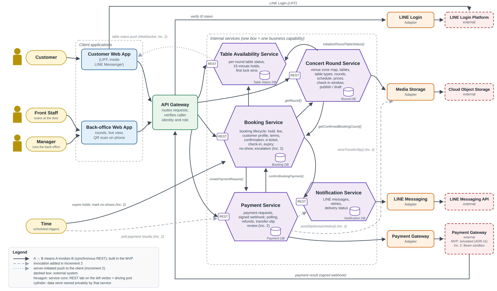

# 5 Microservice Design

## 5.1 Scope of the Microservice Design

This section presents the second version of the microservice architecture for the Concert Table Reservation System (CTRS). It contains the Service–Operations–Collaborators table and the architecture diagram of the system, together with the reasoning that ties them to the four use cases of Section 2. Following the teacher's feedback on Deliverable #2 (FB-D2-01), the table and the diagram mark what the MVP builds and what Increment 2 adds (Section 1.3).

The architecture covers the four use cases end to end, including their alternative and exceptional flows:

- **UC-01 Reserve a Specific Table** — the customer browses concert rounds, holds a table for 15 minutes, completes the profile, accepts the terms, pays the full table fee through the Payment Gateway (simulated in the MVP, ADR-11) and receives a QR e-ticket by LINE.
- **UC-02 Check In Using Digital QR Ticket** — Front Staff scans the e-ticket at the door, the booking reference is verified against the check-in window, the entry is confirmed and the table becomes occupied; bookings not checked in by the end of the grace period become no-shows.
- **UC-03 Create Concert Event** — the Manager creates a concert round on the venue zone map, prices the table types, validates and publishes it, which makes the round bookable in UC-01 and defines the check-in window used in UC-02.
- **UC-04 Create Venue Zone Map** — the Manager uploads the image of the venue, defines and names venue zones on it, places tables with unique table numbers, assigns table types and seating capacities, validates and activates the map, which makes it selectable in UC-03 and provides the floor plan used in UC-01 and UC-02 for rounds that use it.

The Deliverable #2 brief asks for at least three business use cases; the design covers all four. The venue zone map is owned by the same service that owns the rounds, because a round cannot be created without it.

## 5.2 Service–Operations–Collaborators

Operations are the business operations exposed by each service. Collaborators are the services or adapters that the service invokes to complete its own operations; an em dash means the service completes its work without calling anyone else. Operations and collaborations marked *(Inc. 2)* are added in Increment 2; all others are built in the MVP.

*Table 5.1 Service–Operations–Collaborators*

| Service | Operations | Collaborators |
|---|---|---|
| **Concert Round Service** | createOrUpdateZoneMap() uploadZoneMapImage() setTableType() createRound() copyRound() *(Inc. 2)* saveRoundAsDraft() validateRound() previewRound() publishRound() unpublishRound() *(Inc. 2)* editPublishedRound() getUpcomingRounds() getRound() getRoundTables() getRoundPricing() getCheckInWindow() | **Table Availability Service** initializeRoundTableStatus() **Booking Service** getConfirmedBookingCount() **Media Storage Adapter** storeZoneMapImage() |
| **Table Availability Service** | initializeRoundTableStatus() getRoundTableStatus() holdTable() extendHold() *(Inc. 2)* releaseHold() markTableBooked() markTableOccupied() releaseTable() *(Inc. 2)* publishTableStatusUpdate() *(Inc. 2)* | — |
| **Booking Service** | createHeldBooking() setPartySize() calculateTableFee() saveCustomerProfile() acceptBookingTerms() startPayment() confirmBookingPayment() issueETicket() getETicket() cancelBooking() getCustomerBookings() findBookings() *(Inc. 2)* checkInBooking() escalateCheckIn() *(Inc. 2)* resolveEscalation() *(Inc. 2)* expireUnpaidBookings() markNoShows() *(Inc. 2)* getConfirmedBookingCount() | **Concert Round Service** getRound() getRoundPricing() getCheckInWindow() **Table Availability Service** holdTable() extendHold() *(Inc. 2)* releaseHold() markTableBooked() markTableOccupied() releaseTable() *(Inc. 2)* **Payment Service** createPaymentRequest() requestRefund() *(Inc. 2)* **Notification Service** sendBookingConfirmation() sendHoldExpiredNotice() sendRefundNotice() *(Inc. 2)* |
| **Payment Service** | createPaymentRequest() receivePaymentResult() getPaymentStatus() pollPendingPaymentResults() *(Inc. 2)* requestRefund() *(Inc. 2)* submitTransferSlip() *(Inc. 2)* reviewTransferSlip() *(Inc. 2)* | **Payment Gateway Adapter** createCheckoutSession() verifyWebhookSignature() queryPaymentStatus() *(Inc. 2)* refundPayment() *(Inc. 2)* **Media Storage Adapter** storeTransferSlip() *(Inc. 2)* **Booking Service** confirmBookingPayment() **Notification Service** sendSlipDecisionNotice() *(Inc. 2)* |
| **Notification Service** | sendBookingConfirmation() sendHoldExpiredNotice() sendRefundNotice() *(Inc. 2)* sendSlipDecisionNotice() *(Inc. 2)* retryFailedMessages() getDeliveryStatus() | **LINE Messaging Adapter** pushLineMessage() |

## 5.3 Architecture Diagram

*Figure 5.1 CTRS microservice architecture, version 2*

The diagram is drawn in the ports-and-adapters style: every service is a hexagon whose business logic is reached only through adapters on its edges. An arrow A → B means A invokes B; response paths are not drawn. The hosted checkout page of the Payment Gateway is opened by the customer's browser inside the web app and is therefore not shown as a service call. Grey dashed arrows are added in Increment 2. In the MVP the web apps read the table status by polling through the API Gateway (ADR-09), and the Payment Gateway is the simulated gateway of ADR-11.
