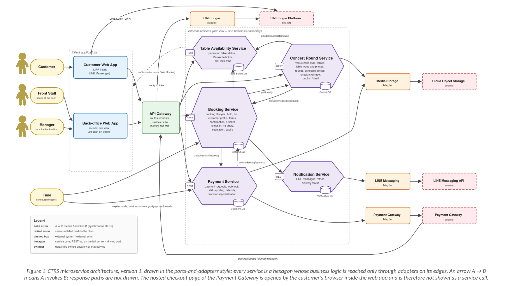

# Microservice Design

## 1. Scope of this deliverable

This document presents the first version of the microservice architecture for the Concert Table Reservation System (CTRS). It contains the Service–Operations–Collaborators table and the architecture diagram of the system, together with the reasoning that ties them to the three business use cases of Deliverable #1.

The architecture covers the three business use cases end to end, including their alternative and exceptional flows:

- **UC-01 Reserve a Specific Table** — the customer browses concert rounds, holds a table for 15 minutes, completes the profile, accepts the terms, pays the full table fee through the Payment Gateway and receives a QR e-ticket by LINE.
- **UC-02 Check In Using Digital QR Ticket** — Front Staff scans the e-ticket at the door, the booking reference is verified against the check-in window, the entry is confirmed and the table becomes occupied; bookings not checked in by the end of the grace period become no-shows.
- **UC-03 Create Concert Event** — the Manager creates a concert round on the venue zone map, prices the table types, validates and publishes it, which makes the round bookable in UC-01 and defines the check-in window used in UC-02.
- **UC-04 Create Venue Zone Map** — the Manager defines and names venue zones, places tables with unique table numbers, assigns table types and seating capacities, uploads seat-view photographs, validates and activates the map, which makes it selectable in UC-03 and provides the floor plan used in UC-01 and UC-02 for rounds that use it.

Maintaining the venue zone map is not itself one of the three business use cases. It appears in the architecture because a round cannot be created without it, and it is owned by the same service that owns the rounds.

## 1. Service–Operations–Collaborators

Operations are the business operations exposed by each service. Collaborators are the services or adapters that the service invokes to complete its own operations; an em dash means the service completes its work without calling anyone else.

| Service | Operations | Collaborators |
|---|---|---|
| **Concert Round Service** | createOrUpdateZoneMap() setTableType() uploadSeatViewPhoto() createRound() copyRound() saveRoundAsDraft() validateRound() previewRound() publishRound() unpublishRound() editPublishedRound() getUpcomingRounds() getRound() getRoundTables() getRoundPricing() getCheckInWindow() | **Table Availability Service** initializeRoundTableStatus() **Booking Service** getConfirmedBookingCount() **Media Storage Adapter** storeSeatViewPhoto() |
| **Table Availability Service** | initializeRoundTableStatus() getRoundTableStatus() holdTable() extendHold() releaseHold() markTableBooked() markTableOccupied() releaseTable() publishTableStatusUpdate() | — |
| **Booking Service** | createHeldBooking() setPartySize() calculateTableFee() saveCustomerProfile() acceptBookingTerms() startPayment() confirmBookingPayment() issueETicket() getETicket() cancelBooking() getCustomerBookings() findBookings() checkInBooking() recordAdditionalGuests() escalateCheckIn() resolveEscalation() expireUnpaidBookings() markNoShows() getConfirmedBookingCount() | **Concert Round Service** getRound() getRoundPricing() getCheckInWindow() **Table Availability Service** holdTable() extendHold() releaseHold() markTableBooked() markTableOccupied() releaseTable() **Payment Service** createPaymentRequest() requestRefund() **Notification Service** sendBookingConfirmation() sendHoldExpiredNotice() sendRefundNotice() |
| **Payment Service** | createPaymentRequest() receivePaymentResult() getPaymentStatus() pollPendingPaymentResults() requestRefund() submitTransferSlip() reviewTransferSlip() | **Payment Gateway Adapter** createCheckoutSession() verifyWebhookSignature() queryPaymentStatus() refundPayment() **Media Storage Adapter** storeTransferSlip() **Booking Service** confirmBookingPayment() |
| **Notification Service** | sendBookingConfirmation() sendHoldExpiredNotice() sendRefundNotice() sendSlipDecisionNotice() retryFailedMessages() getDeliveryStatus() | **LINE Messaging Adapter** pushLineMessage() |

## Architecture diagram

*Figure 1  CTRS microservice architecture, version 1, drawn in the ports-and-adapters style: every service is a hexagon whose business logic is reached only through adapters on its edges. An arrow A → B means A invokes B; response paths are not drawn. The hosted checkout page of the Payment Gateway is opened by the customer's browser inside the web app and is therefore not shown as a service call.*
