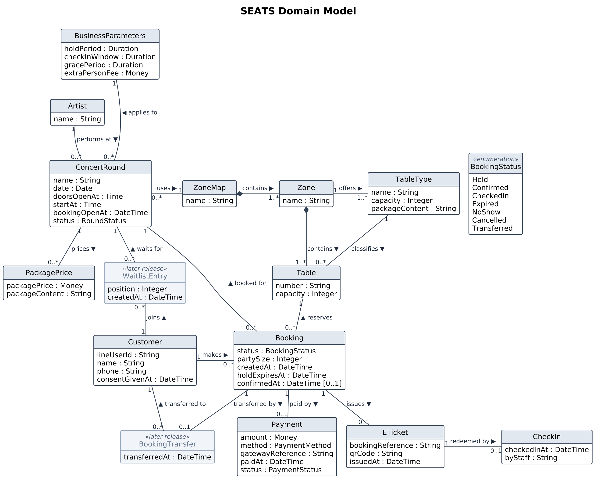
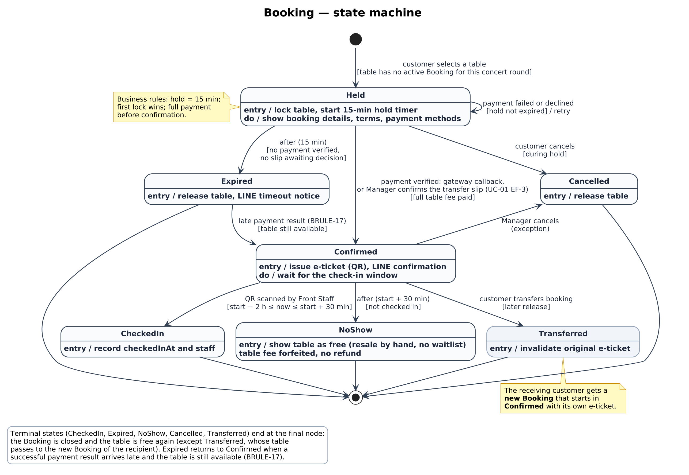
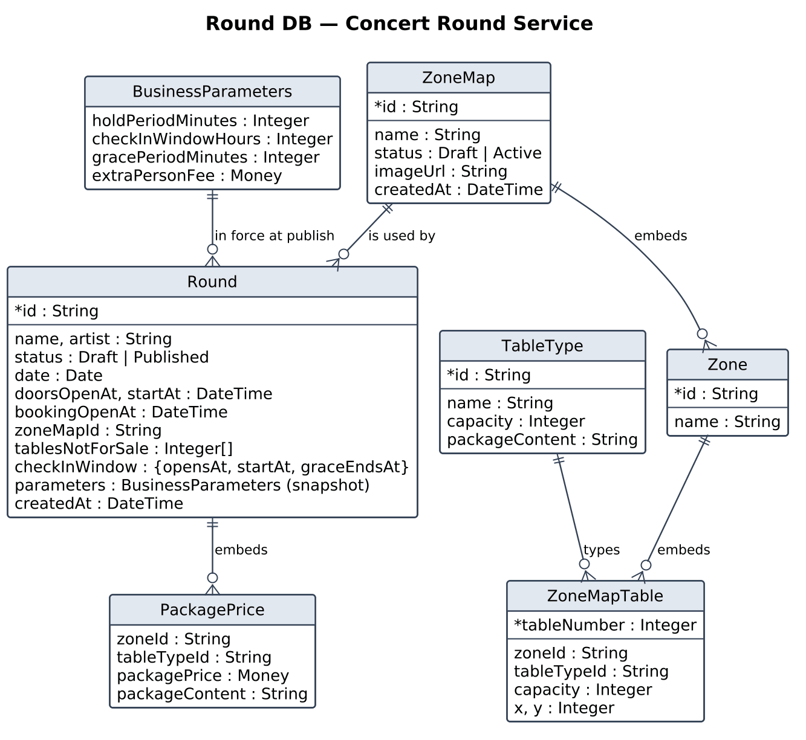
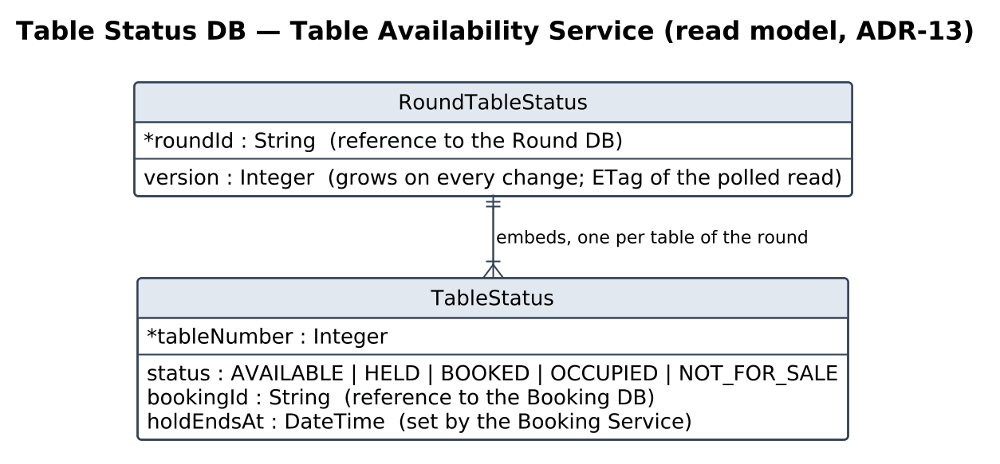
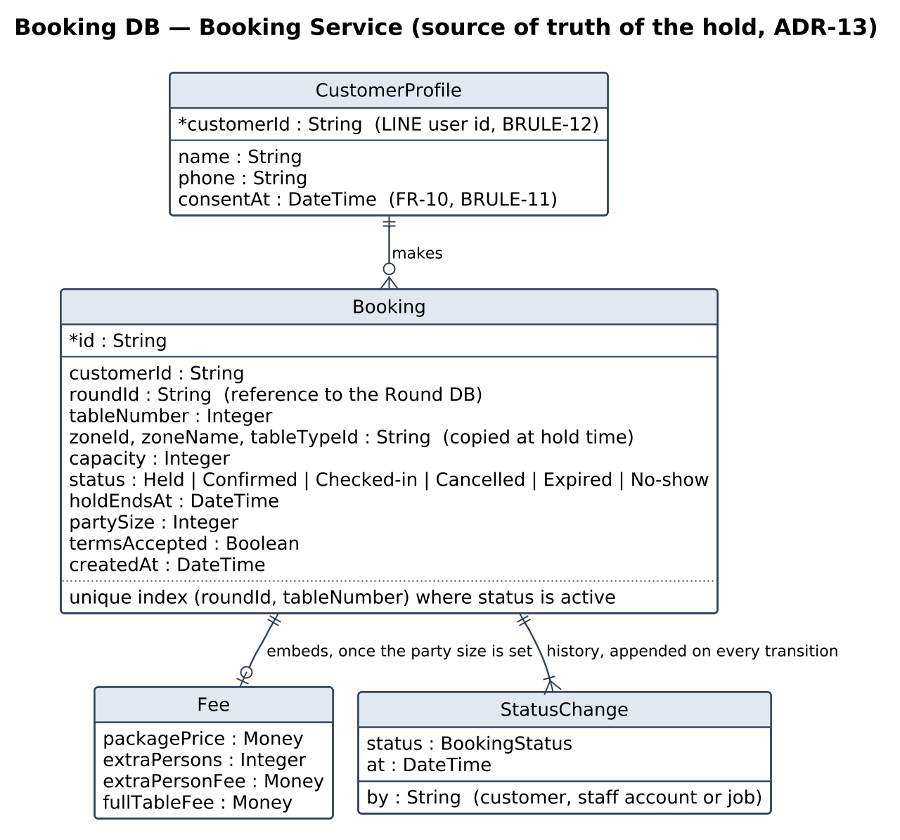

# 6 Domain Model and API Specification

This chapter is the bridge between the business and the code. It states the domain model that every part of the document shares (6.1) and the rule by which a model becomes a contract (6.2). Then one section per service gives what its implementer must hold and serve: the slice of the model in its own database, its gRPC API and the fields of its messages (6.3 to 6.6). The last section is the API Gateway, the public REST API, one route per gRPC method (6.7). Deliverable #3 demonstrates these contracts: REST with create, read, update and delete on the routes of the Concert Round Service, and gRPC with the same four on the Table Availability Service. In every table a field marked `?` is optional and, in an update, unchanged when left out.

## 6.1 Domain Model

The domain model is the conceptual model of the concert-table business: the things that exist in the domain, their attributes, how they relate, and the rules that constrain them. It is the shared vocabulary behind the use cases (Section 2), the requirements (Section 3), the glossary (Appendix C) and the services of Section 5: every entity is a glossary term, every invariant is a business rule of Appendix B, and the booking lifecycle supplies the alternative and exception flows of UC-01 and UC-02. Actors (**Customer**, **Manager**, **Front Staff**, **Owner**) are not entities; the **Customer** entity is the **customer profile** that a LINE account owns. The model is drawn without instance data: the current **zones**, **table types**, **package prices** and the **extra-person fee** are maintained by the **Manager** and stated as BRULE-08 and BRULE-09, not as values on the diagram.

*Figure 6.1 Domain model of SEATS (UML class diagram); WaitlistEntry and BookingTransfer belong to a later release*

*Table 6.1 Business entities*

| Entity | Definition | Key attributes | Glossary term |
|---|---|---|---|
| ConcertRound | One concert night at the venue, for which tables are sold in advance | name, date, doors-open time, start time, **booking-open time**, status (Draft, Published; then not yet open, open, sold out, finished, cancelled as seen by the **Customer**) | **concert round** |
| Artist | The performer of a concert night | name | — |
| ZoneMap | The plan of the venue; one map serves many rounds, and the map of a round is fixed once its booking opens (BRULE-07) | name, image of the venue | **zone map** |
| Zone | A pricing area of the **zone map**, defined by the **Manager** per map | name | **zone** |
| Table | A physical, numbered table inside a **zone** | number, capacity, position on the image | table |
| TableType | The kind of table with its **package**, defined by the **Manager**; the same type may have a different price in each **zone** | name, capacity, package content | **table type**, **package** |
| PackagePrice | The **package price** of one **table type** in one **zone** for one round (BRULE-08) | price, package content | **package price** |
| BusinessParameters | The venue's settings; a round uses the values in force at its **booking-open time** (FR-38) | **hold period**, **check-in window**, **grace period**, **extra-person fee** | **business parameters** |
| Customer | A person identified by a LINE account who reserves tables (BRULE-12) | LINE user id, name, phone, consent given at | **Customer**, **customer profile** |
| Booking | The reservation of one table for one round by one customer; the central record of the system | status (BookingStatus, Figure 6.2), **party size**, created at, **hold** expires at, confirmed at | booking, **hold** |
| Payment | The payment of the **full table fee** for a booking through the **Payment Gateway** | amount, method, gateway reference, paid at, status | **full table fee** |
| ETicket | The proof of a Confirmed booking, presented as a QR code at the door | **booking reference** (signed), QR code, issued at, valid for (round, table) | **e-ticket** |
| CheckIn | The event of admitting the **Customer** at the door | checked-in at, by staff, guests present | check-in |
| WaitlistEntry | A **Customer**'s request to be offered a table of a full round; later release | position, created at | **waitlist** |
| BookingTransfer | The official reassignment of a Confirmed booking to another **Customer**; later release | transferred at, to customer | — |

The invariants of the model are the business rules of Appendix B: a table has at most one active booking (Held, Confirmed or Checked-in) per round (BRULE-03, **first lock wins**); a booking is Confirmed only after the **full table fee** is verified (BRULE-01); a Held booking expires after the **hold period** (BRULE-02); check-in is accepted within the **check-in window** and the **grace period**, after which the booking is a **no-show** (BRULE-04, BRULE-05, BRULE-06); the **zone map** of a round does not change once booking is open (BRULE-07); and a customer is identified by exactly one LINE account (BRULE-12).

*Figure 6.2 Lifecycle of a booking (UML state machine); Transferred belongs to a later release*

*Table 6.2 Booking states*

| State | Entered when | Leaves when |
|---|---|---|
| Held | the **Customer** selects a free table (UC-01 step 7) | the payment is verified (UC-10 step 6), or the **Manager** confirms the **transfer slip** in **degraded mode** (UC-10 EF-2, Increment 2) → Confirmed; the **hold period** ends with no payment verified → Expired (EF-1); the **Customer** cancels or the profile is not completed → Cancelled (AF-4, AF-5) |
| Confirmed | the payment result is verified and the **e-ticket** issued (UC-01 steps 16–17) | the **e-ticket** is scanned within the **check-in window** → Checked-in (UC-02); the **grace period** passes → **No-show** (UC-02 EF-4, Increment 2); the **Manager** cancels as an exception → Cancelled |
| Checked-in | **Front Staff** confirms the entry (UC-02 step 6) | final |
| Expired | the **hold** ends with no payment verified; the table is released and the **Customer** notified (UC-01 EF-1) | a successful payment result arrives late while the table is still available → Confirmed (UC-10 EF-1, BRULE-17, Increment 2); otherwise final |
| No-show | the **grace period** ends without a check-in; the table is shown as free, the fee is forfeited (BRULE-06) | final |
| Cancelled | the **Customer** cancels during the **hold**, or the **Manager** cancels as an exception | final |
| Transferred | later release: the booking is reassigned and its **e-ticket** invalidated | final |

## 6.2 From Model to Contract

The types of the code, the gRPC messages and the routes of the API Gateway are all derived from the model, in that order, and a change is made in that order too:

*Table 6.3 From the domain model to the contracts*

| Step | Artifact | What it holds | Example: the booking |
|---|---|---|---|
| 1 | Domain model (6.1) | The business entity, its attributes and its rules | Booking: status, **party size**, **hold** end; one active booking per table per round (BRULE-03) |
| 2 | Data model of the owning service (6.3 to 6.5) | The entity as stored, with the copies and references the service needs | Booking DB: `zoneId`, `tableTypeId` and `capacity` copied from the round; `history` of state changes; unique index on (`roundId`, `tableNumber`, active) |
| 3 | Type in the service (`model.ts`) | The stored shape, used by the operations and the store | `Booking`, `BookingStatus`, `Fee`, `CustomerProfile` |
| 4 | gRPC message (`.proto`) | Only what a caller needs, the API Gateway or another service: a projection of the model, never the stored document | `Booking` carries the fee and the remaining hold seconds; `HoldTableRequest` carries only `round_id`, `table_number`, `booking_id`, `hold_ends_at`, nothing of the customer |
| 5 | Route of the API Gateway (6.7) | The method and path the web app calls, mapped one to one onto a gRPC method: the JSON body is the request message and the JSON answer the response message | `POST /bookings {roundId, tableNumber}` is CreateHeldBooking and answers the booking with `remainingHoldSeconds`; the unique index and the store stay inside the service |

Two consequences of the rule shape the design. First, a gRPC message is owned by the service that serves it: `concert_round.proto`, `table_availability.proto` and `booking.proto` are the contracts of the three services, and a change to a message is a compile error in every caller, the API Gateway included. Second, the table map is a read model and not a second truth: the Booking Service decides who holds a table, and the Table Availability Service keeps the projection that the web apps poll (ADR-13). The projection is created from the round when it is published (createRoundTableStatus()), because which tables exist and which are not for sale come from the round, not from any booking; from then on every booking transition updates it, by a gRPC call in the MVP and by an event on the message broker from Increment 2.

## 6.3 Concert Round Service

Each service owns one database and one slice of the domain model (ADR-06, Table 5.1); a service never reads another service's database, so a `roundId` in the Booking DB is a reference by identifier, not a foreign key, and what a service needs from another it asks by gRPC. A message named after an entity of the service's data model carries the stored fields plus what its row lists.

The venue and events context: **zone maps**, **table types**, **concert rounds**, **package prices** and **business parameters**, in the Round DB. Its gRPC API (port 5001, `concert_round.proto`) is called by the API Gateway for the **back-office** and customer routes of Table 6.11, and by the Booking Service for GetRound, GetRoundPricing and GetCheckInWindow; it calls the Table Availability Service when a round is published and for the sold-out counts, and the Media Storage Adapter for the image of the venue.

*Figure 6.3 Round DB of the Concert Round Service*

A **zone map** is one document with its **zones** and tables embedded; a round embeds its **package prices**, its **check-in window** and the snapshot of the **business parameters** in force when it was published (FR-38). The tables of a round are the tables of its map minus those not for sale.

*Table 6.4 Concert Round Service, gRPC API (port 5001)*

| Operation | gRPC method | Request message | Response message |
|---|---|---|---|
| defineTableType() | DefineTableType | `DefineTableTypeRequest {id, name, capacity, package_content}` | `TableType` |
| listTableTypes() | ListTableTypes | `Empty` | `TableTypeList {table_types[]}` |
| getBusinessParameters() | GetBusinessParameters | `Empty` | `BusinessParameters` |
| updateBusinessParameters() | UpdateBusinessParameters | `UpdateBusinessParametersRequest {hold_period_minutes?, check_in_window_hours?, grace_period_minutes?, extra_person_fee?}` | `BusinessParameters` |
| createZoneMap() | CreateZoneMap | `CreateZoneMapRequest {name?}` | `ZoneMap` (Draft) |
| listZoneMaps() | ListZoneMaps | `ListZoneMapsRequest {status?}` | `ZoneMapList {zone_maps[]}` of `ZoneMapSummary` |
| getZoneMap() | GetZoneMap | `ZoneMapRef {zone_map_id}` | `ZoneMap` with `summary[]` per **zone** |
| updateZoneMap() | UpdateZoneMap | `UpdateZoneMapRequest {zone_map_id, name?, zones?[], tables?[]}` | `ZoneMap`; on an Active map only the changes of UC-04 AF-1 |
| uploadZoneMapImage() | UploadZoneMapImage | `UploadZoneMapImageRequest {zone_map_id, file_name}` | `ZoneMap` with `image_url` |
| validateZoneMap() | ValidateZoneMap | `ZoneMapRef` | `ValidationResult` |
| activateZoneMap() | ActivateZoneMap | `ZoneMapRef` | `ZoneMap` (Active); INVALID_ARGUMENT with the problems when not valid |
| discardDraftZoneMap() | DiscardDraftZoneMap | `ZoneMapRef` | `Removed`; FAILED_PRECONDITION unless Draft |
| createRound() | CreateRound | `CreateRoundRequest {name?}` | `Round` (Draft) |
| getUpcomingRounds() | GetUpcomingRounds | `Empty` | `UpcomingRoundList {rounds[]}` of `UpcomingRound` |
| getRound() | GetRound | `RoundRef {round_id}` | `Round` with its `tables[]` and `hold_period_minutes` |
| getRoundTables() | GetRoundTables | `RoundRef` | `RoundTableList {tables[]}` of `RoundTable` |
| updateRound() | UpdateRound | `UpdateRoundRequest {round_id, name?, artist?, date?, doors_open_at?, start_at?, booking_open_at?, zone_map_id?, tables_not_for_sale?[], prices?[]}` | `Round`; a Published round accepts only the changes of UC-03 AF-3 (BRULE-07) |
| validateRound() | ValidateRound | `RoundRef` | `ValidationResult` |
| publishRound() | PublishRound | `RoundRef` | `Round` (Published); calls CreateRoundTableStatus; idempotent |
| discardDraftRound() | DiscardDraftRound | `RoundRef` | `Removed`; FAILED_PRECONDITION unless Draft |
| getRoundPricing() | GetRoundPricing | `RoundRef` | `RoundPricing {round_id, prices[], extra_person_fee}` |
| getCheckInWindow() | GetCheckInWindow | `RoundRef` | `CheckInWindow` |

*Table 6.5 Messages of the Concert Round Service*

| Message | Fields |
|---|---|
| `Round` | The round of Figure 6.3: `id, name, artist, status, date, doors_open_at, start_at, booking_open_at, zone_map_id, tables_not_for_sale[], prices[]` of `PackagePrice`, `check_in_window, parameters, created_at`; plus `hold_period_minutes` in force for the round and `tables[]` of `RoundTable` |
| `RoundTable` | `table_number, zone_id, zone_name, table_type_id, table_type_name, capacity, x, y, for_sale, package_price?, package_content`: a table of the map joined with its **table type** and **package price** |
| `UpcomingRound` | `id, name, artist, date, start_at, booking_open_at, status` (not yet open, open, sold out), `available_tables, tables_for_sale` |
| `ZoneMap` | `id, name, status, image_url, zones[]` of `Zone {id, name}`, `tables[]` of `ZoneMapTable {table_number, zone_id, table_type_id, capacity, x, y}`, `created_at, summary[]` of `ZoneSummary {zone_id, name, tables, capacity}` |
| `ZoneMapSummary` | `id, name, status, tables` |
| `TableType` | `id, name, capacity, package_content` |
| `BusinessParameters` | `hold_period_minutes, check_in_window_hours, grace_period_minutes, extra_person_fee` |
| `PackagePrice` | `zone_id, table_type_id, package_price, package_content` |
| `RoundPricing` | `round_id, prices[]` of `PackagePrice`, `extra_person_fee` |
| `CheckInWindow` | `round_id, opens_at, start_at, grace_ends_at` |
| `ValidationResult`, `Removed` | `valid, problems[]`; `removed` |

## 6.4 Table Availability Service

The read model of the table map (ADR-13): the status of every table of every published round, in the Table Status DB. Its gRPC API (port 5003, `table_availability.proto`) is called by the Concert Round Service (create, count, remove), by the Booking Service after every booking transition (hold, release, booked, occupied) and by the API Gateway for the polled read of Table 6.11; it calls no one. It is the gRPC service with create, read, update and delete that Deliverable #3 demonstrates.

*Figure 6.4 Table Status DB of the Table Availability Service*

One document per round with its tables embedded: the read model of the table map (ADR-13). Its version grows on every change and is the ETag of the polled read (ADR-09).

*Table 6.6 Table Availability Service, gRPC API (port 5003)*

| Operation | gRPC method | Request message | Response message |
|---|---|---|---|
| createRoundTableStatus() | CreateRoundTableStatus | `CreateRoundTableStatusRequest {round_id, tables[{table_number, for_sale}]}` | `RoundTableStatus`; idempotent on retry |
| getRoundTableStatus() | GetRoundTableStatus | `RoundRef {round_id}` | `RoundTableStatus` |
| countAvailableTables() | CountAvailableTables | `CountAvailableTablesRequest {round_ids[]}` | `CountAvailableTablesResponse {counts[{round_id, available, for_sale}]}` |
| holdTable() | HoldTable | `HoldTableRequest {round_id, table_number, booking_id, hold_ends_at}` | `TableStatus`; AVAILABLE → HELD, otherwise FAILED_PRECONDITION |
| releaseHold() | ReleaseHold | `TableRef {round_id, table_number, booking_id}` | `TableStatus`; HELD → AVAILABLE, a no-op when already AVAILABLE |
| markTableBooked() | MarkTableBooked | `TableRef` | `TableStatus`; HELD → BOOKED |
| markTableOccupied() | MarkTableOccupied | `TableRef` | `TableStatus`; BOOKED → OCCUPIED |
| removeRoundTableStatus() | RemoveRoundTableStatus | `RoundRef` | `RemoveRoundTableStatusResponse {removed}`; refused while a table is held or booked |

*Table 6.7 Messages of the Table Availability Service*

| Message | Fields |
|---|---|
| `RoundTableStatus` | The document of Figure 6.4: `round_id, version, tables[]` of `TableStatus` |
| `TableStatus` | `table_number, status` (AVAILABLE, HELD, BOOKED, OCCUPIED, NOT_FOR_SALE), `booking_id, hold_ends_at` |

## 6.5 Booking Service

The booking context: the booking from Held to Checked-in, the **customer profile**, the **booking terms** and the **e-ticket**, in the Booking DB; the booking owns the **hold** (ADR-13). Its gRPC API (port 5002, `booking.proto`) is called by the API Gateway for the customer and staff routes of Table 6.11, with the caller in the metadata `x-user-id`, and by the Payment Service for ConfirmBookingPayment; it calls the Concert Round Service (GetRound, GetRoundPricing, GetCheckInWindow), the Table Availability Service (HoldTable, ReleaseHold, MarkTableBooked, MarkTableOccupied) and, from progress 2, the Payment and Notification Services. Its own job expires unpaid **holds** (ADR-08).

*Figure 6.5 Booking DB of the Booking Service*

The booking is the source of truth of a table's occupation: at most one active booking (Held, Confirmed, Checked-in) exists per table per round, enforced by a unique index (ADR-13, BRULE-03), and every state change is appended to the booking's history. The booking copies zone, **table type** and capacity from the round when the table is held, so that the fee and the ticket do not change if the map is edited later (BRULE-07).

*Table 6.8 Booking Service, gRPC API (port 5002); the caller is the metadata x-user-id*

| Operation | gRPC method | Request message | Response message |
|---|---|---|---|
| createHeldBooking() | CreateHeldBooking | `CreateHeldBookingRequest {round_id, table_number}` | `Booking` (Held) with `remaining_hold_seconds`; FAILED_PRECONDITION when the table was just taken |
| getBooking() | GetBooking | `BookingRef {booking_id}` | `Booking`; own bookings only |
| setPartySize() | SetPartySize | `SetPartySizeRequest {booking_id, party_size}` | `Booking` with `fee` |
| getCustomerProfile() | GetCustomerProfile | `Empty` | `CustomerProfile`; NOT_FOUND before the first booking |
| createCustomerProfile() | CreateCustomerProfile | `CustomerProfileRequest {name, phone, consent}` | `CustomerProfile` |
| updateCustomerProfile() | UpdateCustomerProfile | `CustomerProfileRequest {name?, phone?}` | `CustomerProfile` |
| getBookingTerms() | GetBookingTerms | `BookingRef` | `BookingTerms` |
| acceptBookingTerms() | AcceptBookingTerms | `BookingRef` | `Booking` with `terms_accepted` |
| startPayment() | StartPayment | `BookingRef` | `PaymentRequest`; UNIMPLEMENTED in Increment 1 |
| cancelBooking() | CancelBooking | `BookingRef` | `Booking` (Cancelled) |
| getCustomerBookings() | GetCustomerBookings | `Empty` | `BookingList {bookings[]}` |
| getETicket() | GetETicket | `BookingRef` | `ETicket` |
| verifyBookingReference() | VerifyBookingReference | `BookingReference {booking_reference}` | `VerificationResult` |
| checkInBooking() | CheckInBooking | `BookingReference` | `Booking` (Checked-in) |
| getRoundBookings() | GetRoundBookings | `RoundRef {round_id}` | `BookingList` for the **live view** |
| confirmBookingPayment() | ConfirmBookingPayment | `ConfirmBookingPaymentRequest {booking_id, payment_id, amount}` | `Booking` (Confirmed) with its **e-ticket**; idempotent |

*Table 6.9 Messages of the Booking Service*

| Message | Fields |
|---|---|
| `Booking` | The booking of Figure 6.5: `id, customer_id, round_id, table_number, zone_id, zone_name, table_type_id, capacity, status, hold_ends_at, party_size?, fee, terms_accepted, created_at, history[]` of `StatusChange {status, at, by}`; plus `remaining_hold_seconds` |
| `Fee` | `package_price, extra_persons, extra_person_fee, full_table_fee` |
| `CustomerProfile` | `customer_id, name, phone, consent_at` |
| `BookingTerms` | `booking_id, terms[], check_in_window` |
| `ETicket` | `booking_id, booking_reference, qr_payload` |
| `VerificationResult`, `PaymentRequest` | `valid, booking, reason`; `payment_id, checkout_url` |

## 6.6 Payment, Notification and Staff Account Services

The three generic services of Table 5.1 are built after the Deliverable #3 demo. Their contracts are fixed now, so that the Booking Service and the API Gateway are written against them; their databases are drawn when they are built. The Payment Service is the simulated **Payment Gateway** of the MVP (ADR-11), the Notification Service sends through the LINE Messaging Adapter (ADR-10), and the Staff Account Service issues the session tokens of the **back-office** (ADR-07).

*Table 6.10 Payment, Notification and Staff Account Services, gRPC APIs (MVP contracts)*

| Service | Operation | gRPC method | Request message | Response message |
|---|---|---|---|---|
| Payment (port 5004) | createPaymentRequest() | CreatePaymentRequest | `{booking_id, amount, customer_id}` | `PaymentRequest {payment_id, checkout_url}` |
| | receivePaymentResult() | ReceivePaymentResult | `{payment_id, status, amount, signature}`, the signed result of the **Payment Gateway** | `{accepted}`; a duplicate is ignored |
| | getPaymentStatus() | GetPaymentStatus | `{payment_id}` | `PaymentStatus {payment_id, booking_id, status, amount}` |
| Notification (port 5005) | sendBookingConfirmation(), sendHoldExpiredNotice(), sendPaymentFailedNotice() | SendBookingConfirmation, SendHoldExpiredNotice, SendPaymentFailedNotice | `{customer_id, booking_id, …}` | `{message_id, delivered}` |
| Staff Account (port 5006) | signIn(), signOut() | SignIn, SignOut | `{username, password}`; `{token}` | `Session {token, role}`; `Empty` |
| | createStaffAccount(), updateStaffAccount() | CreateStaffAccount, UpdateStaffAccount | `{username, role, password}`; `{staff_account_id, role?, password?}` | `StaffAccount {staff_account_id, username, role, status}` |
| | listStaffAccounts(), disableStaffAccount() | ListStaffAccounts, DisableStaffAccount | `Empty`; `{staff_account_id}` | `StaffAccountList {accounts[]}`; `StaffAccount` (disabled) |

## 6.7 API Gateway

Every service has one API, gRPC, described by its `.proto` file, and the API Gateway is the only REST API of the system (ADR-12). The two are specified separately because they differ in shape: a gRPC method takes one request message and returns one response message, named as in the `.proto` file with `snake_case` fields, while a route of the gateway is a method and a path whose path parameters, query and JSON body are turned into the request message and whose answer is the response message as JSON, with the same fields in `camelCase` (`round_id` becomes `roundId`) and a list message unwrapped to an array. Not every method has a route: the methods that only another service calls stay private to the Backend. Table 6.11 lists every route with the gRPC method behind it, the web app of Table 5.1 that calls it, the Customer Web App or the Back-office Web App, and the roles that may call it (FR-66); the payment webhook is called by the **Payment Gateway** itself. Appendix D maps the screens of the two web apps to these routes, and the same routes are kept as an OpenAPI document in the code repository, from which the web apps take their types.

The gateway authenticates the caller and passes its identity and role to the service as the gRPC metadata `x-user-id` and `x-role`. An error is a gRPC status with a message and, where useful, details, which the gateway maps to an HTTP status and a JSON body `{error, details?}`: INVALID_ARGUMENT to 400 (invalid input), UNAUTHENTICATED to 401 (no identity), PERMISSION_DENIED to 403 (role), NOT_FOUND to 404, FAILED_PRECONDITION to 409 (a rule refuses the change, for example the table was just taken), UNIMPLEMENTED to 501 (not built in this increment) and UNAVAILABLE to 502 (the service or one of its collaborators is down).

*Table 6.11 Routes of the API Gateway (REST, port 4000): the public API*

| Service | Route | gRPC method | Web app | Roles | Request body | Response |
|---|---|---|---|---|---|---|
| Concert Round | `PUT /table-types/{id}` | DefineTableType | Back-office | manager | `{name, capacity, packageContent}` | TableType |
|  | `GET /table-types` | ListTableTypes | Back-office | manager, owner | — | [TableType] |
|  | `GET /business-parameters` | GetBusinessParameters | Back-office | manager, owner | — | BusinessParameters |
|  | `PUT /business-parameters` | UpdateBusinessParameters | Back-office | manager | `{holdPeriodMinutes?, checkInWindowHours?, gracePeriodMinutes?, extraPersonFee?}` | BusinessParameters |
|  | `POST /zone-maps` | CreateZoneMap | Back-office | manager | `{name?}` | ZoneMap |
|  | `GET /zone-maps?status=` | ListZoneMaps | Back-office | manager, owner | — | [ZoneMapSummary] |
|  | `GET /zone-maps/{id}` | GetZoneMap | Back-office | manager, owner | — | ZoneMap |
|  | `PUT /zone-maps/{id}` | UpdateZoneMap | Back-office | manager | `{name?, zones?, tables?}` | ZoneMap |
|  | `POST /zone-maps/{id}/image` | UploadZoneMapImage | Back-office | manager | `{fileName}` | ZoneMap |
|  | `POST /zone-maps/{id}/validate` | ValidateZoneMap | Back-office | manager | — | ValidationResult |
|  | `POST /zone-maps/{id}/activate` | ActivateZoneMap | Back-office | manager | — | ZoneMap |
|  | `DELETE /zone-maps/{id}` | DiscardDraftZoneMap | Back-office | manager | — | Removed |
|  | `POST /rounds` | CreateRound | Back-office | manager | `{name?}` | Round |
|  | `GET /rounds` | GetUpcomingRounds | both | everyone | — | [UpcomingRound] |
|  | `GET /rounds/{id}` | GetRound | both | everyone | — | Round |
|  | `GET /rounds/{id}/tables` | GetRoundTables | both | everyone | — | [RoundTable] |
|  | `PUT /rounds/{id}` | UpdateRound | Back-office | manager | `{name?, artist?, date?, doorsOpenAt?, startAt?, bookingOpenAt?, zoneMapId?, tablesNotForSale?, prices?}` | Round |
|  | `POST /rounds/{id}/validate` | ValidateRound | Back-office | manager | — | ValidationResult |
|  | `POST /rounds/{id}/publish` | PublishRound | Back-office | manager | — | Round |
|  | `DELETE /rounds/{id}` | DiscardDraftRound | Back-office | manager | — | Removed |
| Table Availability | `GET /rounds/{id}/table-status` | GetRoundTableStatus | both | everyone | header `If-None-Match: <version>` (ADR-09) | RoundTableStatus with `ETag: <version>`, or 304 |
| Booking | `POST /bookings` | CreateHeldBooking | Customer | customer | `{roundId, tableNumber}` | Booking |
|  | `GET /bookings/{id}` | GetBooking | Customer | customer | — | Booking |
|  | `PUT /bookings/{id}/party-size` | SetPartySize | Customer | customer | `{partySize}` | Booking |
|  | `GET /bookings/{id}/terms` | GetBookingTerms | Customer | customer | — | BookingTerms |
|  | `POST /bookings/{id}/terms-acceptance` | AcceptBookingTerms | Customer | customer | — | Booking |
|  | `POST /bookings/{id}/payment` | StartPayment | Customer | customer | — | PaymentRequest (501 in Increment 1) |
|  | `POST /bookings/{id}/cancel` | CancelBooking | Customer | customer | — | Booking |
|  | `GET /bookings/{id}/e-ticket` | GetETicket | Customer | customer | — | ETicket |
|  | `GET /customers/me` | GetCustomerProfile | Customer | customer | — | CustomerProfile |
|  | `POST /customers/me` | CreateCustomerProfile | Customer | customer | `{name, phone, consent}` | CustomerProfile |
|  | `PUT /customers/me` | UpdateCustomerProfile | Customer | customer | `{name?, phone?}` | CustomerProfile |
|  | `GET /customers/me/bookings` | GetCustomerBookings | Customer | customer | — | [Booking] |
|  | `POST /check-ins/verify` | VerifyBookingReference | Back-office | front staff, manager | `{bookingReference}` | VerificationResult |
|  | `POST /check-ins` | CheckInBooking | Back-office | front staff, manager | `{bookingReference}` | Booking |
|  | `GET /rounds/{id}/bookings` | GetRoundBookings | Back-office | manager, owner | — | [Booking] |
| Payment | `POST /payments/webhook` | ReceivePaymentResult | **Payment Gateway** | the **Payment Gateway**, by its signature (NFR-38) | the signed result | 200 |
|  | `GET /payments/{id}` | GetPaymentStatus | Customer | customer | — | PaymentStatus |
| Staff Account | `POST /sessions` | SignIn | Back-office | anyone | `{username, password}` | Session |
|  | `DELETE /sessions/current` | SignOut | Back-office | staff | — | — |
|  | `POST /staff-accounts` | CreateStaffAccount | Back-office | manager | `{username, role, password}` | StaffAccount |
|  | `GET /staff-accounts` | ListStaffAccounts | Back-office | manager, owner | — | [StaffAccount] |
|  | `PUT /staff-accounts/{id}` | UpdateStaffAccount | Back-office | manager | `{role?, password?}` | StaffAccount |
|  | `DELETE /staff-accounts/{id}` | DisableStaffAccount | Back-office | manager | — | StaffAccount |

