# Appendix A Use Case Traceability

## A.1 Operations by Use Case

Table A.1 traces the ten use cases to the operations of Table 5.3: a cell names the steps and flows of the use case that the operation serves, whether the actor invokes it through the API Gateway or another service invokes it as a collaborator; for UC-05 to UC-08, which have no description, a tick marks the operations they use. Every operation has at least one cell, and the two jobs on a timer are listed below the operations. Section A.2 gives the same trace step by step, with who invokes each operation, the collaborations it needs, the data it stores and the requirements it realises; only the flows that the MVP builds are traced (Section 1.3).

*Table A.1 Operations by use case*

| Service | Operation | UC-01 | UC-02 | UC-03 | UC-04 | UC-05 | UC-06 | UC-07 | UC-08 | UC-09 | UC-10 |
|---|---|---|---|---|---|---|---|---|---|---|---|
| **Concert Round Service** | createZoneMap() |  |  |  | 1–2 |  |  |  |  |  |  |
|  | updateZoneMap() |  |  |  | 4; 5–6; AF-1; AF-3 |  |  |  |  |  |  |
|  | uploadZoneMapImage() |  |  |  | 3, EF-3 |  |  |  |  |  |  |
|  | defineTableType() |  |  |  | 5–6 |  |  |  |  |  |  |
|  | listTableTypes() |  |  |  | 5–6 |  |  |  |  |  |  |
|  | listZoneMaps() |  |  | 6 | AF-1 |  |  |  |  |  |  |
|  | getZoneMap() |  |  | 7 | 7; 10; AF-1 |  |  |  |  |  |  |
|  | validateZoneMap() |  |  |  | 8–9, S-1, EF-1 |  |  |  |  |  |  |
|  | activateZoneMap() |  |  |  | 11–12, EF-2 |  |  |  |  |  |  |
|  | getBusinessParameters() |  |  | 3–5 |  |  |  | ✓ |  |  |  |
|  | updateBusinessParameters() |  |  |  |  |  |  | ✓ |  |  |  |
|  | createRound() |  |  | 1–2 |  |  |  |  |  |  |  |
|  | updateRound() |  |  | 3–5; 8; 9–10; AF-1; AF-3 |  |  |  |  |  |  |  |
|  | validateRound() |  |  | 11–12, S-1, EF-1 |  |  |  |  |  |  |  |
|  | publishRound() |  |  | 14–15, EF-2 |  |  |  |  |  |  |  |
|  | getUpcomingRounds() | 3, AF-2 |  |  |  |  |  |  |  |  |  |
|  | getRound() | 4, AF-1; 6–8, AF-3 |  | 13; AF-3 |  |  |  |  |  |  |  |
|  | getRoundTables() | 5, AF-2 |  | 13 |  |  |  |  |  |  |  |
|  | getRoundPricing() | 10–11 |  |  |  |  |  |  |  |  |  |
|  | getCheckInWindow() | 13 | 2–4, S-1, AF-2, AF-3, AF-5, EF-1, EF-2 |  |  |  |  |  |  |  |  |
| **Table Availability Service** | createRoundTableStatus() |  |  | 14–15, EF-2 |  |  |  |  |  |  |  |
|  | getRoundTableStatus() | 5, AF-2 | 7 | AF-3 | AF-1 | ✓ |  |  |  |  |  |
|  | countAvailableTables() | 3, AF-2 |  |  |  |  |  |  |  |  |  |
|  | holdTable() | 6–8, AF-3 |  |  |  |  |  |  |  |  |  |
|  | releaseHold() | AF-4, AF-5; EF-1 |  |  |  |  |  |  |  |  |  |
|  | markTableBooked() | 16–17 |  |  |  |  |  |  |  |  |  |
|  | markTableOccupied() |  | 6, EF-5 |  |  |  |  |  |  |  |  |
| **Booking Service** | createHeldBooking() | 6–8, AF-3 |  |  |  |  |  |  |  |  |  |
|  | getBooking() | 9; 18 |  |  |  |  |  |  |  |  |  |
|  | setPartySize() | 10–11 |  |  |  |  |  |  |  |  |  |
|  | getCustomerProfile() |  |  |  |  |  |  |  |  | 1–2; 6–7, AF-2, EF-1 |  |
|  | createCustomerProfile() |  |  |  |  |  |  |  |  | 3–5, AF-1, AF-2, EF-1 |  |
|  | updateCustomerProfile() |  |  |  |  |  |  |  |  | 6–7, AF-2, EF-1 |  |
|  | getBookingTerms() | 13 |  |  |  |  |  |  |  |  |  |
|  | acceptBookingTerms() | 14 |  |  |  |  |  |  |  |  |  |
|  | startPayment() |  |  |  |  |  |  |  |  |  | 1–2 |
|  | confirmBookingPayment() | 16–17 |  |  |  |  |  |  |  |  | 5–6, AF-1 |
|  | getETicket() | 18 |  |  |  |  | ✓ |  |  |  |  |
|  | getCustomerBookings() |  |  |  |  |  | ✓ |  |  |  |  |
|  | cancelBooking() | AF-4, AF-5 |  |  |  |  |  |  |  |  |  |
|  | verifyBookingReference() |  | 2–4, S-1, AF-2, AF-3, AF-5, EF-1, EF-2 |  |  |  |  |  |  |  |  |
|  | checkInBooking() |  | 6, EF-5 |  |  |  |  |  |  |  |  |
|  | getRoundBookings() |  | 7 |  |  | ✓ |  |  |  |  |  |
| **Payment Service** | createPaymentRequest() |  |  |  |  |  |  |  |  |  | 1–2; 2 |
|  | receivePaymentResult() |  |  |  |  |  |  |  |  |  | 5–6, AF-1 |
|  | getPaymentStatus() |  |  |  |  |  |  |  |  |  | AF-1 |
| **Notification Service** | sendBookingConfirmation() | 19, S-1 |  |  |  |  |  |  |  |  |  |
|  | sendHoldExpiredNotice() | EF-1; EF-1, S-1 |  |  |  |  |  |  |  |  |  |
|  | sendPaymentFailedNotice() |  |  |  |  |  |  |  |  |  | 5–6, AF-1; AF-1 |
| **Staff Account Service** | signIn() |  |  |  |  |  |  |  | ✓ |  |  |
|  | signOut() |  |  |  |  |  |  |  | ✓ |  |  |
|  | createStaffAccount() |  |  |  |  |  |  |  | ✓ |  |  |
|  | listStaffAccounts() |  |  |  |  |  |  |  | ✓ |  |  |
|  | updateStaffAccount() |  |  |  |  |  |  |  | ✓ |  |  |
|  | disableStaffAccount() |  |  |  |  |  |  |  | ✓ |  |  |
| *Jobs on a timer (not operations)* | hold-expiry job of the Booking Service | EF-1 | | | | | | | | | EF-4 |
| | retry job of the Notification Service | EF-3 | | | | | | | | | |

## A.2 Step by Step

Tables A.2 to A.8 are the evidence behind Table A.1: each row follows one step, or the consecutive steps served by one operation, of a use case: who invokes the operation (an actor, through the API Gateway, or a service), the service and operation that carry the step out, the collaborations the operation needs, the data it stores, and the requirements it realises. Steps in which the actor acts without the system, such as UC-02 step 5, are left out unless a rule applies to them. Only the flows that the MVP builds are listed (Section 1.3), and Table A.8 covers UC-05 to UC-08, which have no description. Every operation of Table 5.3 appears in at least one row, the two jobs appear as jobs, and every MVP requirement of Section 3.1 is realised by at least one row.

*Table A.2 Traceability of Reserve a Specific Table*

| Steps | Invoked by | Operation | Collaborations | Data stored | Requirements |
|---|---|---|---|---|---|
| 1–2, EF-2 | **Customer** | API Gateway: check the LINE ID token that LINE Login gave the LIFF app | LINE Login Adapter, which asks the **LINE Platform** | — | FR-01, FR-02 |
| 3, AF-2 | **Customer** | Concert Round Service: getUpcomingRounds(), with the status of each round | Table Availability Service: countAvailableTables(), for the sold-out status | — | FR-03 |
| 4, AF-1 | **Customer** | Concert Round Service: getRound() | — | — | FR-03, FR-04 |
| 5, AF-2 | **Customer** | Concert Round Service: getRoundTables() Table Availability Service: getRoundTableStatus(), polled every 2 seconds | — | — | FR-05, FR-06 |
| 6–8, AF-3 | **Customer** | Booking Service: createHeldBooking() | Concert Round Service: getRound(), to check that booking is open Table Availability Service: holdTable() | Booking DB: booking Held until the end of the **hold** (one active booking per table per round, ADR-13) Table Status DB: table held | FR-04, FR-07, FR-08 |
| 9 | **Customer** | Booking Service: getBooking(), the booking summary and the remaining **hold** time | — | — | FR-07 |
| 10–11 | **Customer** | Booking Service: setPartySize(), which computes the **full table fee** | Concert Round Service: getRoundPricing() | Booking DB: **party size** and **full table fee** | FR-09 |
| 12 | **Customer** | Included use case UC-09 Maintain Customer Profile (Table A.6) | — | — | FR-10 |
| 13 | **Customer** | Booking Service: getBookingTerms() | Concert Round Service: getCheckInWindow() | — | FR-12 |
| 14 | **Customer** | Booking Service: acceptBookingTerms() | — | Booking DB: **booking terms** accepted | FR-12 |
| 15 | **Customer** | Included use case UC-10 Pay the Full Table Fee (Table A.7) | — | — | FR-13 |
| 16–17 | Payment Service, at UC-10 step 6 | Booking Service: confirmBookingPayment(), which also issues the **e-ticket** | Table Availability Service: markTableBooked() | Booking DB: payment recorded, booking Confirmed, **e-ticket** with the signed **booking reference** Table Status DB: table booked | FR-16, FR-19 |
| 18 | **Customer** | Booking Service: getBooking(), getETicket() | — | — | FR-19 |
| 19, S-1 | Booking Service | Notification Service: sendBookingConfirmation() | LINE Messaging Adapter: pushLineMessage() | Notification DB: message and delivery result | FR-20 |
| AF-4, AF-5 | **Customer** | Booking Service: cancelBooking() | Table Availability Service: releaseHold() | Booking DB: booking Cancelled Table Status DB: table available | FR-10, FR-11 |
| EF-1 | Time | Booking Service: the hold-expiry job, every 5 seconds (ADR-08); not an operation | Table Availability Service: releaseHold() Notification Service: sendHoldExpiredNotice() | Booking DB: booking Expired Table Status DB: table available | FR-21, FR-23 |
| EF-1, S-1 | Booking Service | Notification Service: sendHoldExpiredNotice() | LINE Messaging Adapter: pushLineMessage() | Notification DB: message and delivery result | FR-21 |
| EF-3 | Time | Notification Service: the retry job, 3 times within 5 minutes; not an operation | LINE Messaging Adapter: pushLineMessage() | Notification DB: delivery result | FR-22 |

*Table A.3 Traceability of Check In with E-Ticket*

| Steps | Invoked by | Operation | Collaborations | Data stored | Requirements |
|---|---|---|---|---|---|
| 2–4, S-1, AF-2, AF-3, AF-5, EF-1, EF-2 | **Front Staff** | Booking Service: verifyBookingReference(), with the **booking reference** scanned (step 2) or typed (AF-2); its answer is the result of step 4 or the reason of AF-3, AF-5, EF-1 and EF-2 | Concert Round Service: getCheckInWindow() | — (verification changes nothing) | FR-24, FR-25, FR-26, FR-27 |
| 6, EF-5 | **Front Staff** | Booking Service: checkInBooking(); a retry finds the existing check-in and does not repeat it (EF-5) | Table Availability Service: markTableOccupied() | Booking DB: booking Checked-in with the time and the staff account Table Status DB: table occupied | FR-28 |
| 7 | **Manager** | Booking Service: getRoundBookings() Table Availability Service: getRoundTableStatus(), polled every 2 seconds | — | — | FR-06, FR-42 |
| AF-4 | **Front Staff** | No operation of SEATS: extra guests are handled by hand (BRULE-09) | — | — | — |

*Table A.4 Traceability of Create Concert Round*

| Steps | Invoked by | Operation | Collaborations | Data stored | Requirements |
|---|---|---|---|---|---|
| 1–2 | **Manager** | Concert Round Service: createRound() | — | Round DB: a new round, Draft | FR-34 |
| 3–5 | **Manager** | Concert Round Service: updateRound(), with the concert details, the times and the **booking-open time**; it derives the **check-in window** from getBusinessParameters() | — | Round DB: schedule, **booking-open time**, **check-in window** | FR-34, FR-38 |
| 6 | **Manager** | Concert Round Service: listZoneMaps(), the Active maps | — | — | FR-35 |
| 7 | **Manager** | Concert Round Service: getZoneMap() | — | — | FR-35 |
| 8 | **Manager** | Concert Round Service: updateRound(), with the **zone map** and the tables not for sale | — | Round DB: the round's **zone map** and tables for sale | FR-35 |
| 9–10 | **Manager** | Concert Round Service: updateRound(), with the **package price** and content of each **table type** in each **zone**; it answers with the tables for sale and the capacity of each **zone** | — | Round DB: **package prices** | FR-37 |
| 11–12, S-1, EF-1 | **Manager** | Concert Round Service: validateRound() | — | — | FR-75 |
| 13 | **Manager** | Concert Round Service: getRound(), getRoundTables(), the round as the **Customer** will see it | — | — | — |
| 14–15, EF-2 | **Manager** | Concert Round Service: publishRound(); a retry finds the published round and does not create a second one (EF-2) | Table Availability Service: createRoundTableStatus() | Round DB: round Published Table Status DB: every table for sale available | FR-34, FR-75 |
| AF-1 | **Manager** | Concert Round Service: updateRound(); the round stays Draft | — | Round DB: the round as entered | FR-34 |
| AF-3 | **Manager** | Concert Round Service: getRound(), then updateRound(), which allows a Published round only the changes of AF-3 (BRULE-07) | Table Availability Service: getRoundTableStatus(), whose booked tables are the Confirmed bookings | Round DB: the changed fields | FR-34, FR-35 |

*Table A.5 Traceability of Create Venue Zone Map*

| Steps | Invoked by | Operation | Collaborations | Data stored | Requirements |
|---|---|---|---|---|---|
| 1–2 | **Manager** | Concert Round Service: createZoneMap() | — | Round DB: a new **zone map**, Draft | FR-37 |
| 3, EF-3 | **Manager** | Concert Round Service: uploadZoneMapImage() | Media Storage Adapter: storeZoneMapImage() | Cloud Object Storage: image of the venue Round DB: its address | FR-39 |
| 4 | **Manager** | Concert Round Service: updateZoneMap(), with the **zones** drawn and named | — | Round DB: **zones** | FR-37 |
| 5–6 | **Manager** | Concert Round Service: listTableTypes() to choose a **table type**; updateZoneMap(), with each table's position, number, **table type** and capacity; defineTableType() for a **table type** the venue does not have yet | — | Round DB: tables and **table types** | FR-37, FR-39 |
| 7 | **Manager** | Concert Round Service: getZoneMap(), with the number of tables and the capacity of each **zone** | — | — | FR-37 |
| 8–9, S-1, EF-1 | **Manager** | Concert Round Service: validateZoneMap() | — | — | FR-74 |
| 10 | **Manager** | Concert Round Service: getZoneMap(), the preview | — | — | — |
| 11–12, EF-2 | **Manager** | Concert Round Service: activateZoneMap(); a retry finds the Active map and does not create a second one (EF-2) | — | Round DB: **zone map** Active | FR-74 |
| AF-1 | **Manager** | Concert Round Service: listZoneMaps(), getZoneMap(), then updateZoneMap(), which allows only the changes of AF-1 | Table Availability Service: getRoundTableStatus(), for the Published rounds that use the map | Round DB: the changed **zones** and tables | FR-37 |
| AF-3 | **Manager** | Concert Round Service: updateZoneMap(); the map stays Draft | — | Round DB: the map as entered | FR-37 |

*Table A.6 Traceability of Maintain Customer Profile*

| Steps | Invoked by | Operation | Collaborations | Data stored | Requirements |
|---|---|---|---|---|---|
| 1–2 | **Customer** | Booking Service: getCustomerProfile(), which tells whether a profile exists | — | — | FR-10 |
| 3–5, AF-1, AF-2, EF-1 | **Customer** | Booking Service: createCustomerProfile(), with the consent, the name and the phone; AF-2 is its validation; AF-1 stores nothing | — | Booking DB: **customer profile** and consent | FR-10 |
| 6–7, AF-2, EF-1 | **Customer** | Booking Service: getCustomerProfile(), then updateCustomerProfile() when the **Customer** corrects the profile | — | Booking DB: **customer profile** | FR-10 |

*Table A.7 Traceability of Pay the Full Table Fee*

| Steps | Invoked by | Operation | Collaborations | Data stored | Requirements |
|---|---|---|---|---|---|
| 1–2 | **Customer** | Booking Service: startPayment() | Payment Service: createPaymentRequest() | Booking DB: payment started | FR-13 |
| 2 | Booking Service | Payment Service: createPaymentRequest() | Payment Gateway Adapter: createCheckoutSession() | Payment DB: payment request | FR-13 |
| 3–4 | **Customer** | No operation of SEATS: the **Customer** pays in the hosted checkout of the **Payment Gateway**, simulated in the MVP (ADR-11) | — | — | FR-13 |
| 5–6, AF-1 | **Payment Gateway** | Payment Service: receivePaymentResult(), the signed webhook routed by the API Gateway; a duplicate result is ignored | Payment Gateway Adapter: verifyWebhookSignature() Booking Service: confirmBookingPayment(), when paid (UC-01 step 16) Notification Service: sendPaymentFailedNotice(), when declined | Payment DB: payment result, processed once | FR-14, FR-16, FR-21 |
| AF-1 | **Customer** | Payment Service: getPaymentStatus(), the decline and the remaining **hold** time | — | — | FR-14 |
| AF-1 | Payment Service | Notification Service: sendPaymentFailedNotice() | LINE Messaging Adapter: pushLineMessage() | Notification DB: message and delivery result | FR-21 |
| EF-4 | Time, through UC-01 EF-1 | The hold-expiry job of the Booking Service; not an operation | — | — | FR-23 |

*Table A.8 Traceability of UC-05 to UC-08, the use cases without a description*

| Use case | Invoked by | Operation | Collaborations | Data stored | Requirements |
|---|---|---|---|---|---|
| UC-07 | **Manager** | Concert Round Service: getBusinessParameters(), updateBusinessParameters() | — | Round DB: the **business parameters**; a round uses the values in force at its **booking-open time** | FR-38 |
| UC-06 | **Customer** | Booking Service: getCustomerBookings(), getETicket() | — | — | FR-40 |
| UC-05 | **Manager**, **Owner** | Booking Service: getRoundBookings() Table Availability Service: getRoundTableStatus() | — | — | FR-42 |
| UC-08 | **Manager** | Staff Account Service: createStaffAccount(), listStaffAccounts(), updateStaffAccount() for the role, disableStaffAccount() | — | Staff Account DB: accounts, roles and password hashes | FR-65 |
| UC-08 | **Front Staff**, **Manager**, **Owner** | Staff Account Service: signIn(); the API Gateway checks the role of every request | — | — | FR-65, FR-66 |
| UC-08 | All users | Staff Account Service: signOut(); a **Customer** logs out of LINE Login in the web app | — | — | FR-73 |

# Appendix B Business Rules

The business rules that the use cases (Section 2), the requirements (Section 3) and the domain model (Section 6.1) refer to. Each rule is a policy of the venue, not a design decision; the design realises it (for example BRULE-03 in ADR-08).

*Table B.1 Business rules*

| ID | Name | Rule |
|---|---|---|
| BRULE-01 | Full fee confirms | A booking is confirmed only once the **full table fee**, the **package price** plus any **extra-person fees**, has been received and verified; there is no deposit and no balance to pay at the venue. While a **transfer slip** awaits the **Manager**'s decision in **degraded mode**, the **hold** does not expire. |
| BRULE-02 | 15-minute hold | Selecting a table gives a **hold** of 15 minutes from the moment of selection. If no payment is confirmed within the **hold**, it expires, the table returns to available and the customer is notified; an expired hold costs the customer nothing. |
| BRULE-03 | First hold wins | When several customers try to take the same table for the same round, the first successful hold wins; the later customer is told that the table was just taken and sees a refreshed map. A second hold on a held or confirmed table is never granted. |
| BRULE-04 | Check-in window | The **check-in window** opens 2 hours before the concert start time; before that time an **e-ticket** cannot be checked in. |
| BRULE-05 | Grace period | A customer who arrives late is still given the booked table up to 30 minutes after the concert start. |
| BRULE-06 | No-show | When the **grace period** ends without a check-in, the booking is marked **No-show** and the table is shown as free; the fee is not refunded. The table is resold by hand to **walk-in** guests, who pay at the venue outside the system, and it is never offered to a **waitlist**. |
| BRULE-07 | Booking-open time | The tables of a round can be selected only from the **booking-open time** set by the **Manager**; before it the round is visible but not bookable. The **zone map**, the table numbers and the prices are complete before booking opens and do not change during the round. |
| BRULE-08 | Package pricing | The price of a table is the **package price** of its **table type** in its **zone**, for example 2,400 THB for a 2-person round table, 4,800 THB for a 4-person square table and 7,200 THB for a 6-person sofa in Zone A. The **Manager** maintains the prices and the **package** contents per round. |
| BRULE-09 | Extra-person fee | Each person above the capacity of the **table type** costs 600 THB, added to the table fee before payment. Extra guests at the door are handled by hand, outside the system. |
| BRULE-11 | Personal data | Name, phone, LINE user id and booking and payment history are collected once into a **customer profile**, for booking, payment, check-in and contact about the booking. The purpose is shown and consent obtained before the first booking; the customer can view and correct the profile; the data is deleted or anonymised after the retention period. |
| BRULE-12 | Identity | One LINE account is one customer. LINE Login is the customer's identity; there is no separate registration, and bookings and **e-tickets** are always tied to a LINE account. |
| BRULE-16 | Terms before paying | Before paying, the customer is shown and must accept the **booking terms** (full payment confirms the booking, the **check-in window**, the **grace period**, no refund for a **no-show**); the same terms are repeated in the confirmation message. |
| BRULE-17 | Late payment | If a successful payment result arrives after the **hold** expired, the booking is confirmed anyway when the table is still available; if the table was taken meanwhile, the payment is refunded automatically through the gateway and the customer is told by LINE. |

# Appendix C Glossary

Table C.1 lists the business terms of this document: the words of the venue, its customers and its rules. In the text they are set in bold, and in the PDF each bold term links to its entry. Table C.2 lists the technology and project terms that the ADRs and the microservice design use; they are not set in bold in the text.

*Table C.1 Business terms*

| Term | Definition |
|---|---|
| Back-office | The staff web application of the venue, used on a desktop or a phone by the Front Staff and the Manager; the Owner reads it without changing anything. |
| Booking | A Customer's reservation of one table for one concert round, the central record. Its states are Held, Confirmed, Checked-in, Expired, Cancelled and No-show; Transferred belongs to a later release. |
| Booking reference | The signed reference of a booking encoded in the QR code of its e-ticket, valid only for its concert round and table; it is printed under the code so that it can be typed when a scan fails. |
| Booking terms | The terms shown before payment and accepted by the Customer: full payment confirms the booking, the check-in window, the grace period, and no refund for a no-show (BRULE-16). |
| Booking-open time | The time, set by the Manager for each concert round, from which its tables can be selected; before it the round is visible but not bookable (BRULE-07). |
| Business parameters | The venue's settings that apply to every round opening for booking afterwards: hold period, grace period, check-in window and extra-person fee (FR-38). |
| Check-in window | The period in which an e-ticket can be checked in: from 2 hours before the concert start to the end of the grace period (BRULE-04, BRULE-05). |
| Concert round | One scheduled live performance on a given date and start time, featuring one artist, for which every table is sold in advance; it has a booking-open time and a fixed zone map. |
| Customer | A LINE user who reserves a table for a concert night, for a party of 1 to 6 people. |
| Customer profile | The Customer's name, phone and LINE user id, collected once with consent and pre-filled for later bookings (BRULE-11). |
| Degraded mode | The payment mode used while the payment gateway is unreachable: the Customer transfers the full table fee to the venue's bank account and attaches the transfer slip, and the Manager confirms or rejects it (Increment 2). |
| E-ticket | The electronic ticket with a QR code issued when a booking is confirmed; it carries the booking reference. |
| Escalation | The hand-over of an invalid or duplicate ticket from the Front Staff to the Manager, who accepts or refuses entry (Increment 2). |
| Extra-person fee | 600 THB for each person above the capacity of the table type, added to the full table fee at purchase (BRULE-09). |
| First lock wins | The rule that, of several customers selecting the same table, only the first successful hold keeps it; the others are told that the table was just taken (BRULE-03). |
| Front Staff | The venue staff who work the door on concert nights and check guests in with the back-office on a phone. |
| Full table fee | The whole price of the booked package plus any extra-person fees, paid in advance and in full; there is no deposit and nothing is paid at the venue (BRULE-01). |
| Grace period | The 30 minutes after the concert start during which a late Customer still gets the booked table (BRULE-05). |
| Hold | The temporary, exclusive lock a Customer obtains on a table by selecting it; it lasts the hold period and is released automatically when no payment is confirmed (BRULE-02). |
| Hold period | The 15 minutes a hold lasts from the selection of the table (BRULE-02). |
| LINE Official Account | The venue's account on LINE; Customers who are its friends open the web app from its Rich Menu and receive its messages. |
| LINE Platform | The external LINE services the system uses: LINE Login for the Customer's identity, LIFF and the Messaging API. |
| Live view | The back-office screen that shows the tables and bookings of the current concert round as they change; the Owner reads it read-only. |
| Manager | The venue manager who runs the back-office: zone maps, concert rounds and prices, the live view, and rulings on escalated tickets. |
| No-show | A confirmed booking whose Customer has not checked in by the end of the grace period; the fee is not refunded and the table is resold by hand to walk-in guests (BRULE-06). |
| Owner | The owner of the venue, who reads the back-office without changing anything. |
| Package | A table type as sold: its capacity, contents and package price; "package" and "table type" are used interchangeably (BRULE-08). |
| Package price | The price of a table type in a zone, maintained by the Manager for each round (BRULE-08). |
| Party size | The number of guests of a booking, entered by the Customer; it determines the extra-person fee. |
| Payment Gateway | The external payment service that takes the full table fee and reports the payment result by signed webhook: simulated in the MVP, Beam Checkout from Increment 2. |
| Table type | The type of a table, for example a 2-person round table, a 4-person square table or a 6-person sofa, which fixes its capacity and its package. |
| Transfer slip | The proof of a bank transfer attached by the Customer in degraded mode (Increment 2). |
| Waitlist | A queue of customers for a sold-out round, planned for a later release; a no-show table is never offered to it. |
| Walk-in | Guests without a booking; they can only take the tables of no-shows, seated and paid by hand at the venue (FR-72). |
| Zone | A pricing area of the venue, for example Zone A near the stage and Zone B behind it. |
| Zone map | The plan of the venue with its zones, tables and table types, drawn on an uploaded image of the venue and shown to the Customer as the real-time map of a concert round; the "floor plan" of ADR-02 and ADR-05. |

*Table C.2 Technology and project terms*

| Term | Definition |
|---|---|
| Adapter | A module of a service, or of the API Gateway, that talks to one external system (LINE Login, LINE Messaging, the Payment Gateway, Media Storage), so that the business logic never depends on the provider's API (ports and adapters, Section 5). |
| API Gateway | The single public entry of the Backend and its only REST API: it authenticates the caller, checks its role and turns each request into a gRPC call to the service that owns the operation (ADR-07, ADR-12). |
| Bounded context | A part of the domain with its own model and vocabulary; each service owns one (Section 5.1). |
| gRPC | Remote procedure calls over HTTP/2 with Protocol Buffers messages; the only API of every service, called by the API Gateway and by the other services (ADR-12). |
| Hosted checkout | The payment page of the Payment Gateway, opened inside the web app, where the Customer chooses a payment method and pays; no card data passes through the system (FR-71). |
| ID token | The signed token that LINE Login gives the web app; the API Gateway verifies it and reads the LINE user id from it (FR-01, NFR-36). |
| Idempotent | Said of an operation that can be repeated without changing the result, so that a retry is safe: releaseHold(), publishRound() and confirmBookingPayment() are idempotent (ADR-08, NFR-22). |
| Increment | A planned build of the system: the MVP first, then Increment 2 (Section 1.3). |
| LIFF | LINE Front-end Framework: the customer web app runs as a LIFF app inside LINE's in-app browser (ADR-01). |
| LINE Login | LINE's sign-in (OpenID Connect); the Customer's identity is the LINE user id it returns (BRULE-12). |
| LINE Messaging API | The API through which the Notification Service pushes messages to the Customer (ADR-10). |
| MongoDB | The document database of every service (ADR-06); a zone map or a round is stored as one document. |
| MVP | The first increment: the smallest system that runs the four business use cases end to end (Section 1.3). |
| node-cron | The scheduler in the Booking Service that runs the hold-expiry job every 5 seconds (ADR-03, ADR-08). |
| Polling | The web app asks the API Gateway for the table status every 2 seconds (ADR-09); the answer carries a version, so an unchanged map costs one small response. |
| Protocol Buffers | The typed message format of gRPC; the .proto file of a service is the contract of its gRPC API. |
| REST | HTTP requests with JSON bodies; the way the web apps call the API Gateway and the Payment Gateway sends its webhook; the API Gateway is the only REST API of the system (ADR-12). |
| Rich Menu | The menu of the LINE Official Account from which the Customer opens the web app. |
| Session token | The token that the Staff Account Service issues at sign-in and that the API Gateway checks on every back-office request (ADR-07). |
| Webhook | A call that an external system makes to the API Gateway when something happens; the Payment Gateway reports every payment result by a signed webhook (NFR-38). |
| WebSocket | A persistent connection over which the server pushes table status changes to the open maps; Increment 2 (ADR-09). |

# Appendix D Screens and the Routes They Call

The two web apps of Table 5.1 are, with the payment webhook, the only callers of the API Gateway. Tables D.1 to D.9 give the screens of the Customer Web App and Tables D.10 to D.16 those of the Back-office Web App, one page per screen: the wireframe, the use case steps and flows the screen serves, its main elements, the routes of Table 6.11 it calls, and an example of one call as the web app makes it, with the answer of the gateway. The wireframes are low fidelity: grayscale, English placeholder data, the phone screens at the 360 by 640 viewport of the LIFF app and the back-office screens in a desktop window. In the examples the identity headers of every call (`x-user-id` and `x-role` in progress 1) are left out, `…` stands for the fields not shown, and the gRPC method behind each route is in Table 6.11. A route is called when the screen opens or when the named element is used; a polled route is called again every 2 seconds while the screen is open (ADR-09). Section D.3 checks the mapping in the other direction.

## D.1 Customer Web App

The Customer Web App is the LIFF app inside LINE (ADR-01). Its screens follow the basic flow of UC-01 in order; C9 stands alone.

*Table D.1 Screen C1, Rich Menu and LINE Login*

<table class="screen" markdown="1">
<tr markdown="1">
<td class="shot" rowspan="3" markdown="block">

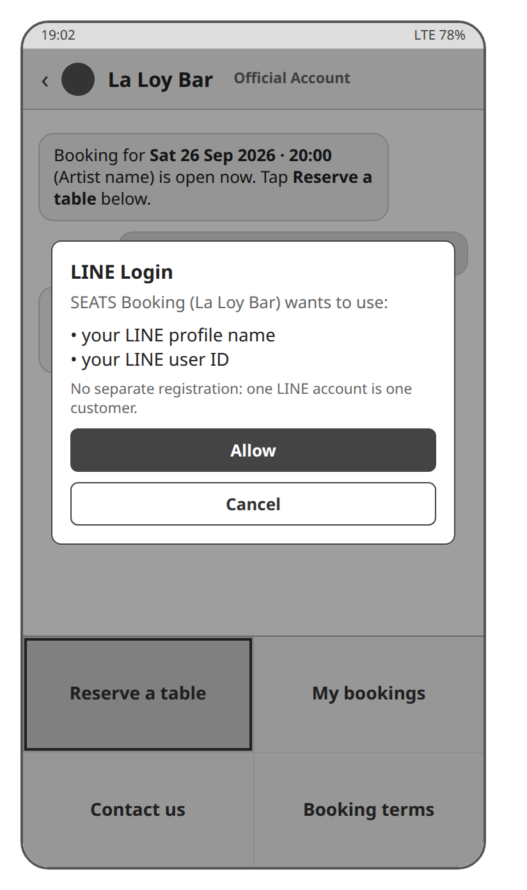

</td>
<td class="k">Use case steps</td>
<td markdown="block">

UC-01 steps 1–2, EF-2

</td>
</tr>
<tr markdown="1">
<td class="k">Main elements</td>
<td markdown="block">

LINE chat, Rich Menu "Reserve a table", LINE Login dialog

</td>
</tr>
<tr markdown="1">
<td class="k">Routes called</td>
<td markdown="block">

None: LINE Login runs in the LIFF app, and the ID token travels in the header of every later call (Table 5.2)

</td>
</tr>
<tr markdown="1">
<td class="ex" colspan="3" markdown="block">

**Example call**

<!-- examples:C1 -->
<pre class="calls">GET /api/rounds   progress 1; later Authorization: Bearer &lt;LINE ID token&gt; (ADR-01)
x-user-id: U-somchai
x-role: customer
→ 200
[…]</pre>
<!-- /examples -->

</td>
</tr>
</table>

*Table D.2 Screen C2, Concert rounds*

<table class="screen" markdown="1">
<tr markdown="1">
<td class="shot" rowspan="3" markdown="block">

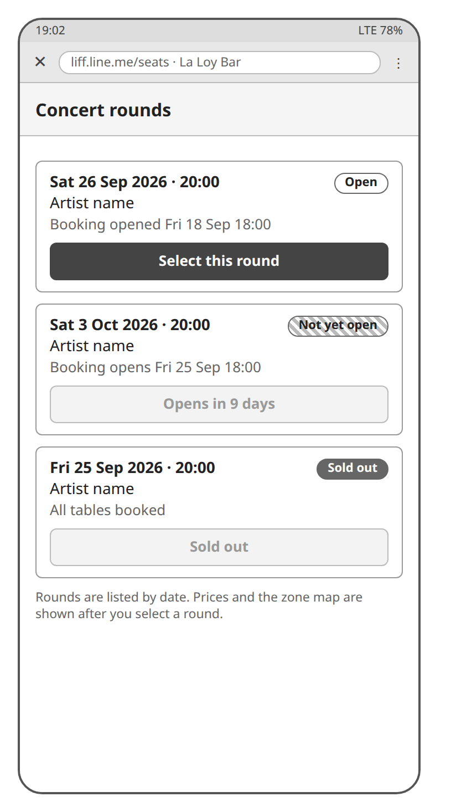

</td>
<td class="k">Use case steps</td>
<td markdown="block">

UC-01 steps 3–4, AF-1, AF-2

</td>
</tr>
<tr markdown="1">
<td class="k">Main elements</td>
<td markdown="block">

Round list with artist, date, start time, **booking-open time** and status; a round not yet open shows its **booking-open time**, a sold-out round is marked

</td>
</tr>
<tr markdown="1">
<td class="k">Routes called</td>
<td markdown="block">

`GET /rounds`

</td>
</tr>
<tr markdown="1">
<td class="ex" colspan="3" markdown="block">

**Example call**

<!-- examples:C2 -->
<pre class="calls">GET /api/rounds
→ 200
[
  {
    &quot;id&quot;: &quot;r-friday&quot;,
    &quot;name&quot;: &quot;Friday Live&quot;,
    &quot;artist&quot;: &quot;The Band&quot;,
    &quot;date&quot;: &quot;2026-10-09&quot;,
    &quot;startAt&quot;: &quot;2026-10-09T20:00:00Z&quot;,
    &quot;bookingOpenAt&quot;: &quot;2026-10-02T18:00:00Z&quot;,
    &quot;status&quot;: &quot;open&quot;,
    &quot;availableTables&quot;: 28,
    &quot;tablesForSale&quot;: 28
  }
]</pre>
<!-- /examples -->

</td>
</tr>
</table>

*Table D.3 Screen C3, Table map*

<table class="screen" markdown="1">
<tr markdown="1">
<td class="shot" rowspan="3" markdown="block">

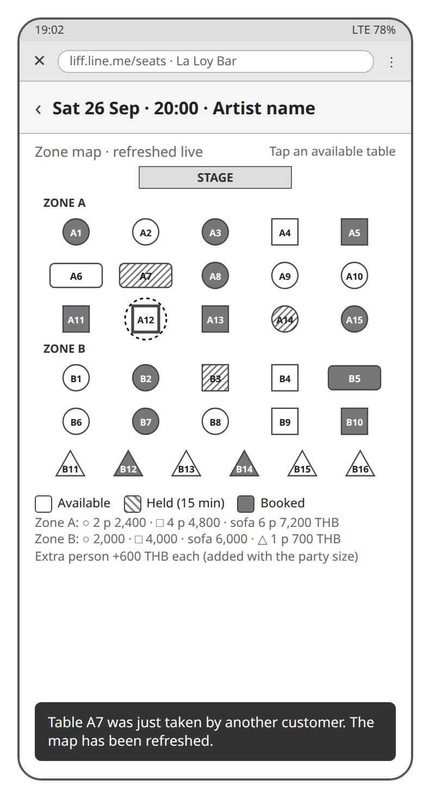

</td>
<td class="k">Use case steps</td>
<td markdown="block">

UC-01 steps 5–8, AF-3

</td>
</tr>
<tr markdown="1">
<td class="k">Main elements</td>
<td markdown="block">

Stage, **zones**, a shape per table with number, **table type**, **package price** and status; a tap on an available table holds it

</td>
</tr>
<tr markdown="1">
<td class="k">Routes called</td>
<td markdown="block">

`GET /rounds/{id}`, `GET /rounds/{id}/tables`; `GET /rounds/{id}/table-status` polled; `POST /bookings` on the tap

</td>
</tr>
<tr markdown="1">
<td class="ex" colspan="3" markdown="block">

**Example call**

<!-- examples:C3 -->
<pre class="calls">GET /api/rounds/r-friday/table-status
If-None-Match: 4
→ 304 unchanged since version 4
→ 200 ETag: 5
{
  &quot;roundId&quot;: &quot;r-friday&quot;,
  &quot;version&quot;: 5,
  &quot;tables&quot;: [
    {&quot;tableNumber&quot;: 1, &quot;status&quot;: &quot;HELD&quot;, &quot;bookingId&quot;: &quot;b-1&quot;, &quot;holdEndsAt&quot;: &quot;…T19:15:00Z&quot;},
    …
  ]
}

POST /api/bookings
{&quot;roundId&quot;: &quot;r-friday&quot;, &quot;tableNumber&quot;: 2}
→ 200
{&quot;id&quot;: &quot;b-2&quot;, &quot;status&quot;: &quot;Held&quot;, &quot;tableNumber&quot;: 2, &quot;remainingHoldSeconds&quot;: 900, …}
→ 409 UC-01 AF-3
{&quot;error&quot;: &quot;the table has just been taken by another customer&quot;}</pre>
<!-- /examples -->

</td>
</tr>
</table>

*Table D.4 Screen C4, Hold and booking summary*

<table class="screen" markdown="1">
<tr markdown="1">
<td class="shot" rowspan="3" markdown="block">

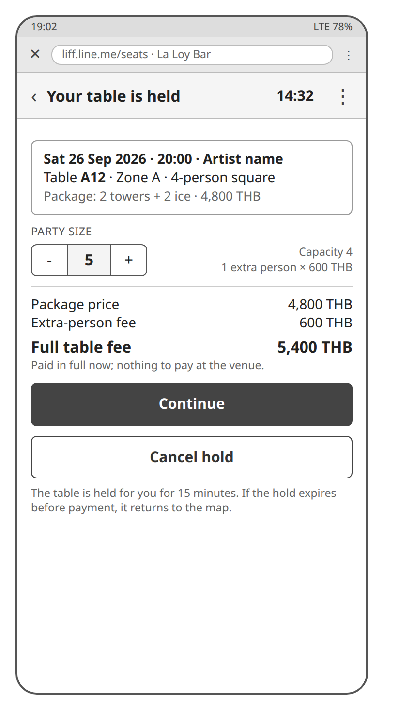

</td>
<td class="k">Use case steps</td>
<td markdown="block">

UC-01 steps 8–11, AF-4, EF-1

</td>
</tr>
<tr markdown="1">
<td class="k">Main elements</td>
<td markdown="block">

**Hold** countdown, booking summary, **party size** stepper, fee breakdown with the **full table fee**, Cancel the hold; on expiry the message of EF-1

</td>
</tr>
<tr markdown="1">
<td class="k">Routes called</td>
<td markdown="block">

`GET /bookings/{id}`, `PUT /bookings/{id}/party-size`, `POST /bookings/{id}/cancel`

</td>
</tr>
<tr markdown="1">
<td class="ex" colspan="3" markdown="block">

**Example call**

<!-- examples:C4 -->
<pre class="calls">PUT /api/bookings/b-2/party-size
{&quot;partySize&quot;: 3}
→ 200
{
  &quot;id&quot;: &quot;b-2&quot;,
  &quot;status&quot;: &quot;Held&quot;,
  &quot;partySize&quot;: 3,
  &quot;fee&quot;: {&quot;packagePrice&quot;: 2400, &quot;extraPersons&quot;: 1, &quot;extraPersonFee&quot;: 600, &quot;fullTableFee&quot;: 3000},
  …
}

POST /api/bookings/b-2/cancel
→ 200
{
  &quot;id&quot;: &quot;b-2&quot;,
  &quot;status&quot;: &quot;Cancelled&quot;,
  &quot;history&quot;: […, {&quot;status&quot;: &quot;Cancelled&quot;, &quot;by&quot;: &quot;U-somchai&quot;, …}],
  …
}</pre>
<!-- /examples -->

</td>
</tr>
</table>

*Table D.5 Screen C5, Customer profile and consent*

<table class="screen" markdown="1">
<tr markdown="1">
<td class="shot" rowspan="3" markdown="block">

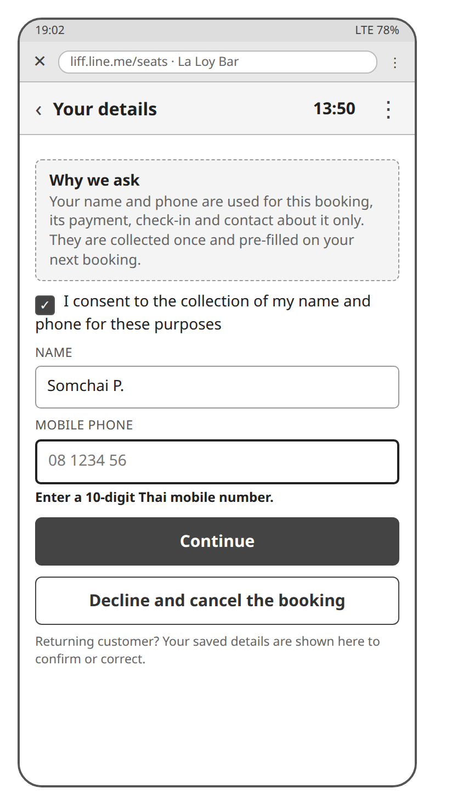

</td>
<td class="k">Use case steps</td>
<td markdown="block">

UC-01 step 12, AF-5; UC-09 steps 1–8, AF-1, AF-2

</td>
</tr>
<tr markdown="1">
<td class="k">Main elements</td>
<td markdown="block">

On the first booking: the purpose of the data collection, consent, name and phone with validation, Decline; later: the stored name and phone to confirm or correct

</td>
</tr>
<tr markdown="1">
<td class="k">Routes called</td>
<td markdown="block">

`GET /customers/me`, `POST /customers/me`, `PUT /customers/me`; `POST /bookings/{id}/cancel` on Decline

</td>
</tr>
<tr markdown="1">
<td class="ex" colspan="3" markdown="block">

**Example call**

<!-- examples:C5 -->
<pre class="calls">GET /api/customers/me
→ 404
{&quot;error&quot;: &quot;no profile yet: this is the first booking&quot;}

POST /api/customers/me
{&quot;name&quot;: &quot;Somchai P.&quot;, &quot;phone&quot;: &quot;0812345678&quot;, &quot;consent&quot;: true}
→ 200
{
  &quot;customerId&quot;: &quot;U-somchai&quot;,
  &quot;name&quot;: &quot;Somchai P.&quot;,
  &quot;phone&quot;: &quot;0812345678&quot;,
  &quot;consentAt&quot;: &quot;2026-10-03T12:00:00Z&quot;
}
→ 400 UC-09 AF-2
{&quot;error&quot;: &quot;invalid profile&quot;, &quot;details&quot;: [&quot;phone must be a Thai mobile number&quot;]}</pre>
<!-- /examples -->

</td>
</tr>
</table>

*Table D.6 Screen C6, Booking terms*

<table class="screen" markdown="1">
<tr markdown="1">
<td class="shot" rowspan="3" markdown="block">

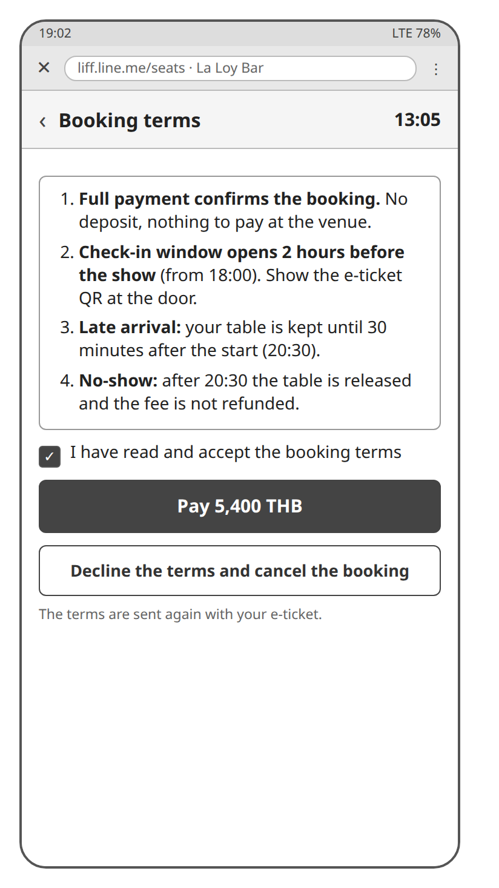

</td>
<td class="k">Use case steps</td>
<td markdown="block">

UC-01 steps 13–14

</td>
</tr>
<tr markdown="1">
<td class="k">Main elements</td>
<td markdown="block">

The **booking terms** with the **check-in window**, Accept, Pay with the amount, Decline and cancel the booking

</td>
</tr>
<tr markdown="1">
<td class="k">Routes called</td>
<td markdown="block">

`GET /bookings/{id}/terms`, `POST /bookings/{id}/terms-acceptance`; `POST /bookings/{id}/cancel` on Decline

</td>
</tr>
<tr markdown="1">
<td class="ex" colspan="3" markdown="block">

**Example call**

<!-- examples:C6 -->
<pre class="calls">GET /api/bookings/b-2/terms
→ 200
{
  &quot;bookingId&quot;: &quot;b-2&quot;,
  &quot;terms&quot;: [&quot;Full payment confirms the booking; …&quot;, …],
  &quot;checkInWindow&quot;: {
    &quot;opensAt&quot;: &quot;2026-10-09T18:00:00Z&quot;,
    &quot;startAt&quot;: &quot;2026-10-09T20:00:00Z&quot;,
    &quot;graceEndsAt&quot;: &quot;2026-10-09T20:30:00Z&quot;
  }
}

POST /api/bookings/b-2/terms-acceptance
→ 200
{&quot;id&quot;: &quot;b-2&quot;, &quot;status&quot;: &quot;Held&quot;, &quot;termsAccepted&quot;: true, …}</pre>
<!-- /examples -->

</td>
</tr>
</table>

*Table D.7 Screen C7, Payment*

<table class="screen" markdown="1">
<tr markdown="1">
<td class="shot" rowspan="3" markdown="block">

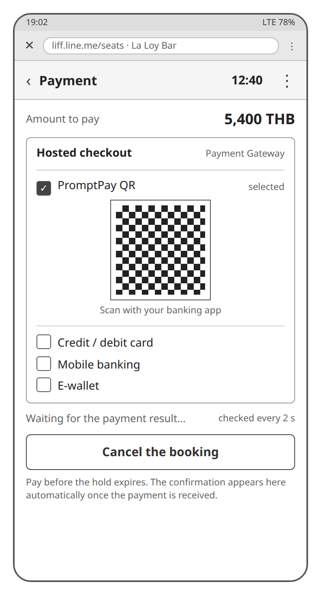

</td>
<td class="k">Use case steps</td>
<td markdown="block">

UC-01 step 15; UC-10 steps 1–7, AF-1, EF-4

</td>
</tr>
<tr markdown="1">
<td class="k">Main elements</td>
<td markdown="block">

Amount, the hosted checkout of the **Payment Gateway** opened inside the web app, Cancel the booking; the payment status while the result is awaited

</td>
</tr>
<tr markdown="1">
<td class="k">Routes called</td>
<td markdown="block">

`POST /bookings/{id}/payment` (501 in Increment 1), `GET /payments/{id}` polled until the result; `POST /bookings/{id}/cancel`

</td>
</tr>
<tr markdown="1">
<td class="ex" colspan="3" markdown="block">

**Example call**

<!-- examples:C7 -->
<pre class="calls">POST /api/bookings/b-2/payment
→ 200
{&quot;paymentId&quot;: &quot;p-7&quot;, &quot;checkoutUrl&quot;: &quot;https://checkout.example/pay/p-7&quot;}
→ 501 Increment 1
{&quot;error&quot;: &quot;startPayment() is built in progress 2&quot;}

GET /api/payments/p-7   polled until the result
→ 200
{&quot;paymentId&quot;: &quot;p-7&quot;, &quot;bookingId&quot;: &quot;b-2&quot;, &quot;status&quot;: &quot;Paid&quot;, &quot;amount&quot;: 3000}</pre>
<!-- /examples -->

</td>
</tr>
</table>

*Table D.8 Screen C8, Confirmation and e-ticket*

<table class="screen" markdown="1">
<tr markdown="1">
<td class="shot" rowspan="3" markdown="block">

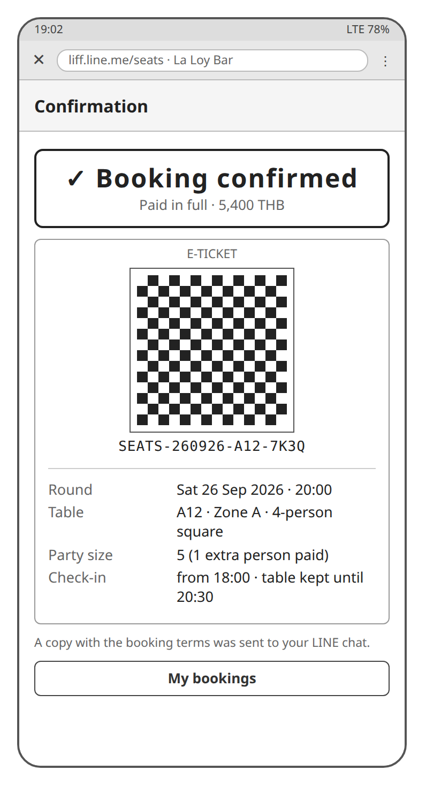

</td>
<td class="k">Use case steps</td>
<td markdown="block">

UC-01 steps 16–20, EF-3

</td>
</tr>
<tr markdown="1">
<td class="k">Main elements</td>
<td markdown="block">

Confirmed banner, QR **e-ticket** with the **booking reference**, booking details, **check-in window**, note that the LINE copy was sent

</td>
</tr>
<tr markdown="1">
<td class="k">Routes called</td>
<td markdown="block">

`GET /bookings/{id}`, `GET /bookings/{id}/e-ticket`

</td>
</tr>
<tr markdown="1">
<td class="ex" colspan="3" markdown="block">

**Example call**

<!-- examples:C8 -->
<pre class="calls">GET /api/bookings/b-2
→ 200
{
  &quot;id&quot;: &quot;b-2&quot;,
  &quot;status&quot;: &quot;Confirmed&quot;,
  &quot;tableNumber&quot;: 2,
  &quot;zoneName&quot;: &quot;Zone A&quot;,
  &quot;partySize&quot;: 3,
  &quot;fee&quot;: {…, &quot;fullTableFee&quot;: 3000},
  …
}

GET /api/bookings/b-2/e-ticket
→ 200
{&quot;bookingId&quot;: &quot;b-2&quot;, &quot;bookingReference&quot;: &quot;SEATS-261009-A02-7K3Q&quot;, &quot;qrPayload&quot;: …}</pre>
<!-- /examples -->

</td>
</tr>
</table>

*Table D.9 Screen C9, My Bookings*

<table class="screen" markdown="1">
<tr markdown="1">
<td class="shot" rowspan="3" markdown="block">

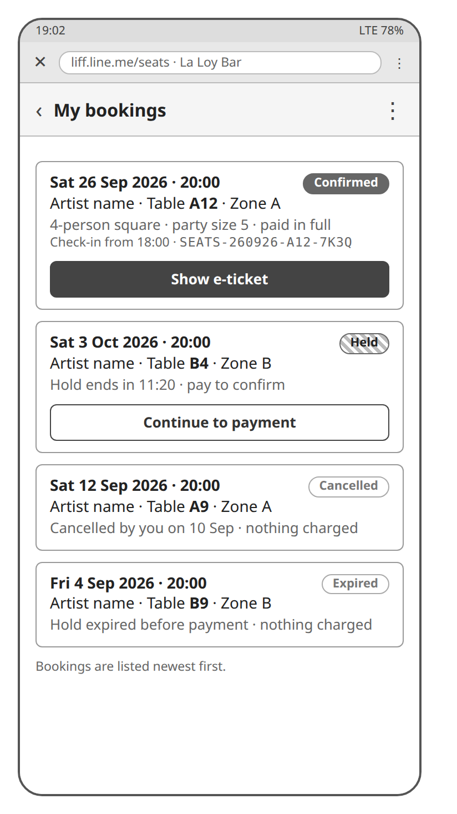

</td>
<td class="k">Use case steps</td>
<td markdown="block">

UC-06

</td>
</tr>
<tr markdown="1">
<td class="k">Main elements</td>
<td markdown="block">

The **Customer**'s bookings with status; a Confirmed booking opens its **e-ticket**

</td>
</tr>
<tr markdown="1">
<td class="k">Routes called</td>
<td markdown="block">

`GET /customers/me/bookings`, `GET /bookings/{id}/e-ticket`

</td>
</tr>
<tr markdown="1">
<td class="ex" colspan="3" markdown="block">

**Example call**

<!-- examples:C9 -->
<pre class="calls">GET /api/customers/me/bookings
→ 200
[
  {&quot;id&quot;: &quot;b-2&quot;, &quot;roundId&quot;: &quot;r-friday&quot;, &quot;tableNumber&quot;: 2, &quot;status&quot;: &quot;Confirmed&quot;, …},
  {&quot;id&quot;: &quot;b-1&quot;, &quot;roundId&quot;: &quot;r-sat&quot;, &quot;tableNumber&quot;: 9, &quot;status&quot;: &quot;Expired&quot;, …}
]</pre>
<!-- /examples -->

</td>
</tr>
</table>

## D.2 Back-office Web App

The Back-office Web App runs in the browsers and phones of the **Manager**, the **Front Staff** and the **Owner**; every screen but B1 needs a signed-in staff account, and the role decides which screens open (FR-66). B5 and B6 run on the staff phone at the door; B6 is drawn in its two states.

*Table D.10 Screen B1, Sign-in*

<table class="screen" markdown="1">
<tr markdown="1">
<td class="shot wide" colspan="2" markdown="block">

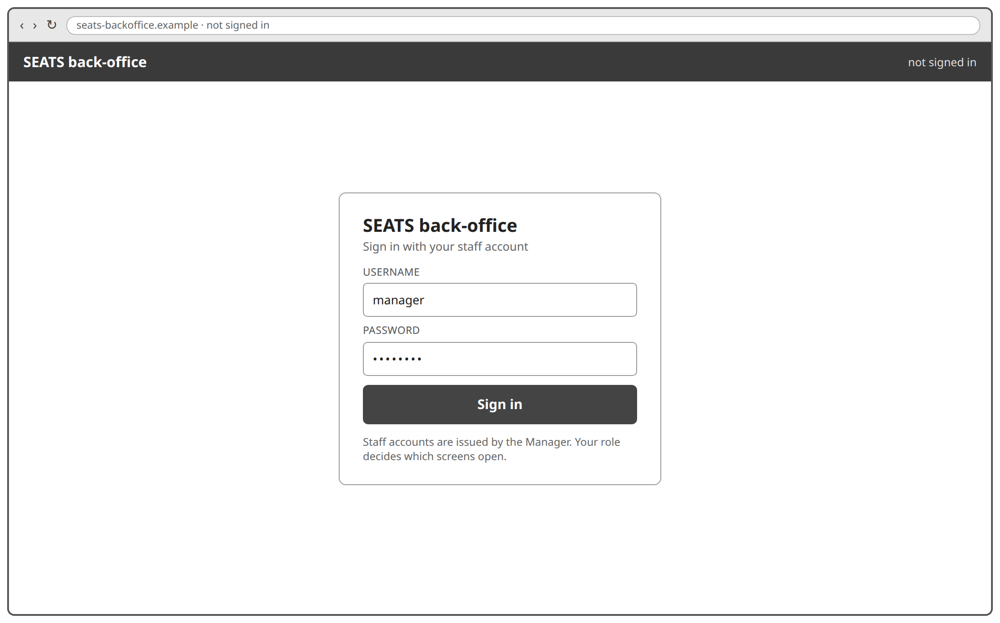

</td>
</tr>
<tr markdown="1">
<td class="k">Use case steps</td>
<td markdown="block">

UC-08 (sign in and log out)

</td>
</tr>
<tr markdown="1">
<td class="k">Main elements</td>
<td markdown="block">

Username, password; Sign out on every other screen

</td>
</tr>
<tr markdown="1">
<td class="k">Routes called</td>
<td markdown="block">

`POST /sessions`, `DELETE /sessions/current`

</td>
</tr>
<tr markdown="1">
<td class="ex" colspan="2" markdown="block">

**Example call**

<!-- examples:B1 -->
<pre class="calls">POST /api/sessions
{&quot;username&quot;: &quot;manager&quot;, &quot;password&quot;: …}
→ 200
{&quot;token&quot;: &quot;5e1f…&quot;, &quot;role&quot;: &quot;manager&quot;, &quot;staffAccountId&quot;: &quot;s-1&quot;}
→ 401
{&quot;error&quot;: &quot;wrong username or password&quot;}

DELETE /api/sessions/current
Authorization: Bearer 5e1f…
→ 200</pre>
<!-- /examples -->

</td>
</tr>
</table>

*Table D.11 Screen B2, Zone map editor*

<table class="screen" markdown="1">
<tr markdown="1">
<td class="shot wide" colspan="2" markdown="block">

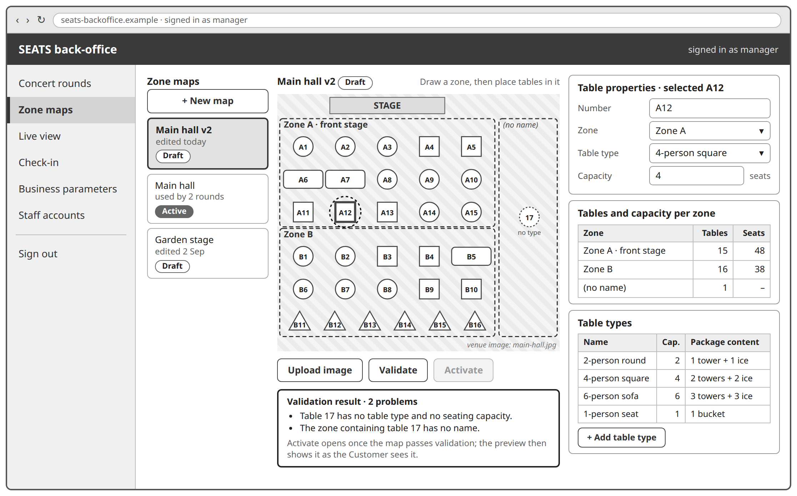

</td>
</tr>
<tr markdown="1">
<td class="k">Use case steps</td>
<td markdown="block">

UC-04 steps 1–13, S-1, AF-1, AF-3, EF-1 to EF-3; **table types** (FR-37)

</td>
</tr>
<tr markdown="1">
<td class="k">Main elements</td>
<td markdown="block">

Map list with status, new map, image upload, **zones** drawn on the image, tables placed with number, **table type** and capacity, tables and capacity per **zone**, validation result, preview, Activate; the **table types** with capacity and **package** content

</td>
</tr>
<tr markdown="1">
<td class="k">Routes called</td>
<td markdown="block">

`GET /zone-maps`, `POST /zone-maps`, `GET /zone-maps/{id}`, `PUT /zone-maps/{id}`, `POST /zone-maps/{id}/image`, `POST /zone-maps/{id}/validate`, `POST /zone-maps/{id}/activate`, `DELETE /zone-maps/{id}`; `GET /table-types`, `PUT /table-types/{id}`

</td>
</tr>
<tr markdown="1">
<td class="ex" colspan="2" markdown="block">

**Example call**

<!-- examples:B2 -->
<pre class="calls">POST /api/zone-maps
{&quot;name&quot;: &quot;Main hall v2&quot;}
→ 200
{
  &quot;id&quot;: &quot;m-2&quot;,
  &quot;name&quot;: &quot;Main hall v2&quot;,
  &quot;status&quot;: &quot;Draft&quot;,
  &quot;imageUrl&quot;: &quot;&quot;,
  &quot;zones&quot;: [],
  &quot;tables&quot;: [],
  &quot;summary&quot;: [],
  …
}

PUT /api/zone-maps/m-2
{
  &quot;zones&quot;: [{&quot;id&quot;: &quot;A&quot;, &quot;name&quot;: &quot;Zone A · front stage&quot;}],
  &quot;tables&quot;: [
    {
      &quot;tableNumber&quot;: 1,
      &quot;zoneId&quot;: &quot;A&quot;,
      &quot;tableTypeId&quot;: &quot;round2&quot;,
      &quot;capacity&quot;: 2,
      &quot;x&quot;: 40,
      &quot;y&quot;: 60
    }
  ]
}
→ 200
{
  &quot;id&quot;: &quot;m-2&quot;,
  &quot;status&quot;: &quot;Draft&quot;,
  &quot;zones&quot;: [{&quot;id&quot;: &quot;A&quot;, &quot;name&quot;: &quot;Zone A · front stage&quot;}],
  &quot;tables&quot;: [
    {
      &quot;tableNumber&quot;: 1,
      &quot;zoneId&quot;: &quot;A&quot;,
      &quot;tableTypeId&quot;: &quot;round2&quot;,
      &quot;capacity&quot;: 2,
      &quot;x&quot;: 40,
      &quot;y&quot;: 60
    }
  ],
  &quot;summary&quot;: [{&quot;zoneId&quot;: &quot;A&quot;, &quot;name&quot;: &quot;Zone A · front stage&quot;, &quot;tables&quot;: 1, &quot;capacity&quot;: 2}],
  …
}

POST /api/zone-maps/m-2/validate   UC-04 S-1
→ 200
{
  &quot;valid&quot;: false,
  &quot;problems&quot;: [&quot;table 17 has no table type&quot;, &quot;the zone containing table 17 has no name&quot;]
}

POST /api/zone-maps/m-2/activate
→ 400
{&quot;error&quot;: &quot;the zone map is not valid&quot;, &quot;details&quot;: [&quot;table 17 has no table type&quot;, …]}
→ 200 once valid
{&quot;id&quot;: &quot;m-2&quot;, &quot;status&quot;: &quot;Active&quot;, …}

PUT /api/table-types/round2
{&quot;name&quot;: &quot;2-person round table&quot;, &quot;capacity&quot;: 2, &quot;packageContent&quot;: &quot;1 tower + 1 ice&quot;}
→ 200
{
  &quot;id&quot;: &quot;round2&quot;,
  &quot;name&quot;: &quot;2-person round table&quot;,
  &quot;capacity&quot;: 2,
  &quot;packageContent&quot;: &quot;1 tower + 1 ice&quot;
}</pre>
<!-- /examples -->

</td>
</tr>
</table>

*Table D.12 Screen B3, Round editor*

<table class="screen" markdown="1">
<tr markdown="1">
<td class="shot wide" colspan="2" markdown="block">

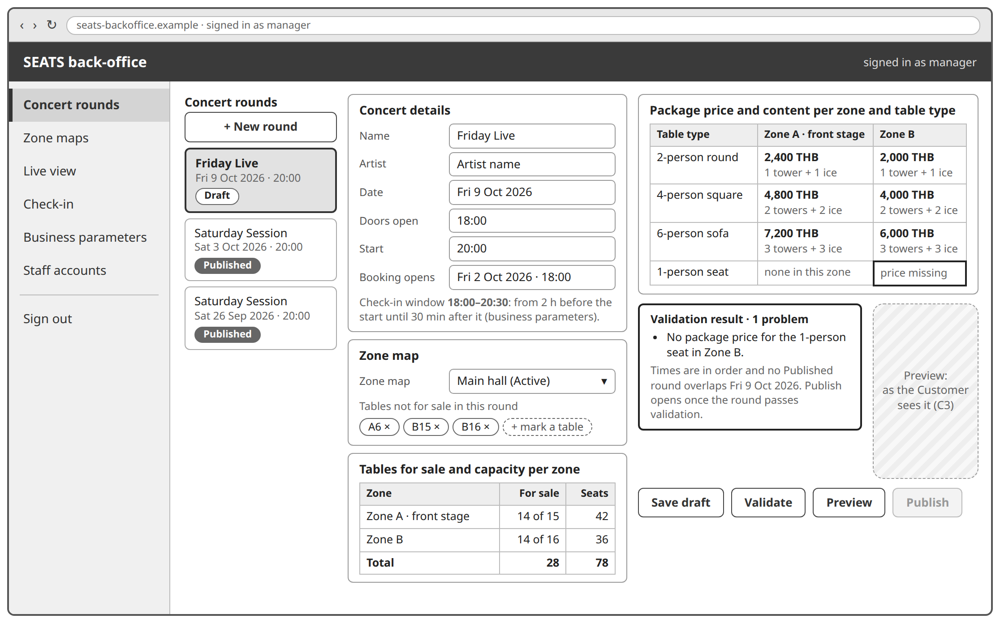

</td>
</tr>
<tr markdown="1">
<td class="k">Use case steps</td>
<td markdown="block">

UC-03 steps 1–16, S-1, AF-1, AF-3, EF-1, EF-2

</td>
</tr>
<tr markdown="1">
<td class="k">Main elements</td>
<td markdown="block">

Round list with status, new round, concert details and times, **zone map** choice, tables not for sale, **package price** and content per **zone** and **table type**, tables for sale and capacity per **zone**, validation result, preview as the **Customer** sees it (the elements of C3), Publish

</td>
</tr>
<tr markdown="1">
<td class="k">Routes called</td>
<td markdown="block">

`GET /rounds`, `POST /rounds`, `GET /rounds/{id}`, `PUT /rounds/{id}`, `GET /zone-maps?status=Active`, `GET /zone-maps/{id}`, `POST /rounds/{id}/validate`, `GET /rounds/{id}/tables` for the preview, `POST /rounds/{id}/publish`, `DELETE /rounds/{id}`

</td>
</tr>
<tr markdown="1">
<td class="ex" colspan="2" markdown="block">

**Example call**

<!-- examples:B3 -->
<pre class="calls">POST /api/rounds
{&quot;name&quot;: &quot;Friday Live&quot;}
→ 200
{
  &quot;id&quot;: &quot;r-friday&quot;,
  &quot;name&quot;: &quot;Friday Live&quot;,
  &quot;status&quot;: &quot;Draft&quot;,
  &quot;checkInWindow&quot;: null,
  &quot;parameters&quot;: null,
  &quot;tables&quot;: [],
  …
}

PUT /api/rounds/r-friday
{
  &quot;artist&quot;: &quot;The Band&quot;,
  &quot;date&quot;: &quot;2026-10-09&quot;,
  &quot;doorsOpenAt&quot;: &quot;2026-10-09T18:00:00Z&quot;,
  &quot;startAt&quot;: &quot;2026-10-09T20:00:00Z&quot;,
  &quot;bookingOpenAt&quot;: &quot;2026-10-02T18:00:00Z&quot;,
  &quot;zoneMapId&quot;: &quot;m-1&quot;,
  &quot;tablesNotForSale&quot;: [6],
  &quot;prices&quot;: [
    {
      &quot;zoneId&quot;: &quot;A&quot;,
      &quot;tableTypeId&quot;: &quot;sofa6&quot;,
      &quot;packagePrice&quot;: 7200,
      &quot;packageContent&quot;: &quot;3 towers + 3 ice&quot;
    },
    …
  ]
}
→ 200
{
  &quot;id&quot;: &quot;r-friday&quot;,
  &quot;status&quot;: &quot;Draft&quot;,
  &quot;artist&quot;: &quot;The Band&quot;,
  &quot;date&quot;: &quot;2026-10-09&quot;,
  &quot;zoneMapId&quot;: &quot;m-1&quot;,
  &quot;tablesNotForSale&quot;: [6],
  &quot;checkInWindow&quot;: {
    &quot;opensAt&quot;: &quot;2026-10-09T18:00:00Z&quot;,
    &quot;startAt&quot;: &quot;2026-10-09T20:00:00Z&quot;,
    &quot;graceEndsAt&quot;: &quot;2026-10-09T20:30:00Z&quot;
  },
  &quot;tables&quot;: [
    {
      &quot;tableNumber&quot;: 1,
      &quot;zoneId&quot;: &quot;A&quot;,
      &quot;tableTypeId&quot;: &quot;sofa6&quot;,
      &quot;capacity&quot;: 6,
      &quot;forSale&quot;: true,
      &quot;packagePrice&quot;: 7200,
      …
    },
    …
  ],
  …
}
→ 409 a Published round, UC-03 AF-3
{
  &quot;error&quot;: &quot;after the booking-open time these fields are fixed: zoneMapId&quot;,
  &quot;details&quot;: {&quot;confirmedBookings&quot;: 12}
}

POST /api/rounds/r-friday/validate   UC-03 S-1
→ 200
{&quot;valid&quot;: false, &quot;problems&quot;: [&quot;no package price for table type seat1 in zone B&quot;]}

POST /api/rounds/r-friday/publish   creates the table map of the round; idempotent
→ 200
{
  &quot;id&quot;: &quot;r-friday&quot;,
  &quot;status&quot;: &quot;Published&quot;,
  &quot;parameters&quot;: {
    &quot;holdPeriodMinutes&quot;: 15,
    &quot;checkInWindowHours&quot;: 2,
    &quot;gracePeriodMinutes&quot;: 30,
    &quot;extraPersonFee&quot;: 600
  },
  …
}
→ 400
{&quot;error&quot;: &quot;the round is not valid&quot;, &quot;details&quot;: […]}</pre>
<!-- /examples -->

</td>
</tr>
</table>

*Table D.13 Screen B4, Live view*

<table class="screen" markdown="1">
<tr markdown="1">
<td class="shot wide" colspan="2" markdown="block">

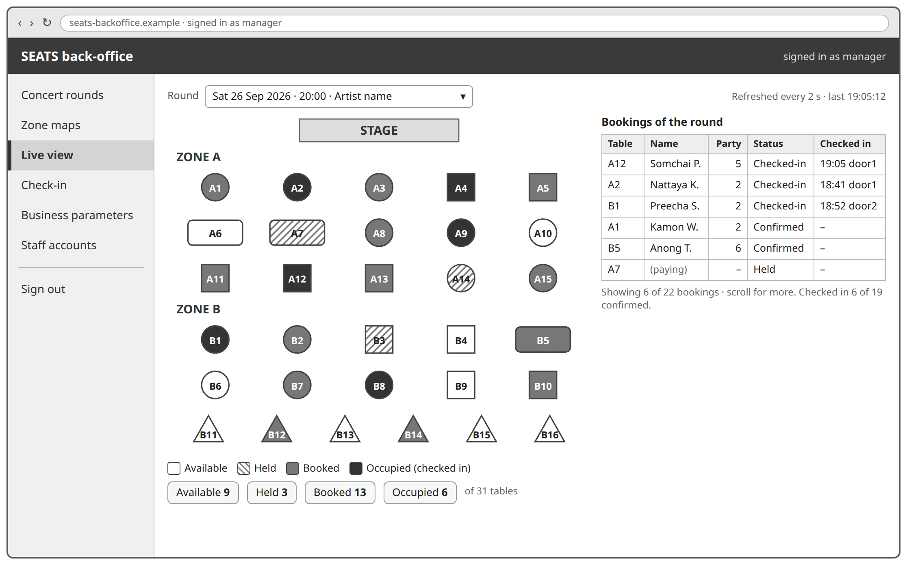

</td>
</tr>
<tr markdown="1">
<td class="k">Use case steps</td>
<td markdown="block">

UC-05; UC-02 step 7

</td>
</tr>
<tr markdown="1">
<td class="k">Main elements</td>
<td markdown="block">

Round choice, the table map with the status of every table, the bookings of the round with **party size** and check-in time, counts of available, held, booked and occupied tables

</td>
</tr>
<tr markdown="1">
<td class="k">Routes called</td>
<td markdown="block">

`GET /rounds`, `GET /rounds/{id}/tables`, `GET /rounds/{id}/table-status` polled, `GET /rounds/{id}/bookings`

</td>
</tr>
<tr markdown="1">
<td class="ex" colspan="2" markdown="block">

**Example call**

<!-- examples:B4 -->
<pre class="calls">GET /api/rounds/r-friday/table-status   polled every 2 seconds
If-None-Match: 41
→ 304 unchanged since version 41; the 200 answer is that of C3

GET /api/rounds/r-friday/bookings
→ 200
[{&quot;id&quot;: &quot;b-2&quot;, &quot;tableNumber&quot;: 1, &quot;partySize&quot;: 3, &quot;status&quot;: &quot;Checked-in&quot;, …}, …]</pre>
<!-- /examples -->

</td>
</tr>
</table>

*Table D.14 Screen B5, Check-in scanner*

<table class="screen" markdown="1">
<tr markdown="1">
<td class="shot" rowspan="3" markdown="block">

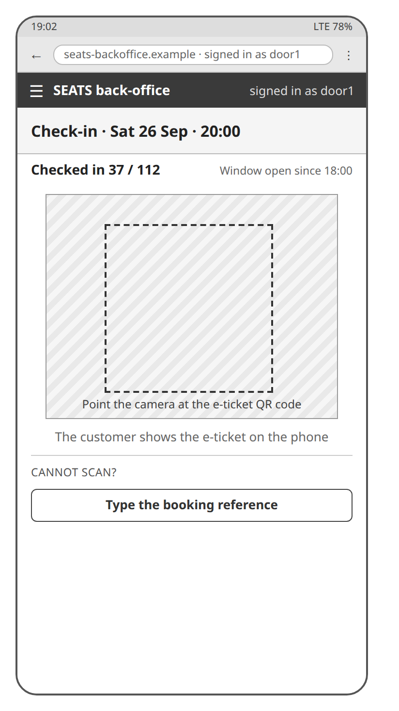

</td>
<td class="k">Use case steps</td>
<td markdown="block">

UC-02 steps 1–2, AF-2

</td>
</tr>
<tr markdown="1">
<td class="k">Main elements</td>
<td markdown="block">

Round and count, camera viewfinder, type the **booking reference**

</td>
</tr>
<tr markdown="1">
<td class="k">Routes called</td>
<td markdown="block">

`POST /check-ins/verify`

</td>
</tr>
<tr markdown="1">
<td class="ex" colspan="3" markdown="block">

**Example call**

<!-- examples:B5 -->
<pre class="calls">POST /api/check-ins/verify
{&quot;bookingReference&quot;: &quot;SEATS-261009-A02-7K3Q&quot;}
→ 200
{
  &quot;valid&quot;: true,
  &quot;booking&quot;: {
    &quot;id&quot;: &quot;b-2&quot;,
    &quot;tableNumber&quot;: 1,
    &quot;zoneName&quot;: &quot;Zone A&quot;,
    &quot;partySize&quot;: 3,
    &quot;status&quot;: &quot;Confirmed&quot;,
    …
  },
  &quot;reason&quot;: &quot;&quot;
}
→ 200 UC-02 EF-1
{&quot;valid&quot;: false, &quot;booking&quot;: null, &quot;reason&quot;: &quot;already checked in at 19:42 by door1&quot;}
→ 501 progress 1
{&quot;error&quot;: &quot;verifyBookingReference() is built in progress 2&quot;}</pre>
<!-- /examples -->

</td>
</tr>
</table>

*Table D.15 Screen B6, Verification result and entry confirmed*

<table class="screen" markdown="1">
<tr markdown="1">
<td class="shot wide tall" colspan="2" markdown="block">

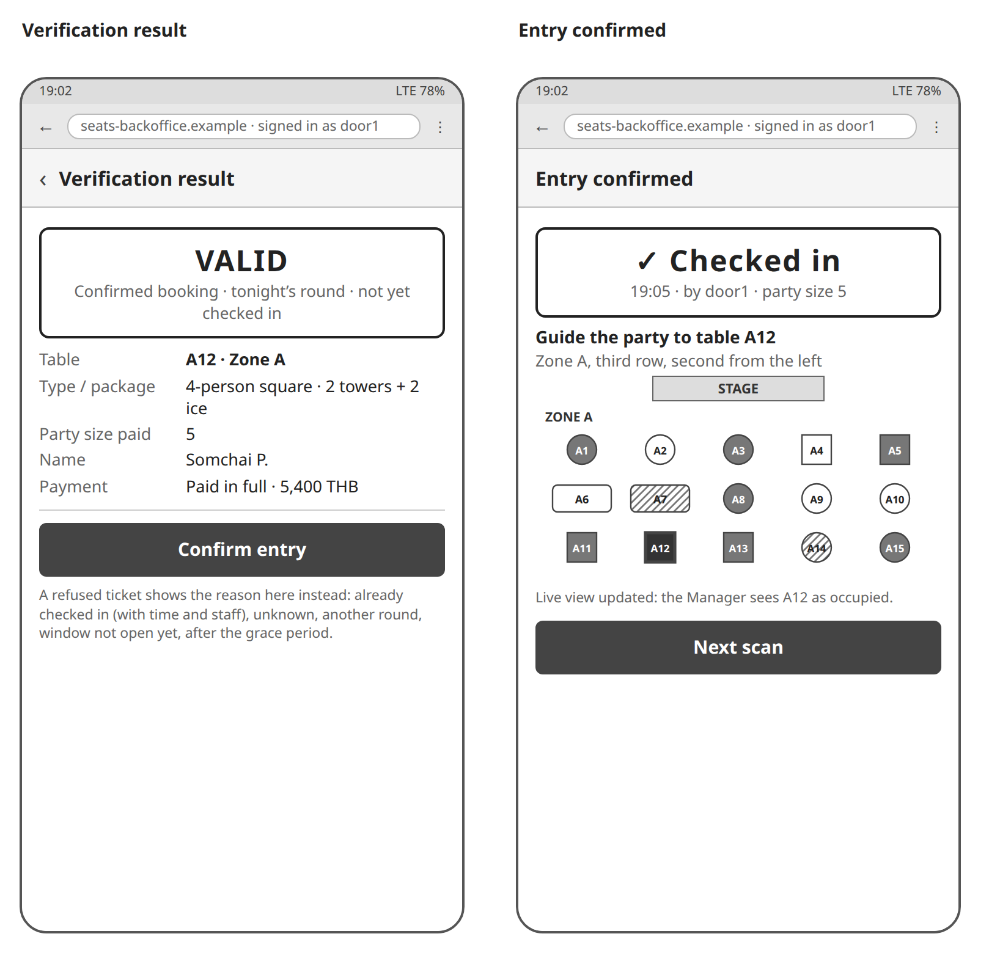

</td>
</tr>
<tr markdown="1">
<td class="k">Use case steps</td>
<td markdown="block">

UC-02 steps 3–8, S-1, AF-3 to AF-5, EF-1, EF-2, EF-5

</td>
</tr>
<tr markdown="1">
<td class="k">Main elements</td>
<td markdown="block">

Result panel with the reason of a failure, booking details with the **party size** paid for, Confirm entry; then the Checked-in banner with time and staff, Next scan

</td>
</tr>
<tr markdown="1">
<td class="k">Routes called</td>
<td markdown="block">

`POST /check-ins`

</td>
</tr>
<tr markdown="1">
<td class="ex" colspan="2" markdown="block">

**Example call**

<!-- examples:B6 -->
<pre class="calls">POST /api/check-ins
{&quot;bookingReference&quot;: &quot;SEATS-261009-A02-7K3Q&quot;}
→ 200
{
  &quot;id&quot;: &quot;b-2&quot;,
  &quot;status&quot;: &quot;Checked-in&quot;,
  &quot;history&quot;: […, {&quot;status&quot;: &quot;Checked-in&quot;, &quot;at&quot;: &quot;2026-10-09T19:05:00Z&quot;, &quot;by&quot;: &quot;door1&quot;}],
  …
}
→ 501 progress 1
{&quot;error&quot;: &quot;checkInBooking() is built in progress 2&quot;}</pre>
<!-- /examples -->

</td>
</tr>
</table>

*Table D.16 Screen B7, Business parameters and staff accounts*

<table class="screen" markdown="1">
<tr markdown="1">
<td class="shot wide" colspan="2" markdown="block">

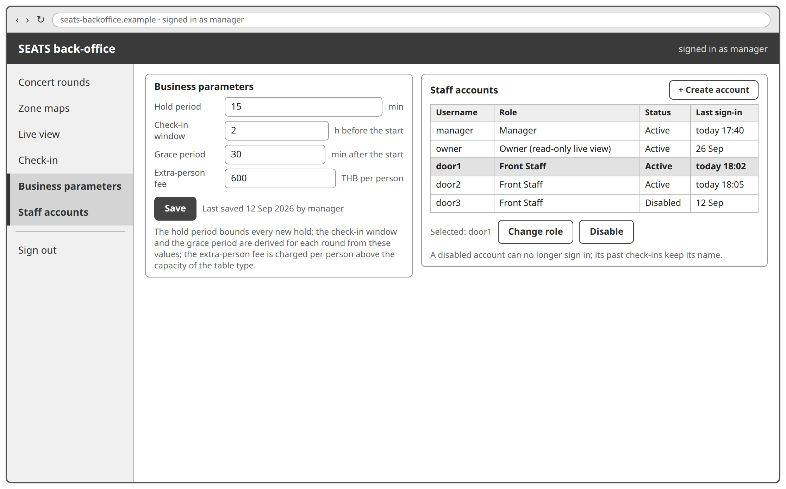

</td>
</tr>
<tr markdown="1">
<td class="k">Use case steps</td>
<td markdown="block">

UC-07; UC-08

</td>
</tr>
<tr markdown="1">
<td class="k">Main elements</td>
<td markdown="block">

**Hold period**, **check-in window**, **grace period**, **extra-person fee**; the staff accounts with role, create, change the role, disable

</td>
</tr>
<tr markdown="1">
<td class="k">Routes called</td>
<td markdown="block">

`GET /business-parameters`, `PUT /business-parameters`; `GET /staff-accounts`, `POST /staff-accounts`, `PUT /staff-accounts/{id}`, `DELETE /staff-accounts/{id}`

</td>
</tr>
<tr markdown="1">
<td class="ex" colspan="2" markdown="block">

**Example call**

<!-- examples:B7 -->
<pre class="calls">GET /api/business-parameters
→ 200
{
  &quot;holdPeriodMinutes&quot;: 15,
  &quot;checkInWindowHours&quot;: 2,
  &quot;gracePeriodMinutes&quot;: 30,
  &quot;extraPersonFee&quot;: 600
}

PUT /api/business-parameters
{&quot;extraPersonFee&quot;: 700}
→ 200
{
  &quot;holdPeriodMinutes&quot;: 15,
  &quot;checkInWindowHours&quot;: 2,
  &quot;gracePeriodMinutes&quot;: 30,
  &quot;extraPersonFee&quot;: 700
}

GET /api/staff-accounts
→ 200
[
  {&quot;staffAccountId&quot;: &quot;s-1&quot;, &quot;username&quot;: &quot;manager&quot;, &quot;role&quot;: &quot;manager&quot;, &quot;status&quot;: &quot;Active&quot;},
  {&quot;staffAccountId&quot;: &quot;s-2&quot;, &quot;username&quot;: &quot;door1&quot;, &quot;role&quot;: &quot;front_staff&quot;, &quot;status&quot;: &quot;Active&quot;},
  …
]

POST /api/staff-accounts
{&quot;username&quot;: &quot;door2&quot;, &quot;role&quot;: &quot;front_staff&quot;, &quot;password&quot;: …}
→ 200
{&quot;staffAccountId&quot;: &quot;s-4&quot;, &quot;username&quot;: &quot;door2&quot;, &quot;role&quot;: &quot;front_staff&quot;, &quot;status&quot;: &quot;Active&quot;}
→ 409
{&quot;error&quot;: &quot;username door2 is taken&quot;}

DELETE /api/staff-accounts/s-4
→ 200
{&quot;staffAccountId&quot;: &quot;s-4&quot;, &quot;username&quot;: &quot;door2&quot;, &quot;role&quot;: &quot;front_staff&quot;, &quot;status&quot;: &quot;Disabled&quot;}</pre>
<!-- /examples -->

</td>
</tr>
</table>

## D.3 Coverage

Read the other way, every route of Table 6.11 is called by at least one screen of Tables D.1 to D.16, except the payment webhook, which the **Payment Gateway** calls. The screens also show one route that the back-office needs and Table 6.11 does not give: the round list of B3 must show the Draft rounds of the venue as well as the Published ones, while `GET /rounds` answers the **Customer**'s upcoming rounds only (getUpcomingRounds()). A listRounds() operation of the Concert Round Service, or a status query on the route, is to be decided before the back-office is built; until then B3 reopens a Draft round by its id.

