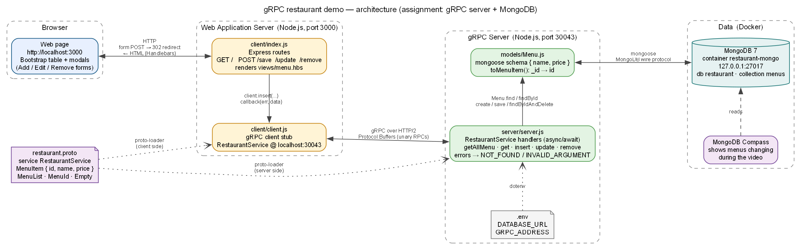

# gRPC Assignment — restaurant CRUD with MongoDB

Assignment (slide 73 + task.txt): take the lecture's gRPC restaurant sample and replace its in-memory
menu array with MongoDB through mongoose, then record a CRUD demo (< 5 min) showing the web page and the
database changing together.

## Folder layout

```
grpc-restaurant-demo/
  restaurant/          the project (git repo) — what is graded
    restaurant.proto   RestaurantService: GetAllMenu / Get / Insert / Update / Remove
    models/Menu.js     MenuSchema { name, price } + toMenuItem() (_id -> id)
    server/server.js   gRPC server, now backed by MongoDB
    client/            Express web app = gRPC client (unchanged from lecture)
    seed.js            reset the collection to Tomyam Gung / Somtam / Pad-Thai
    .env               DATABASE_URL (git-ignored), .env.example is the template
    docker-compose.yml MongoDB 7 container (npm run mongo / npm run mongo:stop)
    tools/clear-db.js  empty the menus collection (npm run db:clear)
  docs/                this file, video-script.md, architecture.png (+ .dot source)
  (lecture slides live in ../../../lecture-slide/grpc/ — PDF, PNGs, markdown transcription)
```

## Architecture



Browser → Express web app (`client/index.js`, which is a gRPC client through the stub in `client/client.js`)
→ gRPC server (`server/server.js`, `RestaurantService` from `restaurant.proto`) → mongoose `Menu` model →
MongoDB 7 in Docker (`restaurant.menus`). Compass reads the same database during the video. Regenerate with
`dot -Tpng -Gdpi=130 docs/architecture.dot -o docs/architecture.png`.

## Git history (for showing the diff in the video)

| Commit | Content |
|---|---|
| `a1903ba` | starter code from the lecture, unmodified |
| `1cbef24` | mongoose + dotenv, `models/Menu.js`, `.env.example` |
| `fc052a2` | `server/server.js` connected to MongoDB (the assignment's core change) |
| `9933edc` | `seed.js` and npm scripts |
| `cf4a1a4` | dev tooling (superseded) |
| latest    | Docker compose for MongoDB + `npm run db:clear` (not part of the assignment) |

Useful commands inside `restaurant/`:

```sh
git log --oneline                       # the 4 commits
git diff a1903ba HEAD -- server/server.js   # everything changed in server.js
git show fc052a2                        # the server commit alone
git diff a1903ba HEAD --stat            # all files touched
```

In VS Code, the Source Control view or GitLens "compare with a1903ba" shows the same diff side by side.

## Run

Three terminals, in this order.

**1. MongoDB.** Pick one:

- **Docker** (used here): start Docker Desktop, then `npm run mongo` in `restaurant/` (= `docker compose up -d`,
  image `mongo:7`, container `restaurant-mongo`). Data lives in the named volume `restaurant-mongo-data`, so it
  survives `npm run mongo:stop` and reboots. Compass: `mongodb://127.0.0.1:27017`.
- **Atlas**: put your connection string in `restaurant/.env` as `DATABASE_URL=...` with database name `restaurant`.

Database housekeeping (both need MongoDB running):

```sh
npm run seed              # reset menus to the 3 lecture items
npm run db:clear          # delete every document in menus (collection stays, Compass shows 0)
npm run db:clear -- --drop   # drop the whole restaurant database
```

**2. gRPC server** (in `restaurant/`, second terminal):

```sh
npm install
copy .env.example .env      # edit DATABASE_URL if using Atlas
npm run seed                # optional: 3 menu items (or add them through the web page)
npm start                   # gRPC server on 127.0.0.1:30043
```

**3. Web client** (in `restaurant/`):

```sh
npm run client              # Express on http://localhost:3000
```

Open http://localhost:3000 and Compass side by side. Database `restaurant`, collection `menus`.

## What changed and why

- **`id` mapping.** The proto declares `string id`; MongoDB uses `_id` (ObjectId). `toMenuItem()` on the
  model returns `{ id: _id.toString(), name, price }`, and the handlers use `findById`. The client and
  `menu.hbs` still work unchanged because they only ever see `id`.
- **async/await.** Every handler awaits the model call inside try/catch and reports errors as gRPC status
  codes: unknown or malformed id → `NOT_FOUND` (5), schema validation → `INVALID_ARGUMENT` (3),
  anything else → `INTERNAL` (13).
- **`uuid` is no longer needed**; MongoDB assigns ids. The dependency is still in package.json since the
  starter had it; harmless.
- **`server.start()` stays.** grpc-js 1.9.2 (the installed version) does not accept connections until
  `start()` is called; removing it makes every call reset.

## Known starter-code behaviour (left unchanged on purpose)

- `client/index.js` does `if (err) throw err` inside gRPC callbacks. Any gRPC error crashes the web
  client process. During the demo, only submit valid forms. The GET `/` handler also never responds if
  `getAllMenu` fails, so a browser tab would spin; both are lecture code, not part of the assignment.
- `client/client.js` loads `../restaurant.proto` relative to the **current directory**, so the client
  must be started from `restaurant/client/` (which `npm run client` does).

## Verified

Tested on 2026-09-16 against MongoDB 7 in Docker: seed, list, create (302 → row + document appear), update
(name/price change in page and `menus`), remove (row and document gone), plus gRPC error cases for unknown
id, malformed id, empty name, update/remove of unknown id.
